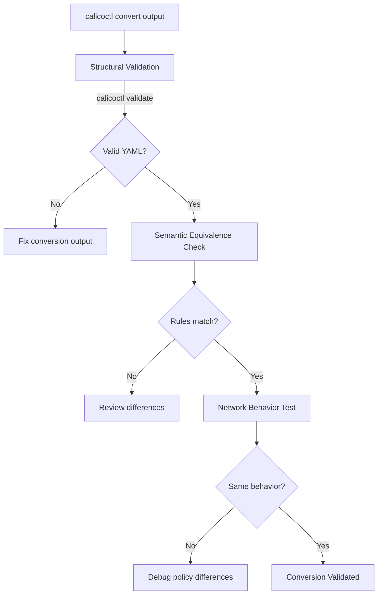

# How to Validate Results After Running calicoctl convert

Author: [nawazdhandala](https://github.com/nawazdhandala)

Tags: Calico, Kubernetes, Validation, Migration, Calicoctl

Description: Learn how to validate that calicoctl convert produced correct Calico policies by comparing semantics, testing network behavior, and running automated equivalence checks.

---

## Introduction

After running `calicoctl convert` to transform Kubernetes NetworkPolicies into Calico format, you need to verify that the converted policies are semantically equivalent to the originals. Structural correctness (valid YAML, correct fields) does not guarantee behavioral equivalence -- subtle differences in selector handling, default deny behavior, or port specifications can cause the converted policy to behave differently.

This guide covers validation strategies for calicoctl convert output, from structural checks to behavioral equivalence testing.

## Prerequisites

- calicoctl v3.27 or later
- Both Kubernetes and converted Calico policy files
- kubectl access to a test cluster
- Basic understanding of network policy semantics

## Structural Validation

First, verify the converted output is valid Calico YAML:

```bash
#!/bin/bash
# validate-converted.sh
# Validates converted Calico policies

set -euo pipefail

CONVERTED_DIR="${1:?Usage: $0 <converted-policies-dir>}"
PASS=0
FAIL=0

find "$CONVERTED_DIR" -name "*.yaml" | while read file; do
  if calicoctl validate -f "$file" > /dev/null 2>&1; then
    echo "VALID: $file"
    PASS=$((PASS + 1))
  else
    echo "INVALID: $file"
    calicoctl validate -f "$file" 2>&1 | sed 's/^/  /'
    FAIL=$((FAIL + 1))
  fi
done

echo "Results: $PASS valid, $FAIL invalid"
```

## Semantic Equivalence Check

Compare the intent of the original and converted policies:

```bash
#!/bin/bash
# check-equivalence.sh
# Compares K8s and Calico policy semantics

set -euo pipefail

K8S_FILE="${1:?Usage: $0 <k8s-policy.yaml> <calico-policy.yaml>}"
CALICO_FILE="${2:?}"

python3 -c "
import yaml

with open('$K8S_FILE') as f:
    k8s = yaml.safe_load(f)

with open('$CALICO_FILE') as f:
    calico = yaml.safe_load(f)

issues = []

# Check 1: Same namespace
k8s_ns = k8s['metadata'].get('namespace', 'default')
calico_ns = calico['metadata'].get('namespace', 'default')
if k8s_ns != calico_ns:
    issues.append(f'Namespace mismatch: K8s={k8s_ns}, Calico={calico_ns}')

# Check 2: Policy types match
k8s_types = set(k8s['spec'].get('policyTypes', []))
calico_types = set(calico['spec'].get('types', []))
if k8s_types != calico_types:
    issues.append(f'Policy types mismatch: K8s={k8s_types}, Calico={calico_types}')

# Check 3: Ingress rule count
k8s_ingress = len(k8s['spec'].get('ingress', []))
calico_ingress = len(calico['spec'].get('ingress', []))
if k8s_ingress != calico_ingress:
    issues.append(f'Ingress rule count: K8s={k8s_ingress}, Calico={calico_ingress}')

# Check 4: Egress rule count
k8s_egress = len(k8s['spec'].get('egress', []))
calico_egress = len(calico['spec'].get('egress', []))
if k8s_egress != calico_egress:
    issues.append(f'Egress rule count: K8s={k8s_egress}, Calico={calico_egress}')

# Check 5: Port specifications
for direction in ['ingress', 'egress']:
    k8s_rules = k8s['spec'].get(direction, [])
    calico_rules = calico['spec'].get(direction, [])
    for i, (kr, cr) in enumerate(zip(k8s_rules, calico_rules)):
        k8s_ports = set()
        for p in kr.get('ports', []):
            k8s_ports.add(f\"{p.get('protocol','TCP')}:{p.get('port','any')}\")
        calico_ports = set()
        for p_val in cr.get('destination', {}).get('ports', []):
            calico_ports.add(f\"{cr.get('protocol','TCP')}:{p_val}\")
        # Simplified comparison
        if k8s_ports and not calico_ports:
            issues.append(f'{direction}[{i}]: K8s has ports but Calico does not')

if issues:
    print('EQUIVALENCE ISSUES:')
    for issue in issues:
        print(f'  - {issue}')
else:
    print('EQUIVALENT: Policies appear semantically equivalent')
"
```

## Network Behavior Testing

Deploy test workloads and verify connectivity under both policies:

```bash
#!/bin/bash
# test-policy-behavior.sh
# Tests that K8s and Calico policies produce the same network behavior

set -euo pipefail

NAMESPACE="policy-test"
export DATASTORE_TYPE=kubernetes

# Create test namespace and workloads
kubectl create namespace "$NAMESPACE" --dry-run=client -o yaml | kubectl apply -f -
kubectl run server -n "$NAMESPACE" --image=nginx --labels="app=server" --port=80
kubectl run client -n "$NAMESPACE" --image=busybox --labels="app=client" -- sleep 3600
kubectl wait -n "$NAMESPACE" --for=condition=ready pod/server pod/client --timeout=60s

SERVER_IP=$(kubectl get pod server -n "$NAMESPACE" -o jsonpath='{.status.podIP}')

# Test with K8s NetworkPolicy
echo "=== Testing K8s NetworkPolicy ==="
kubectl apply -f k8s-policy.yaml
sleep 5
K8S_RESULT=$(kubectl exec -n "$NAMESPACE" client -- wget -q -O- --timeout=5 "http://${SERVER_IP}" 2>/dev/null && echo "ALLOWED" || echo "BLOCKED")
echo "K8s result: $K8S_RESULT"
kubectl delete -f k8s-policy.yaml

# Test with Calico NetworkPolicy
echo "=== Testing Calico NetworkPolicy ==="
calicoctl apply -f calico-policy.yaml
sleep 5
CALICO_RESULT=$(kubectl exec -n "$NAMESPACE" client -- wget -q -O- --timeout=5 "http://${SERVER_IP}" 2>/dev/null && echo "ALLOWED" || echo "BLOCKED")
echo "Calico result: $CALICO_RESULT"
calicoctl delete -f calico-policy.yaml

# Compare results
if [ "$K8S_RESULT" = "$CALICO_RESULT" ]; then
  echo "PASS: Both policies produce the same behavior ($K8S_RESULT)"
else
  echo "FAIL: Behavior differs - K8s=$K8S_RESULT, Calico=$CALICO_RESULT"
fi

# Clean up
kubectl delete namespace "$NAMESPACE"
```



## Verification

```bash
# Run all validation steps
calicoctl validate -f calico-policy.yaml
bash check-equivalence.sh k8s-policy.yaml calico-policy.yaml
bash test-policy-behavior.sh
```

## Troubleshooting

- **Equivalence check shows extra rules in Calico output**: calicoctl convert may add explicit rules that were implicit in K8s format. Review whether the extra rules are functionally equivalent.
- **Behavior test shows different results**: Check for default deny differences. K8s NetworkPolicy implicitly denies unmatched traffic when policyTypes is set, while Calico may need explicit deny rules.
- **Port comparison fails**: Named ports in K8s may convert to numeric ports in Calico. This is functionally equivalent but looks different.
- **Test pods cannot start**: Check if existing policies in the test namespace block pod communication.

## Conclusion

Validating calicoctl convert results requires checking three layers: structural validity (calicoctl validate), semantic equivalence (rule comparison), and behavioral testing (actual connectivity). This three-layer approach ensures that converted policies faithfully reproduce the original Kubernetes NetworkPolicy behavior while taking advantage of Calico's richer feature set.
