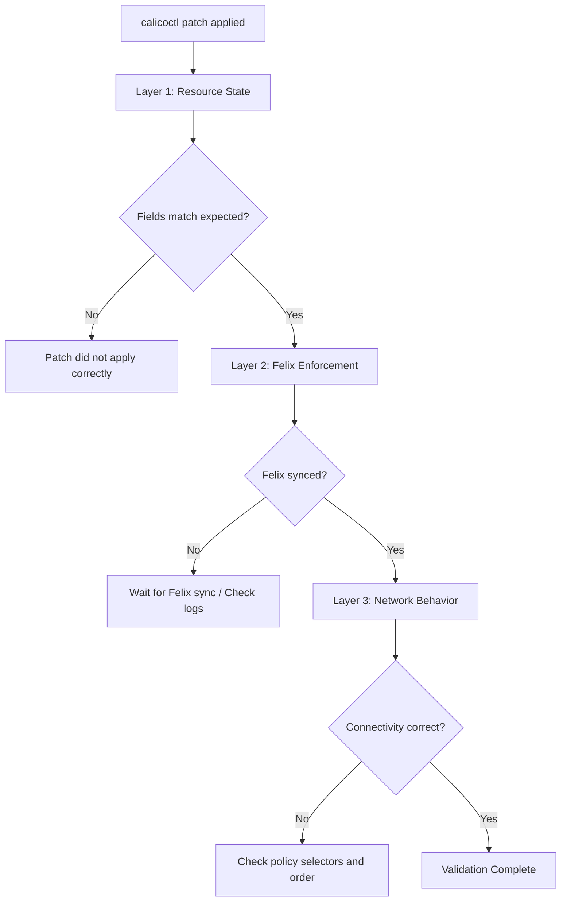

# How to Validate Results After Running calicoctl patch

Author: [nawazdhandala](https://github.com/nawazdhandala)

Tags: Calico, Kubernetes, Validation, calicoctl, Testing

Description: Learn how to validate that calicoctl patch operations produced the expected results by checking resource state, testing network connectivity, and monitoring Felix enforcement.

---

## Introduction

Running `calicoctl patch` is only half the job. The patch command may succeed at the API level but fail to produce the intended network behavior. A patched policy selector might not match the intended pods, a modified Felix configuration might not take effect until Felix restarts, or a patched BGP configuration might cause route flapping.

Validating the results of a patch operation requires checking three layers: the resource state in the datastore, the enforcement state in Felix, and the actual network behavior in the cluster.

This guide covers comprehensive validation strategies for calicoctl patch operations across all three layers.

## Prerequisites

- A running Kubernetes cluster with Calico installed
- calicoctl v3.27 or later
- kubectl access to the cluster
- Basic understanding of Calico policy enforcement

## Layer 1: Resource State Validation

Verify the patched resource has the expected field values:

```bash
#!/bin/bash
# validate-patch-state.sh
# Validates that a patch produced the expected resource state

set -euo pipefail

export DATASTORE_TYPE=kubernetes
RESOURCE_KIND="${1:?Usage: $0 <kind> <name> <field-path> <expected-value>}"
RESOURCE_NAME="${2:?}"
FIELD_PATH="${3:?}"
EXPECTED_VALUE="${4:?}"

# Get the current field value using python3 to traverse the YAML
ACTUAL_VALUE=$(calicoctl get "$RESOURCE_KIND" "$RESOURCE_NAME" -o json | python3 -c "
import sys, json
data = json.load(sys.stdin)
keys = '$FIELD_PATH'.split('.')
for key in keys:
    if key.isdigit():
        data = data[int(key)]
    else:
        data = data[key]
print(json.dumps(data) if isinstance(data, (dict, list)) else data)
")

if [ "$ACTUAL_VALUE" = "$EXPECTED_VALUE" ]; then
  echo "PASS: ${FIELD_PATH} = ${ACTUAL_VALUE} (expected: ${EXPECTED_VALUE})"
  exit 0
else
  echo "FAIL: ${FIELD_PATH} = ${ACTUAL_VALUE} (expected: ${EXPECTED_VALUE})"
  exit 1
fi
```

```bash
# Example usage
./validate-patch-state.sh felixconfiguration default spec.logSeverityScreen Warning
./validate-patch-state.sh globalnetworkpolicy my-policy spec.order 100
```

## Layer 2: Felix Enforcement Validation

Verify that Felix has picked up and enforced the patched policy:

```bash
#!/bin/bash
# validate-felix-enforcement.sh
# Checks that Felix has processed the latest policy changes

set -euo pipefail

# Check Felix logs for policy update events
echo "=== Recent Felix Policy Updates ==="
kubectl logs -n calico-system -l k8s-app=calico-node -c calico-node --tail=50 | \
  grep -i "policy\|update\|applied" | tail -20

# Check Felix metrics for sync status
echo ""
echo "=== Felix Sync Status ==="
CALICO_NODE_POD=$(kubectl get pods -n calico-system -l k8s-app=calico-node -o jsonpath='{.items[0].metadata.name}')
kubectl exec -n calico-system "$CALICO_NODE_POD" -c calico-node -- \
  wget -q -O- http://localhost:9091/metrics 2>/dev/null | \
  grep -E "felix_resync_state|felix_cluster_num_policies"
```

## Layer 3: Network Behavior Validation

Test actual network connectivity to confirm the patch has the intended effect:

```bash
#!/bin/bash
# validate-network-behavior.sh
# Tests network connectivity to validate policy enforcement

set -euo pipefail

# Test 1: Allowed connections should succeed
echo "Test 1: Testing allowed connections..."
kubectl exec -it deploy/frontend -- curl -s --max-time 5 -o /dev/null -w "%{http_code}" http://backend:8080/health
echo ""

# Test 2: Blocked connections should fail
echo "Test 2: Testing blocked connections..."
if kubectl exec -it deploy/frontend -- curl -s --max-time 5 -o /dev/null http://restricted-service:8080 2>/dev/null; then
  echo "FAIL: Connection to restricted-service should be blocked"
else
  echo "PASS: Connection to restricted-service is blocked as expected"
fi

# Test 3: DNS should work
echo "Test 3: Testing DNS resolution..."
kubectl exec -it deploy/frontend -- nslookup kubernetes.default.svc.cluster.local
```

## Automated Validation Pipeline

Combine all validation layers into a single script:

```bash
#!/bin/bash
# full-validation.sh
# Complete validation after a calicoctl patch operation

set -euo pipefail

export DATASTORE_TYPE=kubernetes
RESOURCE_KIND="${1:?Usage: $0 <kind> <name>}"
RESOURCE_NAME="${2:?}"

PASS=0
FAIL=0

check() {
  local desc="$1"
  shift
  if "$@" > /dev/null 2>&1; then
    echo "PASS: $desc"
    PASS=$((PASS + 1))
  else
    echo "FAIL: $desc"
    FAIL=$((FAIL + 1))
  fi
}

echo "=== Validating patch results for ${RESOURCE_KIND}/${RESOURCE_NAME} ==="

# Resource exists
check "Resource exists in datastore" calicoctl get "$RESOURCE_KIND" "$RESOURCE_NAME"

# Resource is valid YAML
check "Resource is valid" calicoctl get "$RESOURCE_KIND" "$RESOURCE_NAME" -o yaml

# Felix is in sync
check "Felix is processing policies" kubectl logs -n calico-system -l k8s-app=calico-node -c calico-node --tail=10

# All calico-node pods are running
check "All calico-node pods are running" kubectl get pods -n calico-system -l k8s-app=calico-node --field-selector=status.phase=Running

echo ""
echo "=== Results: $PASS passed, $FAIL failed ==="
[ "$FAIL" -eq 0 ] && exit 0 || exit 1
```



## Verification

```bash
export DATASTORE_TYPE=kubernetes

# Run the full validation
./full-validation.sh globalnetworkpolicy my-policy

# Quick manual checks
calicoctl get globalnetworkpolicy my-policy -o yaml
kubectl get pods -n calico-system -l k8s-app=calico-node
```

## Troubleshooting

- **Resource state correct but network behavior wrong**: The policy selector may not match the intended pods. Check label matching with `kubectl get pods --show-labels` and compare with the policy selector syntax.
- **Felix shows stale policy count**: Felix caches policies and may take 10-30 seconds to process updates. Wait and recheck the metrics.
- **Validation passes on some nodes but fails on others**: Check that all calico-node pods are running and in sync. A node with a failed Felix agent will not enforce the patched policy.
- **Network tests inconsistent**: Ensure test pods are not cached connections. Use `--max-time` and fresh connections for reliable testing.

## Conclusion

Validating calicoctl patch results across three layers -- resource state, Felix enforcement, and network behavior -- provides complete confidence that your patch produced the intended effect. Automate these validation checks as part of your patch workflow to catch issues immediately and before they affect production traffic. The investment in validation automation pays off every time a patch has an unexpected side effect.
