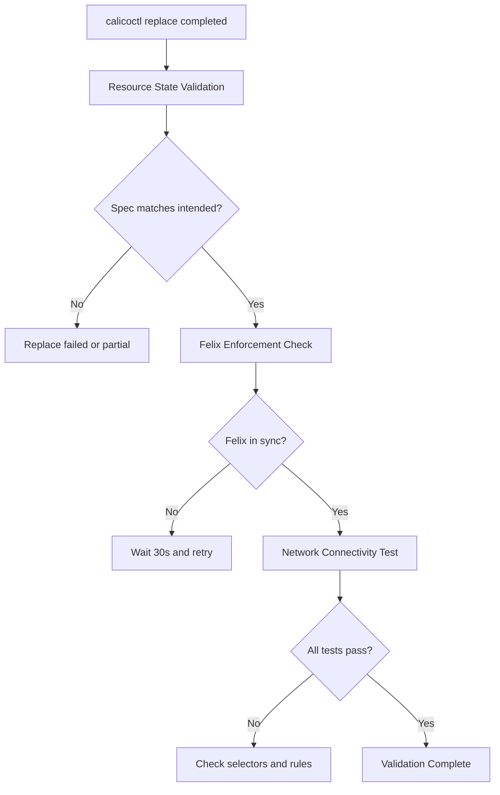

# How to Validate Results After Running calicoctl replace

Author: [nawazdhandala](https://github.com/nawazdhandala)

Tags: Calico, Kubernetes, Validation, Calicoctl, Testing

Description: Learn how to validate that calicoctl replace operations produced the expected results by comparing resource definitions, testing policy enforcement, and monitoring Felix sync status.

---

## Introduction

After running `calicoctl replace`, you need to verify that the new resource definition is active in the datastore, that Felix has processed the update, and that network behavior matches your expectations. Because `replace` overwrites the entire resource, validation must confirm not only that the new fields are present but also that no unintended fields were removed.

This guide provides a structured validation approach for calicoctl replace operations covering resource state comparison, Felix enforcement verification, and network connectivity testing.

## Prerequisites

- A running Kubernetes cluster with Calico installed
- calicoctl v3.27 or later
- kubectl access to the cluster
- python3 for YAML/JSON comparison

## Validating Resource State

Compare the resource in the datastore against the intended definition:

```bash
#!/bin/bash
# validate-replace.sh
# Validates that a replace operation produced the expected state

set -euo pipefail

export DATASTORE_TYPE=kubernetes
INTENDED_FILE="${1:?Usage: $0 <intended-resource.yaml>}"

KIND=$(python3 -c "import yaml; print(yaml.safe_load(open('$INTENDED_FILE'))['kind'])")
NAME=$(python3 -c "import yaml; print(yaml.safe_load(open('$INTENDED_FILE'))['metadata']['name'])")

echo "Validating ${KIND}/${NAME} against intended state..."

# Get current state from cluster
calicoctl get "$KIND" "$NAME" -o json > /tmp/actual.json

# Compare spec sections (ignoring metadata like resourceVersion, uid)
python3 -c "
import yaml, json

with open('$INTENDED_FILE') as f:
    intended = yaml.safe_load(f)

with open('/tmp/actual.json') as f:
    actual = json.load(f)

# Compare specs
intended_spec = intended.get('spec', {})
actual_spec = actual.get('spec', {})

def compare(intended, actual, path='spec'):
    diffs = []
    if isinstance(intended, dict):
        for key in intended:
            if key not in actual:
                diffs.append(f'MISSING: {path}.{key}')
            else:
                diffs.extend(compare(intended[key], actual[key], f'{path}.{key}'))
    elif isinstance(intended, list):
        if len(intended) != len(actual):
            diffs.append(f'LENGTH MISMATCH: {path} (intended={len(intended)}, actual={len(actual)})')
        else:
            for i, (a, b) in enumerate(zip(intended, actual)):
                diffs.extend(compare(a, b, f'{path}[{i}]'))
    elif intended != actual:
        diffs.append(f'VALUE MISMATCH: {path} (intended={intended}, actual={actual})')
    return diffs

diffs = compare(intended_spec, actual_spec)
if diffs:
    print('VALIDATION FAILED:')
    for d in diffs:
        print(f'  {d}')
    exit(1)
else:
    print('VALIDATION PASSED: Resource matches intended state')
"
```

## Validating Felix Enforcement

```bash
#!/bin/bash
# validate-felix-sync.sh
# Verify Felix has processed the replaced resource

set -euo pipefail

echo "=== Felix Sync Status ==="

# Check all calico-node pods for sync state
kubectl get pods -n calico-system -l k8s-app=calico-node -o name | while read pod; do
  node=$(kubectl get "$pod" -n calico-system -o jsonpath='{.spec.nodeName}')
  # Check Felix metrics for in-sync state
  sync_status=$(kubectl exec -n calico-system "${pod##*/}" -c calico-node -- \
    wget -q -O- http://localhost:9091/metrics 2>/dev/null | \
    grep "felix_resync_state" | head -1 || echo "unknown")
  echo "Node: $node - $sync_status"
done

# Check recent Felix logs for policy updates
echo ""
echo "=== Recent Policy Updates ==="
kubectl logs -n calico-system -l k8s-app=calico-node -c calico-node --tail=20 2>/dev/null | \
  grep -i "policy\|replaced\|updated" | tail -10
```

## Network Connectivity Validation

```bash
#!/bin/bash
# validate-connectivity.sh
# Tests network connectivity to validate replaced policy

set -euo pipefail

TESTS_PASSED=0
TESTS_FAILED=0

test_connection() {
  local desc="$1"
  local src_deploy="$2"
  local target="$3"
  local expected="$4"  # "pass" or "fail"

  result=$(kubectl exec deploy/"$src_deploy" -- curl -s --max-time 5 -o /dev/null -w "%{http_code}" "$target" 2>/dev/null || echo "000")

  if [ "$expected" = "pass" ] && [ "$result" != "000" ]; then
    echo "PASS: $desc (status: $result)"
    TESTS_PASSED=$((TESTS_PASSED + 1))
  elif [ "$expected" = "fail" ] && [ "$result" = "000" ]; then
    echo "PASS: $desc (connection blocked as expected)"
    TESTS_PASSED=$((TESTS_PASSED + 1))
  else
    echo "FAIL: $desc (status: $result, expected: $expected)"
    TESTS_FAILED=$((TESTS_FAILED + 1))
  fi
}

# Define test cases based on your policy
test_connection "Frontend to API" "frontend" "http://api:8080/health" "pass"
test_connection "Frontend to DB (should fail)" "frontend" "http://database:5432" "fail"

echo ""
echo "Results: $TESTS_PASSED passed, $TESTS_FAILED failed"
[ "$TESTS_FAILED" -eq 0 ] || exit 1
```



## Verification

```bash
export DATASTORE_TYPE=kubernetes

# Run full validation
./validate-replace.sh intended-policy.yaml
./validate-felix-sync.sh
./validate-connectivity.sh

# Quick manual verification
calicoctl get globalnetworkpolicy my-policy -o yaml
```

## Troubleshooting

- **Spec comparison shows unexpected extra fields**: The cluster may add default values not present in your definition. Update your intended file to include defaults, or exclude known auto-populated fields from comparison.
- **Felix shows stale sync state**: Wait 30 seconds after replace for Felix to process. If still stale, check Felix logs for errors.
- **Connectivity test fails intermittently**: Existing TCP connections may persist after policy change. Test with new connections using short timeouts.
- **Validation passes but users report issues**: Check that validation tests cover all relevant traffic patterns. Add test cases for edge cases like UDP, ICMP, and cross-namespace traffic.

## Conclusion

Validating calicoctl replace results requires checking three layers: resource state in the datastore matches the intended definition, Felix has synchronized the change, and actual network behavior reflects the policy. Automate these validation steps and run them as part of every replace operation to catch issues before they affect production traffic.
