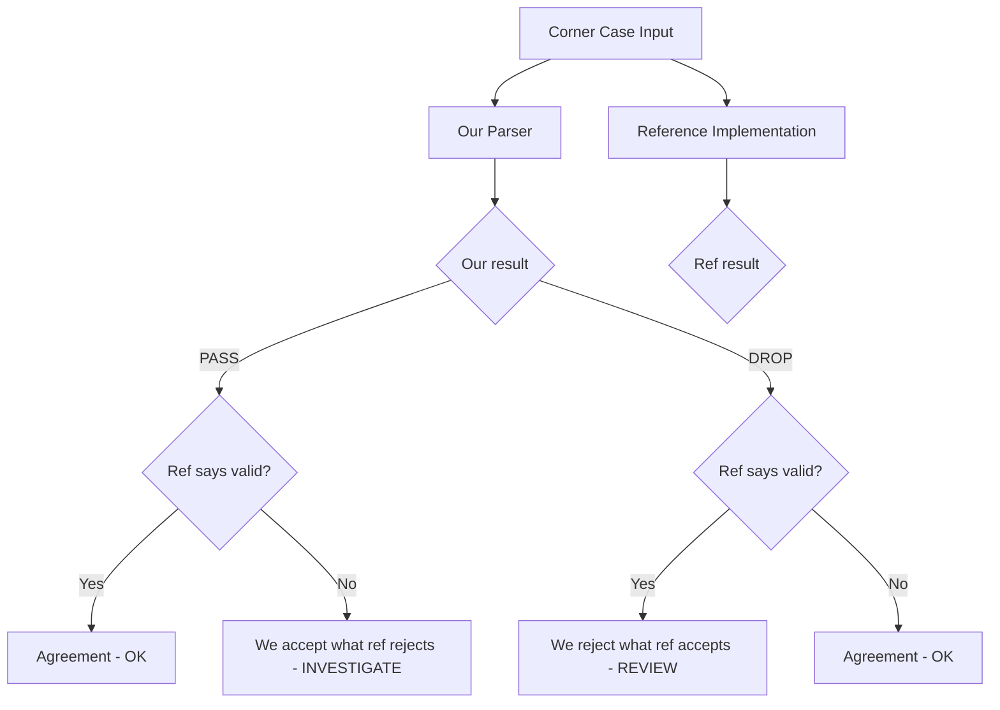

# Validating Protocol Spec Corner Case Handling in Cilium Network Security

Author: [nawazdhandala](https://github.com/nawazdhandala)

Tags: Cilium, Network Security, Validation, Protocol Specification, Corner Cases, Testing

Description: Validate that a Cilium L7 parser correctly handles all identified protocol specification corner cases through targeted tests, cross-implementation comparison, and systematic boundary verification.

---

## Introduction

Validating corner case handling ensures that every documented ambiguity, optional feature, and boundary condition in the protocol specification is handled correctly by the parser. This validation is the bridge between specification review (identifying corner cases) and production readiness (confirming they are handled).

Without this validation step, corner case documentation becomes theoretical - you know the issues exist but have no evidence that the parser handles them. Targeted tests for each corner case provide that evidence.

## Prerequisites

- Documented corner cases from specification review
- Parser implementation with corner case handling
- Reference implementation for comparison testing
- Go 1.21 or later with fuzzing support
- Protocol test vectors (if available from spec body)

## Building Corner Case Test Vectors

Create targeted test vectors for each documented corner case:

```go
func TestCornerCases(t *testing.T) {
    tests := []struct {
        name       string
        caseID     string // Links to corner case documentation
        input      []byte
        wantOp     proxylib.OpType
        wantN      int
        rationale  string
    }{
        {
            name:      "CC-001: zero-length body",
            caseID:    "CORNER_CASE_001",
            input:     []byte{0x00, 0x00, 0x00, 0x00}, // length=0
            wantOp:    proxylib.DROP,
            wantN:     0,
            rationale: "Zero-length bodies rejected per security decision",
        },
        {
            name:      "CC-002: unknown command type",
            caseID:    "CORNER_CASE_002",
            input:     append([]byte{0x00, 0x00, 0x00, 0x05, 0xFF}, make([]byte, 4)...),
            wantOp:    proxylib.DROP,
            wantN:     0,
            rationale: "Unknown commands rejected to prevent policy bypass",
        },
        {
            name:      "CC-003: request ID zero",
            caseID:    "CORNER_CASE_003",
            input:     buildMessage(0x01, 0, []byte("test")), // reqID=0
            wantOp:    proxylib.PASS,
            wantN:     13,
            rationale: "Request ID 0 is valid per spec",
        },
        {
            name:      "CC-004: request ID max uint32",
            caseID:    "CORNER_CASE_004",
            input:     buildMessage(0x01, 0xFFFFFFFF, []byte("test")),
            wantOp:    proxylib.PASS,
            wantN:     13,
            rationale: "Maximum request ID is valid per spec",
        },
        {
            name:      "CC-005: reserved flags set to non-zero",
            caseID:    "CORNER_CASE_005",
            input:     buildMessageWithFlags(0x01, 1, []byte("test"), 0xFF),
            wantOp:    proxylib.DROP,
            wantN:     0,
            rationale: "Reserved flags must be zero per spec",
        },
        {
            name:      "CC-006: signed negative length",
            caseID:    "CORNER_CASE_006",
            input:     []byte{0x80, 0x00, 0x00, 0x01}, // -2147483647 as signed
            wantOp:    proxylib.DROP,
            wantN:     0,
            rationale: "Negative lengths indicate malformed or malicious input",
        },
    }

    for _, tt := range tests {
        t.Run(tt.name, func(t *testing.T) {
            parser := &Parser{state: stateRunning}
            reader := proxylib.NewTestReader(tt.input)

            gotOp, gotN := parser.OnData(false, reader)

            if gotOp != tt.wantOp {
                t.Errorf("[%s] Op: got %v, want %v (%s)",
                    tt.caseID, gotOp, tt.wantOp, tt.rationale)
            }
            if gotN != tt.wantN {
                t.Errorf("[%s] N: got %d, want %d",
                    tt.caseID, gotN, tt.wantN)
            }
        })
    }
}
```

## Cross-Implementation Comparison

Test corner cases against reference implementations:

```go
func TestCornerCaseCrossImplementation(t *testing.T) {
    cornerCaseInputs := [][]byte{
        {0x00, 0x00, 0x00, 0x00},                     // Zero-length body
        {0xFF, 0xFF, 0xFF, 0xFF},                     // All-ones length
        append([]byte{0x00, 0x00, 0x00, 0x01}, 0xFF), // Single-byte unknown command
        buildMessage(0x01, 0, nil),                     // Request with nil body
    }

    for i, input := range cornerCaseInputs {
        t.Run(fmt.Sprintf("cross_impl_%d", i), func(t *testing.T) {
            // Our parser
            ourParser := &Parser{state: stateRunning}
            ourReader := proxylib.NewTestReader(input)
            ourOp, ourN := ourParser.OnData(false, ourReader)

            // Reference implementation
            refValid := reference.IsValid(input)

            // Log comparison for review
            t.Logf("Input: %x", input)
            t.Logf("Our parser: op=%v n=%d", ourOp, ourN)
            t.Logf("Reference:  valid=%v", refValid)

            // Our parser should be at least as strict as the reference
            if ourOp == proxylib.PASS && !refValid {
                t.Error("Our parser accepts input that reference rejects - potential security issue")
            }
        })
    }
}
```



## Systematic Boundary Testing

Validate all numeric boundaries defined in the spec:

```go
func TestSpecBoundaries(t *testing.T) {
    type boundary struct {
        name      string
        field     string
        value     int
        shouldAccept bool
    }

    boundaries := []boundary{
        // Message length boundaries
        {"min valid length", "length", 1, true},
        {"max valid length", "length", maxMessageSize, true},
        {"one over max length", "length", maxMessageSize + 1, false},
        {"zero length", "length", 0, false},
        {"negative length", "length", -1, false},

        // String length boundaries
        {"empty string", "strLen", 0, true},
        {"max string", "strLen", maxStringLen, true},
        {"one over max string", "strLen", maxStringLen + 1, false},

        // Array length boundaries
        {"empty array", "arrayLen", 0, true},
        {"max array", "arrayLen", maxArrayLen, true},
        {"one over max array", "arrayLen", maxArrayLen + 1, false},
    }

    for _, b := range boundaries {
        t.Run(b.name, func(t *testing.T) {
            input := buildInputForBoundary(b.field, b.value)
            parser := &Parser{state: stateRunning}
            reader := proxylib.NewTestReader(input)

            op, _ := parser.OnData(false, reader)

            accepted := (op == proxylib.PASS)
            if accepted != b.shouldAccept {
                t.Errorf("Boundary %s (value=%d): accepted=%v, want %v",
                    b.name, b.value, accepted, b.shouldAccept)
            }
        })
    }
}
```

## Fuzz-Driven Corner Case Discovery

Use fuzzing to find corner cases not identified during spec review:

```go
func FuzzCornerCaseDiscovery(f *testing.F) {
    // Seed with known corner cases
    f.Add([]byte{0x00, 0x00, 0x00, 0x00})
    f.Add([]byte{0xFF, 0xFF, 0xFF, 0xFF})
    f.Add([]byte{0x80, 0x00, 0x00, 0x00})
    f.Add([]byte{0x7F, 0xFF, 0xFF, 0xFF})

    f.Fuzz(func(t *testing.T, data []byte) {
        parser := &Parser{state: stateRunning}
        reader := proxylib.NewTestReader(data)

        op, n := parser.OnData(false, reader)

        // If the parser accepts this input, verify it is actually valid
        if op == proxylib.PASS && n > 0 {
            // Re-parse the accepted portion and verify consistency
            accepted := data[:n]
            parser2 := &Parser{state: stateRunning}
            reader2 := proxylib.NewTestReader(accepted)

            op2, n2 := parser2.OnData(false, reader2)
            if op2 != proxylib.PASS || n2 != n {
                t.Errorf("Accepted data does not re-parse consistently: first(%v,%d) second(%v,%d)",
                    op, n, op2, n2)
            }
        }
    })
}
```

## Verification

Run the complete corner case validation suite:

```bash
# Corner case tests
go test ./proxylib/myprotocol/... -v -run TestCornerCases

# Cross-implementation tests
go test ./proxylib/myprotocol/... -v -run TestCornerCaseCrossImplementation

# Boundary tests
go test ./proxylib/myprotocol/... -v -run TestSpecBoundaries

# Fuzz for new corner cases
go test ./proxylib/myprotocol/... -fuzz=FuzzCornerCaseDiscovery -fuzztime=5m

# Full suite with race detection
go test ./proxylib/myprotocol/... -race -v -count=1
```

## Troubleshooting

**Problem: Corner case test fails but spec is ambiguous**
Choose the more restrictive interpretation. Document the decision and the alternative interpretation for future reference.

**Problem: Cross-implementation test shows our parser is too strict**
Being too strict is generally safer than being too permissive. Only relax restrictions if specific client compatibility requires it, and document the security trade-off.

**Problem: Fuzzer finds inputs that crash the parser**
These are critical findings. Each crashing input represents a corner case that was missed. Add it as a permanent regression test and fix the crash.

**Problem: Boundary tests require different maxima for different environments**
Make size limits configurable through Cilium's configuration system. Test with both default and custom limits.

## Conclusion

Validating corner case handling transforms specification review from documentation into evidence. By building targeted test vectors, comparing against reference implementations, systematically testing boundaries, and using fuzzing to discover new corner cases, you build comprehensive proof that the parser handles the full complexity of the protocol correctly. Each corner case test also serves as a regression guard for future changes.
