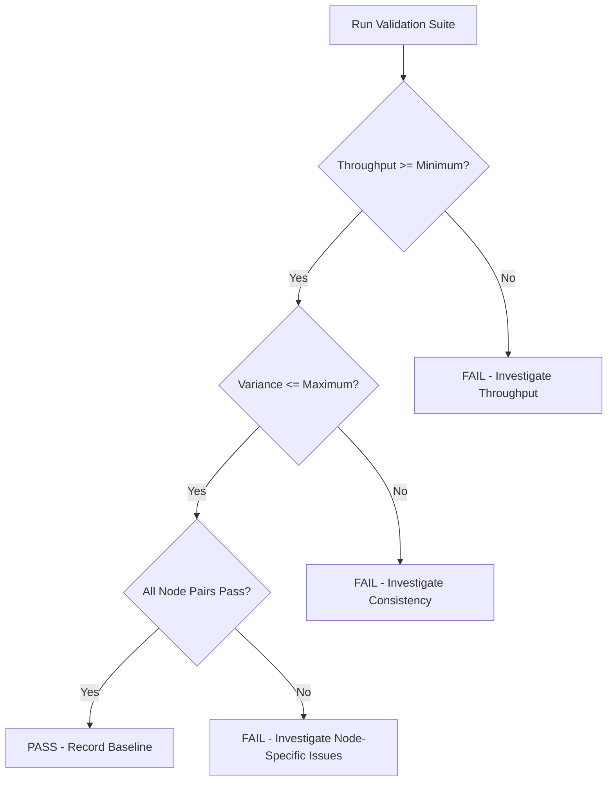

# Validating Single-Stream Performance in Cilium

Author: [nawazdhandala](https://github.com/nawazdhandala)

Tags: Cilium, Kubernetes, Networking, Performance, Validation, Benchmarking

Description: A comprehensive guide to validating single-stream TCP throughput in Cilium, including benchmark methodology, acceptance criteria, and automated validation pipelines.

---

## Introduction

Validation is the final step in any performance optimization workflow. After diagnosing, fixing, and implementing preventive measures for single-stream performance in Cilium, you need a rigorous validation process that confirms the improvements are real, repeatable, and sustainable. Without proper validation, you risk shipping configurations that only appear to work under specific conditions.

Single-stream validation is particularly nuanced because results can vary significantly based on test duration, time of day, background load, and even CPU thermal state. A proper validation framework must account for all these variables and produce statistically meaningful results.

This guide covers establishing acceptance criteria, building automated validation pipelines, and interpreting results with statistical rigor.

## Prerequisites

- Kubernetes cluster (v1.24+) with Cilium v1.14+
- `iperf3` and `netperf` container images
- Prometheus and Grafana for metrics collection
- Basic understanding of statistical concepts (mean, standard deviation, percentiles)
- CI/CD system for automated validation

## Defining Acceptance Criteria

Before running any tests, define what "good" looks like:

```yaml
# validation-criteria.yaml
apiVersion: v1
kind: ConfigMap
metadata:
  name: perf-criteria
  namespace: monitoring
data:
  single_stream_min_bps: "9000000000"  # 9 Gbps on 10G NIC
  single_stream_variance_max: "0.05"    # Max 5% variance
  latency_p99_max_us: "500"             # Max 500us p99 latency
  cpu_per_gbps_max: "0.15"             # Max 15% CPU per Gbps
```

## Building a Validation Test Suite

Create a comprehensive test Job:

```yaml
apiVersion: batch/v1
kind: Job
metadata:
  name: cilium-validate-single-stream
  namespace: monitoring
spec:
  template:
    spec:
      containers:
      - name: validator
        image: networkstatic/iperf3
        command:
        - /bin/sh
        - -c
        - |
          #!/bin/sh
          SERVER="iperf-server.monitoring"
          RESULTS_FILE="/tmp/results.json"
          echo "[]" > $RESULTS_FILE

          # Run 10 iterations for statistical significance
          for i in $(seq 1 10); do
            echo "=== Iteration $i ==="
            RESULT=$(iperf3 -c $SERVER -t 30 -P 1 -J)
            BPS=$(echo "$RESULT" | jq '.end.sum_sent.bits_per_second')
            RETRANSMITS=$(echo "$RESULT" | jq '.end.sum_sent.retransmits')
            echo "Throughput: $BPS bps, Retransmits: $RETRANSMITS"

            # Append to results
            jq --arg bps "$BPS" --arg rt "$RETRANSMITS" \
              '. += [{"bps": ($bps|tonumber), "retransmits": ($rt|tonumber)}]' \
              $RESULTS_FILE > /tmp/tmp.json && mv /tmp/tmp.json $RESULTS_FILE

            # Wait between runs to avoid thermal throttling
            sleep 10
          done

          # Calculate statistics
          echo "=== Results Summary ==="
          jq '{
            mean_bps: ([.[].bps] | add / length),
            min_bps: ([.[].bps] | min),
            max_bps: ([.[].bps] | max),
            total_retransmits: ([.[].retransmits] | add),
            stddev: (([.[].bps] | add / length) as $mean |
                     ([.[].bps | . - $mean | . * .] | add / length | sqrt))
          }' $RESULTS_FILE

      restartPolicy: Never
  backoffLimit: 1
```

## Automated CI/CD Validation

Integrate validation into your CI/CD pipeline:

```bash
#!/bin/bash
# validate-cilium-perf.sh
# Run as part of CI/CD after Cilium configuration changes

set -euo pipefail

MIN_BPS=9000000000
MAX_VARIANCE=0.05
NUM_RUNS=10

echo "Starting Cilium single-stream validation..."

# Deploy test infrastructure
kubectl apply -f iperf-server.yaml
kubectl wait --for=condition=ready pod -l app=iperf-server -n monitoring --timeout=60s

SERVER_IP=$(kubectl get svc iperf-server -n monitoring -o jsonpath='{.spec.clusterIP}')

declare -a RESULTS

for i in $(seq 1 $NUM_RUNS); do
  BPS=$(kubectl run "iperf-client-$i" --image=networkstatic/iperf3 \
    --rm -it --restart=Never -- \
    -c "$SERVER_IP" -t 30 -P 1 -J 2>/dev/null | jq '.end.sum_sent.bits_per_second')
  RESULTS+=("$BPS")
  echo "Run $i: $BPS bps"
  sleep 5
done

# Calculate mean and variance
MEAN=$(echo "${RESULTS[@]}" | tr ' ' '\n' | awk '{s+=$1} END {print s/NR}')
VARIANCE=$(echo "${RESULTS[@]}" | tr ' ' '\n' | awk -v mean="$MEAN" '{s+=($1-mean)^2} END {print sqrt(s/NR)/mean}')

echo "Mean throughput: $MEAN bps"
echo "Coefficient of variation: $VARIANCE"

# Validate against criteria
if (( $(echo "$MEAN < $MIN_BPS" | bc -l) )); then
  echo "FAIL: Mean throughput $MEAN below minimum $MIN_BPS"
  exit 1
fi

if (( $(echo "$VARIANCE > $MAX_VARIANCE" | bc -l) )); then
  echo "FAIL: Variance $VARIANCE exceeds maximum $MAX_VARIANCE"
  exit 1
fi

echo "PASS: Single-stream validation successful"
```

## Cross-Node Validation Matrix

Test across all node pairs to ensure consistent performance:

```bash
#!/bin/bash
# cross-node-validate.sh

NODES=$(kubectl get nodes -o jsonpath='{.items[*].metadata.name}')

echo "Node-to-Node Single-Stream Throughput Matrix"
echo "============================================="

for src in $NODES; do
  for dst in $NODES; do
    if [ "$src" != "$dst" ]; then
      # Run iperf3 between node pairs
      BPS=$(kubectl run "test-${src}-${dst}" \
        --image=networkstatic/iperf3 \
        --overrides="{\"spec\":{\"nodeSelector\":{\"kubernetes.io/hostname\":\"$src\"}}}" \
        --rm -it --restart=Never -- \
        -c "$DST_IP" -t 10 -P 1 -J 2>/dev/null | jq '.end.sum_sent.bits_per_second')

      echo "$src -> $dst: $(echo "scale=2; $BPS / 1000000000" | bc) Gbps"
    fi
  done
done
```

## Interpreting Results

Use Grafana dashboards to visualize validation trends:



## Verification

Confirm your validation framework itself is working correctly:

```bash
# Verify test infrastructure
kubectl get pods -n monitoring -l app=iperf-server
kubectl get cronjobs -n monitoring

# Run a known-bad test to verify failure detection
# Temporarily throttle bandwidth and confirm validation catches it
kubectl exec -n kube-system cilium-agent-xxx -- \
  cilium bpf bandwidth list

# Check validation job history
kubectl get jobs -n monitoring --sort-by=.metadata.creationTimestamp
```

## Troubleshooting

- **High variance in results**: Increase test duration to 60 seconds. Check for noisy neighbors with `kubectl top nodes`.
- **Validation passes but users report slowness**: Add application-level benchmarks (HTTP, gRPC) alongside raw TCP tests.
- **Inconsistent cross-node results**: Check for asymmetric routing, different NIC firmware versions, or nodes with different CPU models.
- **CI pipeline timeouts**: Run validation in a dedicated namespace with resource guarantees. Set appropriate Job timeouts.

## Conclusion

Validating single-stream performance in Cilium requires statistical rigor, automation, and comprehensive coverage across the cluster. By running multiple iterations, calculating variance, testing across all node pairs, and integrating validation into CI/CD, you gain confidence that performance optimizations are delivering real, consistent improvements. The validation framework itself becomes a permanent asset that continuously guards against regression.
