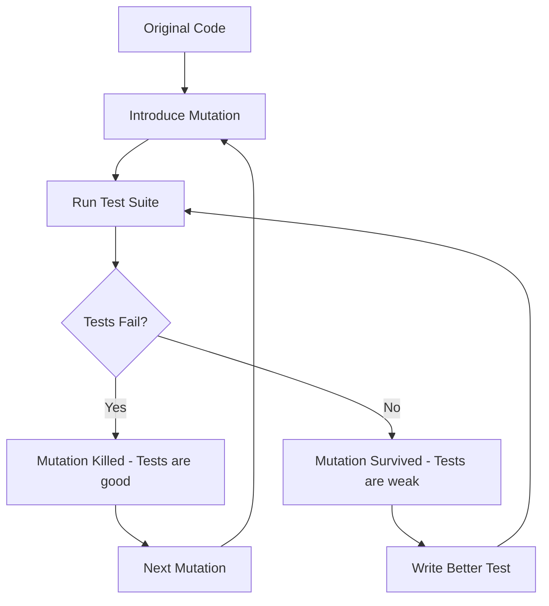

# Validating Unit Test Quality for Cilium L7 Parser Development

Author: [nawazdhandala](https://github.com/nawazdhandala)

Tags: Cilium, Network Security, Unit Testing, Validation, Test Quality, Go

Description: Learn how to validate that your unit test suite for Cilium L7 parsers is comprehensive, correct, and maintainable through mutation testing, coverage analysis, and test quality metrics.

---

## Introduction

Writing unit tests is necessary but not sufficient. The tests themselves must be validated to ensure they actually catch bugs, cover meaningful scenarios, and do not give false confidence through tests that always pass regardless of code correctness.

Test validation answers a fundamental question: if a bug were introduced into the parser, would these tests catch it? Techniques like mutation testing, coverage branch analysis, and test quality auditing provide objective answers to this question.

This guide demonstrates how to validate the quality of your unit test suite for Cilium L7 parsers, ensuring the tests provide genuine security and correctness guarantees.

## Prerequisites

- Go 1.21 or later
- Existing parser with a test suite
- `go-mutesting` or `gremlins` mutation testing tool
- `go tool cover` for coverage analysis
- Understanding of test quality metrics

## Measuring Test Coverage Depth

Line coverage alone is insufficient. Measure branch coverage and condition coverage:

```bash
# Generate atomic coverage profile (tracks branch-level coverage)
go test ./proxylib/myprotocol/... -coverprofile=coverage.out -covermode=atomic

# View function-level coverage
go tool cover -func=coverage.out

# Generate HTML report for visual inspection
go tool cover -html=coverage.out -o coverage.html
```

Analyze which branches are covered in critical functions:

```go
// Example: OnData has 6 return paths. Are all covered?
func (p *Parser) OnData(reply bool, reader *proxylib.Reader) (proxylib.OpType, int) {
    if p.state == stateError {       // Branch 1: error state
        return proxylib.DROP, 0
    }
    dataLen := reader.Length()
    if dataLen < 4 {                 // Branch 2: insufficient header
        return proxylib.MORE, 4
    }
    // ... parse header ...
    if msgLen <= 0 || msgLen > maxMessageSize {  // Branch 3: invalid length
        return proxylib.DROP, 0
    }
    if dataLen < totalLen {          // Branch 4: incomplete message
        return proxylib.MORE, totalLen
    }
    if !p.matchesPolicy(command) {   // Branch 5: policy denied
        return proxylib.DROP, 0
    }
    return proxylib.PASS, totalLen   // Branch 6: success
}

// Test validation checklist:
// [ ] Branch 1 tested: TestOnData_ErrorState
// [ ] Branch 2 tested: TestOnData_PartialHeader
// [ ] Branch 3a tested: TestOnData_NegativeLength
// [ ] Branch 3b tested: TestOnData_OversizedLength
// [ ] Branch 4 tested: TestOnData_IncompleteBody
// [ ] Branch 5 tested: TestOnData_PolicyDenied
// [ ] Branch 6 tested: TestOnData_ValidMessage
```

## Running Mutation Tests

Mutation testing introduces small changes (mutations) to your code and checks whether your tests detect them:

```bash
# Install go-mutesting
go install github.com/zimmski/go-mutesting/cmd/go-mutesting@latest

# Run mutation testing on the parser
go-mutesting ./proxylib/myprotocol/...
```

Example mutation and expected test failure:

```go
// Original code
if msgLen <= 0 || msgLen > maxMessageSize {
    return proxylib.DROP, 0
}

// Mutation 1: Change <= to <
if msgLen < 0 || msgLen > maxMessageSize {
    return proxylib.DROP, 0
}
// Your test for zero-length messages MUST catch this mutation

// Mutation 2: Change > to >=
if msgLen <= 0 || msgLen >= maxMessageSize {
    return proxylib.DROP, 0
}
// Your test for exactly-maxMessageSize messages MUST catch this mutation

// Mutation 3: Remove the entire check
// return proxylib.DROP, 0  // removed
// Your oversized message test MUST catch this mutation
```



## Validating Test Assertions

Check that tests have meaningful assertions, not just coverage:

```go
// BAD: Test executes code but does not assert behavior
func TestOnData_WeakTest(t *testing.T) {
    parser := &Parser{state: stateRunning}
    reader := proxylib.NewTestReader(makeValidMessage())
    parser.OnData(false, reader)  // No assertions! Always passes.
}

// GOOD: Test asserts specific expected behavior
func TestOnData_StrongTest(t *testing.T) {
    parser := &Parser{state: stateRunning}
    msg := makeValidMessage()
    reader := proxylib.NewTestReader(msg)

    op, n := parser.OnData(false, reader)

    if op != proxylib.PASS {
        t.Errorf("Valid message should PASS, got %v", op)
    }
    if n != len(msg) {
        t.Errorf("Should consume %d bytes, got %d", len(msg), n)
    }
    if parser.state != stateRunning {
        t.Errorf("State should remain running, got %v", parser.state)
    }
}
```

Write a script to detect assertion-free tests:

```bash
#!/bin/bash
# find-weak-tests.sh - Find test functions without assertions

FILE="proxylib/myprotocol/myprotocolparser_test.go"

# Extract test function bodies and check for assertions
awk '/^func Test/{name=$0; has_assert=0} /t\.Error|t\.Fatal|t\.Fail|assert\./{has_assert=1} /^}$/{if(!has_assert && name) print "WEAK: " name; name=""}' "$FILE"
```

## Boundary Value Analysis

Validate that tests cover boundary values for all numeric parameters:

```go
func TestOnData_BoundaryValues(t *testing.T) {
    tests := []struct {
        name    string
        msgLen  int
        wantOp  proxylib.OpType
    }{
        // Length boundaries
        {"length = -1", -1, proxylib.DROP},
        {"length = 0", 0, proxylib.DROP},
        {"length = 1", 1, proxylib.PASS},           // minimum valid
        {"length = maxMessageSize-1", maxMessageSize - 1, proxylib.PASS},
        {"length = maxMessageSize", maxMessageSize, proxylib.PASS},
        {"length = maxMessageSize+1", maxMessageSize + 1, proxylib.DROP},
    }

    for _, tt := range tests {
        t.Run(tt.name, func(t *testing.T) {
            header := make([]byte, 4)
            header[0] = byte(tt.msgLen >> 24)
            header[1] = byte(tt.msgLen >> 16)
            header[2] = byte(tt.msgLen >> 8)
            header[3] = byte(tt.msgLen)

            var data []byte
            if tt.msgLen > 0 && tt.msgLen <= maxMessageSize {
                data = append(header, make([]byte, tt.msgLen)...)
            } else {
                data = header
            }

            parser := &Parser{state: stateRunning}
            reader := proxylib.NewTestReader(data)
            op, _ := parser.OnData(false, reader)

            if op != tt.wantOp {
                t.Errorf("msgLen=%d: got %v, want %v", tt.msgLen, op, tt.wantOp)
            }
        })
    }
}
```

## Verification

Run the full validation suite:

```bash
# Standard test run
go test ./proxylib/myprotocol/... -v -race -count=1

# Coverage with branch detail
go test ./proxylib/myprotocol/... -coverprofile=cover.out -covermode=atomic
go tool cover -func=cover.out

# Mutation testing
go-mutesting ./proxylib/myprotocol/... 2>&1 | tail -20

# Count assertions per test
grep -c "t\.Error\|t\.Fatal\|assert\." proxylib/myprotocol/*_test.go
```

## Troubleshooting

**Problem: Mutation testing is slow**
Limit mutations to critical files: `go-mutesting ./proxylib/myprotocol/myprotocolparser.go`. Skip test files and generated code.

**Problem: Many surviving mutations in logging code**
Logging mutations (changing log messages) surviving is acceptable. Focus on mutations in logic, conditionals, and arithmetic.

**Problem: Cannot achieve 100% branch coverage**
Some branches may be defensive code for conditions that are hard to trigger in unit tests. Document these as requiring integration testing and move on.

**Problem: Tests are brittle and break on refactoring**
Test behavior through the public interface (OnData return values), not internal implementation details. This makes tests resilient to refactoring.

## Conclusion

Validating test quality ensures your unit tests provide real protection against regressions and security issues. By combining coverage analysis, mutation testing, assertion auditing, and boundary value analysis, you build confidence that the test suite will catch bugs when they are introduced. Make test validation a regular part of your development cycle, especially before parser code is merged or released.
