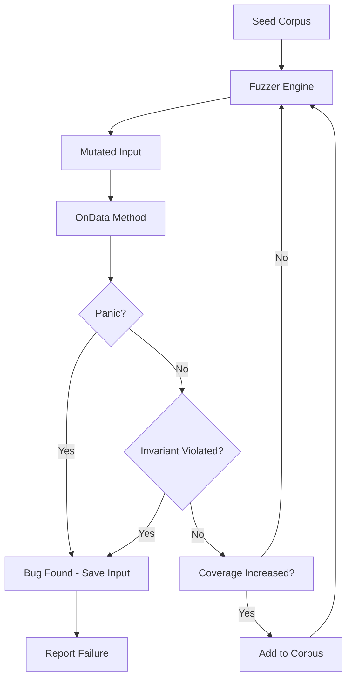

# Validating the OnData Method in Cilium Network Security

Author: [nawazdhandala](https://github.com/nawazdhandala)

Tags: Cilium, Network Security, Validation, OnData, Testing, L7 Proxy

Description: A comprehensive guide to validating Cilium L7 parser OnData implementations through unit tests, fuzz testing, integration tests, and property-based verification to ensure correctness and safety.

---

## Introduction

Validation of the OnData method goes beyond simple unit testing. It requires proving that the parser correctly handles every class of input — valid messages, malformed packets, truncated data, oversized payloads, and adversarial inputs designed to exploit parsing weaknesses.

A well-validated OnData method gives confidence that the parser will behave correctly in production, where it processes untrusted traffic at scale. Without thorough validation, subtle bugs can cause data corruption, connection stalls, or security bypasses that only manifest under specific traffic patterns.

This guide covers a multi-layered validation strategy for Cilium L7 parser OnData methods, including table-driven unit tests, fuzz testing, property-based testing, and integration validation against real traffic.

## Prerequisites

- Go 1.21 or later (with native fuzz support)
- Cilium source code with your parser implemented
- Familiarity with Go testing patterns
- `testify` assertion library (optional but recommended)
- A test Kubernetes cluster with Cilium for integration tests

## Table-Driven Unit Tests for OnData

Table-driven tests systematically cover all return value combinations:

```go
package myprotocol

import (
    "testing"

    "github.com/cilium/cilium/proxylib/proxylib"
)

func TestOnDataReturnValues(t *testing.T) {
    tests := []struct {
        name       string
        input      []byte
        reply      bool
        wantOp     proxylib.OpType
        wantN      int
        desc       string
    }{
        {
            name:   "empty input requests more data",
            input:  []byte{},
            reply:  false,
            wantOp: proxylib.MORE,
            wantN:  4, // minimum header size
            desc:   "Parser should request header bytes when no data available",
        },
        {
            name:   "partial header requests more data",
            input:  []byte{0x00, 0x00},
            reply:  false,
            wantOp: proxylib.MORE,
            wantN:  4,
            desc:   "Parser should request full header when only partial available",
        },
        {
            name:   "complete small message passes",
            input:  append([]byte{0x00, 0x00, 0x00, 0x05}, make([]byte, 5)...),
            reply:  false,
            wantOp: proxylib.PASS,
            wantN:  9, // 4 header + 5 body
            desc:   "Valid complete message should be passed",
        },
        {
            name:   "zero length message is dropped",
            input:  []byte{0x00, 0x00, 0x00, 0x00},
            reply:  false,
            wantOp: proxylib.DROP,
            wantN:  0,
            desc:   "Zero-length body indicates malformed message",
        },
        {
            name:   "oversized message is dropped",
            input:  []byte{0x7F, 0xFF, 0xFF, 0xFF},
            reply:  false,
            wantOp: proxylib.DROP,
            wantN:  0,
            desc:   "Message exceeding maxMessageSize must be dropped",
        },
        {
            name:   "negative length is dropped",
            input:  []byte{0xFF, 0xFF, 0xFF, 0xFF},
            reply:  false,
            wantOp: proxylib.DROP,
            wantN:  0,
            desc:   "Negative length (high bit set) must be dropped",
        },
        {
            name:   "incomplete body requests more data",
            input:  append([]byte{0x00, 0x00, 0x00, 0x0A}, make([]byte, 5)...),
            reply:  false,
            wantOp: proxylib.MORE,
            wantN:  14, // 4 header + 10 body
            desc:   "Incomplete body should request total message length",
        },
    }

    for _, tt := range tests {
        t.Run(tt.name, func(t *testing.T) {
            parser := &Parser{state: stateRunning}
            reader := proxylib.NewTestReader(tt.input)

            gotOp, gotN := parser.OnData(tt.reply, reader)

            if gotOp != tt.wantOp {
                t.Errorf("OnData() op = %v, want %v: %s", gotOp, tt.wantOp, tt.desc)
            }
            if gotN != tt.wantN {
                t.Errorf("OnData() n = %v, want %v: %s", gotN, tt.wantN, tt.desc)
            }
        })
    }
}
```

## Fuzz Testing the OnData Method

Go's built-in fuzzer is ideal for finding edge cases in parsers:

```go
func FuzzOnData(f *testing.F) {
    // Seed corpus with known-good inputs
    f.Add([]byte{0x00, 0x00, 0x00, 0x05, 0x01, 0x02, 0x03, 0x04, 0x05}, false)
    f.Add([]byte{0x00, 0x00, 0x00, 0x00}, true)
    f.Add([]byte{}, false)
    f.Add([]byte{0xFF}, true)

    f.Fuzz(func(t *testing.T, data []byte, reply bool) {
        parser := &Parser{state: stateRunning}
        reader := proxylib.NewTestReader(data)

        // OnData must never panic
        op, n := parser.OnData(reply, reader)

        // Validate return value invariants
        switch op {
        case proxylib.PASS:
            if n <= 0 {
                t.Error("PASS must consume positive bytes")
            }
            if n > len(data) {
                t.Error("PASS must not consume more bytes than available")
            }
        case proxylib.MORE:
            if n <= 0 {
                t.Error("MORE must request positive bytes")
            }
            if n <= len(data) {
                t.Error("MORE must request more bytes than currently available")
            }
        case proxylib.DROP:
            if n != 0 {
                t.Error("DROP should consume 0 bytes")
            }
        default:
            t.Errorf("Unknown OpType: %v", op)
        }
    })
}
```

Run the fuzzer:

```bash
# Run fuzzing for 60 seconds
go test ./proxylib/myprotocol/... -fuzz=FuzzOnData -fuzztime=60s

# Run with longer duration for thorough coverage
go test ./proxylib/myprotocol/... -fuzz=FuzzOnData -fuzztime=5m

# Check the corpus for interesting inputs found
ls testdata/fuzz/FuzzOnData/
```



## Property-Based Validation

Define properties that must always hold for OnData, regardless of input:

```go
func TestOnDataProperties(t *testing.T) {
    // Property 1: OnData never panics on any input
    t.Run("no panics", func(t *testing.T) {
        for size := 0; size < 1000; size++ {
            data := make([]byte, size)
            for i := range data {
                data[i] = byte(i % 256)
            }
            parser := &Parser{state: stateRunning}
            reader := proxylib.NewTestReader(data)

            // This should not panic
            parser.OnData(false, reader)
            parser.OnData(true, reader)
        }
    })

    // Property 2: PASS never exceeds available data
    t.Run("pass within bounds", func(t *testing.T) {
        for size := 1; size < 500; size++ {
            data := make([]byte, size)
            data[0] = 0x00
            data[1] = 0x00
            data[2] = 0x00
            if size > 4 {
                data[3] = byte(size - 4) // Exact fit
            }

            parser := &Parser{state: stateRunning}
            reader := proxylib.NewTestReader(data)
            op, n := parser.OnData(false, reader)

            if op == proxylib.PASS && n > size {
                t.Errorf("PASS consumed %d bytes but only %d available", n, size)
            }
        }
    })

    // Property 3: Error state is terminal
    t.Run("error state terminal", func(t *testing.T) {
        data := []byte{0x00, 0x00, 0x00, 0x05, 0x01, 0x02, 0x03, 0x04, 0x05}
        parser := &Parser{state: stateError}
        reader := proxylib.NewTestReader(data)

        op, _ := parser.OnData(false, reader)
        if op != proxylib.DROP {
            t.Errorf("Error state should always DROP, got %v", op)
        }
    })
}
```

## Integration Validation with Live Traffic

Validate the parser against real protocol traffic in a cluster:

```yaml
# test-deployment.yaml
apiVersion: apps/v1
kind: Deployment
metadata:
  name: protocol-server
spec:
  replicas: 1
  selector:
    matchLabels:
      app: protocol-server
  template:
    metadata:
      labels:
        app: protocol-server
    spec:
      containers:
        - name: server
          image: protocol-server:test
          ports:
            - containerPort: 9000
---
apiVersion: cilium.io/v2
kind: CiliumNetworkPolicy
metadata:
  name: test-l7-policy
spec:
  endpointSelector:
    matchLabels:
      app: protocol-server
  ingress:
    - fromEndpoints:
        - matchLabels:
            app: test-client
      toPorts:
        - ports:
            - port: "9000"
              protocol: TCP
          rules:
            l7proto: myprotocol
            l7:
              - command: "GET"
```

```bash
# Apply test resources
kubectl apply -f test-deployment.yaml

# Send test traffic
kubectl exec test-client -- protocol-client send --command GET --target protocol-server:9000

# Verify parser logs
kubectl logs -n kube-system ds/cilium -c cilium-agent | grep "myprotocol"

# Check proxy statistics
kubectl exec -n kube-system ds/cilium -- cilium bpf proxy list
```

## Verification

Run the complete validation suite:

```bash
# Unit tests
go test ./proxylib/myprotocol/... -v -count=1

# Race detection
go test ./proxylib/myprotocol/... -race -count=1

# Fuzzing
go test ./proxylib/myprotocol/... -fuzz=FuzzOnData -fuzztime=60s

# Coverage (aim for >90% on OnData)
go test ./proxylib/myprotocol/... -coverprofile=cover.out
go tool cover -func=cover.out | grep OnData

# Benchmarks
go test ./proxylib/myprotocol/... -bench=BenchmarkOnData -benchmem
```

## Troubleshooting

**Problem: Fuzzer finds panics immediately**
Start by fixing the most basic bounds checks — usually missing length validation before slice access. Re-run the fuzzer after each fix.

**Problem: Test reader does not match production behavior**
The test reader may not perfectly simulate proxylib's Reader. Validate critical behavior differences by testing in a real cluster alongside unit tests.

**Problem: Coverage cannot reach certain code paths**
Some paths may only be reachable through specific state transitions. Create tests that set parser state explicitly before calling OnData, rather than relying on natural state progression.

**Problem: Fuzz corpus grows very large**
Periodically clean the corpus by removing inputs that do not improve coverage. Use `go test -fuzz=FuzzOnData -fuzztime=1s` to verify corpus entries still provide value.

## Conclusion

Validating the OnData method requires multiple complementary approaches: table-driven tests for known scenarios, fuzz testing for unknown edge cases, property-based testing for invariant verification, and integration tests for real-world behavior. Together, these techniques provide strong confidence that the parser handles all inputs safely and correctly. Make validation an ongoing practice — run fuzz tests regularly and expand the test suite whenever a new bug is discovered.
