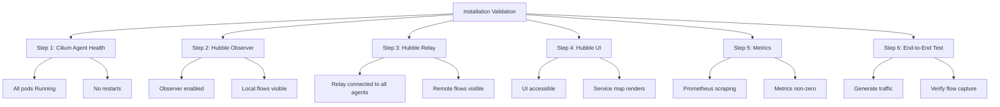

# How to Use Validating the Installation in Cilium Hubble

Author: [nawazdhandala](https://github.com/nawazdhandala)

Tags: Cilium, Hubble, Installation, Validation, Kubernetes

Description: A comprehensive guide to validating your Cilium Hubble installation, including connectivity tests, component health checks, flow verification, and end-to-end observability confirmation.

---

## Introduction

After installing Cilium with Hubble, it is essential to validate that all components are working correctly before relying on them for production observability. A partially working Hubble installation can be worse than no installation at all -- it may give you a false sense of visibility while silently missing critical flows.

Validation goes beyond simply checking that pods are running. You need to verify that the Hubble observer is capturing flows, the relay is aggregating data from all nodes, metrics are being exposed correctly, and the UI can render service maps.

This guide provides a complete validation checklist with commands you can run after any Hubble installation or upgrade.

## Prerequisites

- Kubernetes cluster with Cilium and Hubble freshly installed
- kubectl and cilium CLI installed
- Helm 3 (for checking configuration)
- Access to create test pods for traffic generation

## Step 1: Validate Cilium Agent Health

Before checking Hubble, ensure the underlying Cilium deployment is healthy:

```bash
# Check Cilium overall status
cilium status --brief

# Verify all Cilium agent pods are running
kubectl -n kube-system get pods -l k8s-app=cilium -o wide

# Run the built-in connectivity test
cilium connectivity test --single-node

# Check for any agent pods in error state
kubectl -n kube-system get pods -l k8s-app=cilium -o json | python3 -c "
import json, sys
pods = json.load(sys.stdin)
for pod in pods['items']:
    name = pod['metadata']['name']
    phase = pod['status']['phase']
    restarts = sum(c.get('restartCount',0) for c in pod['status'].get('containerStatuses',[]))
    if phase != 'Running' or restarts > 0:
        print(f'WARNING: {name} phase={phase} restarts={restarts}')
    else:
        print(f'OK: {name}')
"
```

## Step 2: Validate Hubble Observer

Check that the Hubble observer is running on each agent:

```bash
# Check Hubble status on each node
for pod in $(kubectl get pods -n kube-system -l k8s-app=cilium -o name); do
  node=$(kubectl -n kube-system get $pod -o jsonpath='{.spec.nodeName}')
  status=$(kubectl -n kube-system exec $pod -- cilium status 2>/dev/null | grep "Hubble" | head -1)
  echo "$node: $status"
done

# Verify local flow observation works
kubectl -n kube-system exec ds/cilium -- hubble observe --last 5
```



## Step 3: Validate Hubble Relay

The relay must connect to all agents to provide a cluster-wide view:

```bash
# Check relay pod status
kubectl -n kube-system get pods -l k8s-app=hubble-relay

# Check relay logs for connection status
kubectl -n kube-system logs deploy/hubble-relay --tail=20

# Port-forward and test the relay
cilium hubble port-forward &
hubble status

# Verify relay receives flows from multiple nodes
hubble observe --last 50 -o json 2>/dev/null | python3 -c "
import json, sys
nodes = set()
for line in sys.stdin:
    f = json.loads(line)
    node = f.get('flow',{}).get('node_name','')
    if node:
        nodes.add(node)
print(f'Flows received from {len(nodes)} nodes: {nodes}')
"
```

## Step 4: Validate Hubble UI

If the UI is enabled, verify it is accessible and functional:

```bash
# Check UI pod status
kubectl -n kube-system get pods -l k8s-app=hubble-ui

# Port-forward and test
kubectl -n kube-system port-forward svc/hubble-ui 12000:80 &
curl -s -o /dev/null -w 'HTTP Status: %{http_code}\n' http://localhost:12000

# Check the UI backend can connect to relay
kubectl -n kube-system logs deploy/hubble-ui -c backend --tail=10
```

## Step 5: Validate Metrics

Verify that Hubble metrics are being exposed and scraped:

```bash
# Check metrics endpoint on agent
kubectl -n kube-system exec ds/cilium -- \
  wget -qO- http://localhost:9965/metrics 2>/dev/null | head -10

# Count available Hubble metrics
kubectl -n kube-system exec ds/cilium -- \
  wget -qO- http://localhost:9965/metrics 2>/dev/null | \
  grep "^hubble_" | cut -d'{' -f1 | sort -u

# If Prometheus is available, check targets
kubectl port-forward -n monitoring svc/prometheus-operated 9090:9090 &
curl -s 'http://localhost:9090/api/v1/targets' | python3 -c "
import json, sys
data = json.load(sys.stdin)
for t in data['data']['activeTargets']:
    if 'hubble' in t.get('labels',{}).get('job','').lower():
        print(f\"Job: {t['labels']['job']}, Health: {t['health']}\")
"
```

## Step 6: End-to-End Flow Validation

Generate traffic and verify complete flow capture:

```bash
# Create a test namespace and pods
kubectl create namespace hubble-test 2>/dev/null || true

kubectl -n hubble-test run server --image=nginx --port=80 --labels="app=server"
kubectl -n hubble-test expose pod server --port=80

kubectl -n hubble-test run client --image=curlimages/curl --rm -it --restart=Never -- \
  curl -s http://server.hubble-test/

# Verify the flow was captured
hubble observe --namespace hubble-test --last 20

# Check that flows have complete metadata
hubble observe --namespace hubble-test --last 5 -o json | python3 -c "
import json, sys
for line in sys.stdin:
    f = json.loads(line)
    flow = f.get('flow',{})
    src = flow.get('source',{})
    dst = flow.get('destination',{})
    checks = {
        'has_source_namespace': bool(src.get('namespace')),
        'has_source_pod': bool(src.get('pod_name')),
        'has_destination_namespace': bool(dst.get('namespace')),
        'has_destination_pod': bool(dst.get('pod_name')),
        'has_verdict': bool(flow.get('verdict')),
    }
    all_ok = all(checks.values())
    print(f'Flow metadata complete: {all_ok}')
    if not all_ok:
        for check, result in checks.items():
            if not result:
                print(f'  MISSING: {check}')
"

# Clean up
kubectl delete namespace hubble-test
```

## Verification

Run the complete validation summary:

```bash
echo "=== Cilium Hubble Installation Validation ==="
echo ""

# Agent
echo "1. Cilium Agent:"
cilium status --brief 2>/dev/null | head -3

# Observer
echo ""
echo "2. Hubble Observer:"
kubectl -n kube-system exec ds/cilium -- cilium status 2>/dev/null | grep Hubble

# Relay
echo ""
echo "3. Hubble Relay:"
kubectl -n kube-system get deploy hubble-relay -o jsonpath='Replicas: {.status.readyReplicas}/{.spec.replicas}'
echo ""

# UI
echo ""
echo "4. Hubble UI:"
kubectl -n kube-system get deploy hubble-ui -o jsonpath='Replicas: {.status.readyReplicas}/{.spec.replicas}' 2>/dev/null || echo "Not installed"
echo ""

# Flows
echo ""
echo "5. Flow capture:"
FLOW_COUNT=$(hubble observe --last 100 -o json 2>/dev/null | wc -l)
echo "Recent flows: $FLOW_COUNT"

# Metrics
echo ""
echo "6. Metrics:"
METRIC_COUNT=$(kubectl -n kube-system exec ds/cilium -- wget -qO- http://localhost:9965/metrics 2>/dev/null | grep "^hubble_" | wc -l)
echo "Hubble metric series: $METRIC_COUNT"
```

## Troubleshooting

- **Cilium status shows Hubble "Disabled"**: Re-check Helm values. Run `helm get values cilium -n kube-system | grep hubble`.

- **Relay not connecting**: Check TLS configuration if enabled, or verify the peer service exists: `kubectl -n kube-system get svc hubble-peer`.

- **No flows captured after generating traffic**: The Hubble observer may need a BPF program regeneration. Run `kubectl -n kube-system exec ds/cilium -- cilium endpoint regenerate --all`.

- **Metrics endpoint returns 404**: Hubble metrics server may be on a different port. Check with `kubectl -n kube-system exec ds/cilium -- ss -tlnp | grep 996`.

- **UI shows no data**: Navigate to a specific namespace in the UI, not the cluster overview. Generate fresh traffic in that namespace.

## Conclusion

Validating a Hubble installation requires checking each component in the stack: the observer on every agent, the relay for cluster-wide aggregation, the UI for visualization, and the metrics endpoint for Prometheus integration. The end-to-end flow test is the definitive validation -- if you can generate traffic and see it captured with complete Kubernetes metadata in Hubble, your installation is working correctly. Run this validation after every Cilium upgrade to catch regressions early.
