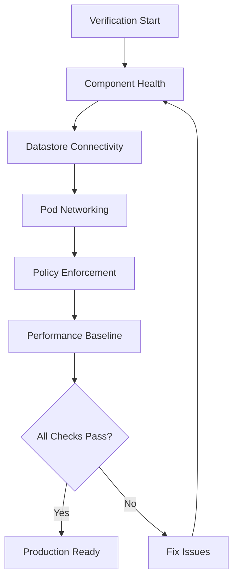

# How to Verify a Hard Way Calico Installation Before Production

Author: [nawazdhandala](https://github.com/nawazdhandala)

Tags: Calico, Kubernetes, Verification, Production, Installation

Description: A thorough verification checklist and procedure for validating a manually installed Calico cluster before promoting it to production, covering component health, connectivity, policy enforcement, and performance.

---

## Introduction

Installing Calico the hard way gives you full control over every component, but it also means there is no operator to automatically verify that everything is configured correctly. Before promoting a hard-way Calico installation to production, you need a systematic verification process that catches misconfigurations, connectivity issues, and policy gaps.

This guide provides a structured approach to verifying every layer of a hard-way Calico installation. We cover component health checks, datastore connectivity, pod networking, network policy enforcement, and performance baseline measurements. Each section includes specific commands and expected outputs.

Skipping verification on a manual installation is the fastest path to a production incident. The time invested in thorough verification is always less than the time spent troubleshooting a broken cluster under pressure.

## Prerequisites

- A Kubernetes cluster with Calico installed manually (the hard way)
- `kubectl` configured with cluster-admin access
- `calicoctl` installed and configured to connect to the datastore
- Network access to all cluster nodes via SSH
- A basic understanding of Calico architecture (Felix, BIRD, Typha, datastore)

## Verifying Core Component Health

Check that all Calico components are running and healthy on every node.

```bash
# Verify calico-node pods are running on all nodes
kubectl get pods -n kube-system -l k8s-app=calico-node -o wide
# Expected: One calico-node pod per node, all in Running state

# Check Felix health on each calico-node pod
for pod in $(kubectl get pods -n kube-system -l k8s-app=calico-node -o name); do
  echo "=== ${pod} ==="
  # Felix readiness check returns 0 if healthy
  kubectl exec -n kube-system "${pod}" -c calico-node -- calico-node -felix-ready
done

# Verify Typha deployment (if used for scale)
kubectl get deployment -n kube-system calico-typha
kubectl get pods -n kube-system -l k8s-app=calico-typha

# Check calico-kube-controllers
kubectl get pods -n kube-system -l k8s-app=calico-kube-controllers
```

Verify the datastore connection is healthy:

```bash
# Check datastore readiness using calicoctl
calicoctl node status

# Verify cluster information is accessible
calicoctl get clusterinformation -o yaml
```



## Verifying Pod Networking and Connectivity

Deploy test workloads to verify that pod networking works correctly across all nodes.

```yaml
# verification-pods.yaml
# Deploy test pods on different nodes to verify cross-node connectivity
apiVersion: projectcalico.org/v3
kind: IPPool
metadata:
  name: default-pool
spec:
  cidr: 192.168.0.0/16
  ipipMode: Always
  natOutgoing: true
  nodeSelector: all()
```

```bash
# Create test pods on different nodes
kubectl run test-pod-1 --image=busybox:1.36 --overrides='{"spec":{"nodeName":"node-01"}}' -- sleep 3600
kubectl run test-pod-2 --image=busybox:1.36 --overrides='{"spec":{"nodeName":"node-02"}}' -- sleep 3600

# Wait for pods to be ready
kubectl wait --for=condition=Ready pod/test-pod-1 pod/test-pod-2 --timeout=60s

# Test pod-to-pod connectivity across nodes
POD2_IP=$(kubectl get pod test-pod-2 -o jsonpath='{.status.podIP}')
kubectl exec test-pod-1 -- ping -c 3 "${POD2_IP}"

# Test service DNS resolution
kubectl exec test-pod-1 -- nslookup kubernetes.default.svc.cluster.local

# Test external connectivity
kubectl exec test-pod-1 -- wget -qO- --timeout=5 http://httpbin.org/get
```

## Verifying Network Policy Enforcement

Apply test policies and verify they are enforced correctly.

```yaml
# test-policy.yaml
# Verify that Calico correctly enforces network policies
apiVersion: projectcalico.org/v3
kind: NetworkPolicy
metadata:
  name: deny-all-ingress
  namespace: default
spec:
  selector: app == 'network-test'
  types:
    - Ingress
  ingress: []
```

```bash
# Apply the deny-all policy
calicoctl apply -f test-policy.yaml

# Verify the policy blocks traffic (this should timeout)
kubectl exec test-pod-1 -- wget -qO- --timeout=3 "http://${POD2_IP}" 2>&1 || echo "Correctly blocked by policy"

# Clean up test policy
calicoctl delete -f test-policy.yaml

# Verify traffic flows again after policy removal
kubectl exec test-pod-1 -- ping -c 3 "${POD2_IP}"
```

## Performance Baseline

Establish a performance baseline before production traffic arrives.

```bash
# Run iperf3 bandwidth test between pods on different nodes
kubectl run iperf-server --image=networkstatic/iperf3 --restart=Never -- -s
kubectl wait --for=condition=Ready pod/iperf-server --timeout=60s

IPERF_IP=$(kubectl get pod iperf-server -o jsonpath='{.status.podIP}')
kubectl run iperf-client --image=networkstatic/iperf3 --restart=Never -- -c ${IPERF_IP} -t 30
kubectl wait --for=condition=Ready pod/iperf-client --timeout=60s

# View results after test completes
sleep 35
kubectl logs iperf-client

# Clean up performance test pods
kubectl delete pod iperf-server iperf-client
```

## Verification

Run a final comprehensive check that covers all components:

```bash
#!/bin/bash
# final-verification.sh
# Final pre-production verification script

echo "=== Calico Component Summary ==="
echo "Calico Node Pods:"
kubectl get pods -n kube-system -l k8s-app=calico-node --no-headers | wc -l
echo "Expected: $(kubectl get nodes --no-headers | wc -l)"

echo ""
echo "=== IP Pool Configuration ==="
calicoctl get ippools -o wide

echo ""
echo "=== BGP Peering Status ==="
calicoctl node status

echo ""
echo "=== Cluster Info ==="
calicoctl get clusterinformation -o yaml
```

## Troubleshooting

- **calico-node not starting**: Check that the datastore (etcd or Kubernetes API) is reachable. Verify TLS certificates are valid and mounted correctly.
- **Pod-to-pod connectivity fails**: Verify IP-in-IP or VXLAN tunnel interfaces exist on each node with `ip link show tunl0` or `ip link show vxlan.calico`. Check that the IPPool CIDR does not overlap with node networks.
- **Policy not enforced**: Verify Felix is programming iptables rules with `iptables-save | grep cali` on the node. Check Felix logs for policy calculation errors.
- **BIRD not establishing BGP sessions**: Check BIRD configuration files in `/etc/calico/confd/config/` on calico-node. Verify node-to-node connectivity on TCP port 179.

## Conclusion

Verifying a hard-way Calico installation before production is a non-negotiable step. By systematically checking component health, datastore connectivity, pod networking, and policy enforcement, you can confidently promote your cluster. Save the verification scripts and run them after any Calico upgrade or cluster change to maintain confidence in your networking layer.
