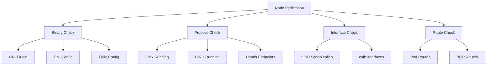

# How to Verify Node Installation in a Hard Way Calico Cluster Before Production

Author: [nawazdhandala](https://github.com/nawazdhandala)

Tags: Calico, Kubernetes, Node, Verification, Installation

Description: A detailed guide to verifying that Calico components are correctly installed and functioning on every node in a manually deployed cluster, covering Felix, BIRD, CNI plugin, and interface validation.

---

## Introduction

In a hard-way Calico installation, each node must have multiple components correctly configured: the Felix agent for policy enforcement, the BIRD daemon for route distribution, the CNI plugin binary and configuration, and the appropriate network interfaces. A single misconfigured node can cause intermittent connectivity issues that are difficult to diagnose.

This guide provides a node-by-node verification procedure that confirms every Calico component is properly installed and communicating with the rest of the cluster. We check binaries, configuration files, running processes, network interfaces, and route tables on each node.

Verifying at the node level is especially important for hard-way installations because there is no operator or DaemonSet controller automatically reconciling state. What you install is what you get.

## Prerequisites

- A Kubernetes cluster with Calico installed manually
- SSH access to all cluster nodes
- Root or sudo access on each node
- `calicoctl` installed on your workstation
- `kubectl` configured with cluster-admin access

## Verifying Calico Binaries and Configuration

SSH into each node and verify that all required binaries and configuration files are present.

```bash
#!/bin/bash
# verify-node-binaries.sh
# Run this script on each cluster node via SSH

echo "=== Calico Binary Verification ==="

# Check CNI plugin binaries
echo "CNI plugin binary:"
ls -la /opt/cni/bin/calico
ls -la /opt/cni/bin/calico-ipam

# Check CNI configuration
echo ""
echo "CNI configuration:"
ls -la /etc/cni/net.d/10-calico.conflist
cat /etc/cni/net.d/10-calico.conflist | python3 -m json.tool > /dev/null 2>&1 \
  && echo "CNI config: valid JSON" || echo "CNI config: INVALID JSON"

# Check calico-node binary (if running as a system service)
echo ""
echo "calico-node binary:"
which calico-node 2>/dev/null || echo "calico-node not in PATH (may be in container)"

# Verify Felix configuration file
echo ""
echo "Felix configuration:"
if [ -f /etc/calico/felix.cfg ]; then
  echo "Felix config file exists"
else
  echo "Felix config file not found (may use datastore config)"
fi
```

## Verifying Running Processes and Services

Check that all Calico processes are running correctly on each node.

```bash
#!/bin/bash
# verify-node-processes.sh
# Verify Calico processes on each node

echo "=== Calico Process Verification ==="

# Check if calico-node container/pod is running
echo "calico-node pod status:"
CALICO_POD=$(kubectl get pods -n kube-system -l k8s-app=calico-node \
  --field-selector spec.nodeName=$(hostname) -o name)

# Check Felix process inside calico-node
echo ""
echo "Felix process:"
kubectl exec -n kube-system ${CALICO_POD} -c calico-node -- pgrep -la felix

# Check BIRD process for BGP route distribution
echo ""
echo "BIRD process:"
kubectl exec -n kube-system ${CALICO_POD} -c calico-node -- pgrep -la bird

# Verify Felix readiness
echo ""
echo "Felix readiness:"
kubectl exec -n kube-system ${CALICO_POD} -c calico-node -- calico-node -felix-ready
echo "Exit code: $?"

# Verify BIRD readiness
echo ""
echo "BIRD readiness:"
kubectl exec -n kube-system ${CALICO_POD} -c calico-node -- calico-node -bird-ready
echo "Exit code: $?"
```



## Verifying Network Interfaces and Routes

Check that Calico has created the expected network interfaces and routes on each node.

```bash
#!/bin/bash
# verify-node-networking.sh
# Verify network interfaces and routes on each node

echo "=== Network Interface Verification ==="

# Check for Calico tunnel interface (IP-in-IP mode)
echo "Tunnel interface (tunl0):"
ip link show tunl0 2>/dev/null || echo "tunl0 not found (may use VXLAN or native routing)"

# Check for VXLAN interface (VXLAN mode)
echo ""
echo "VXLAN interface:"
ip link show vxlan.calico 2>/dev/null || echo "vxlan.calico not found (may use IPIP or native routing)"

# List all Calico virtual interfaces (one per local pod)
echo ""
echo "Calico pod interfaces (cali*):"
ip link show | grep cali | wc -l
echo "interfaces found"

# Verify routes to other nodes pod CIDRs
echo ""
echo "=== Route Table Verification ==="
echo "Routes via Calico tunnel:"
ip route show | grep -E "(tunl0|vxlan.calico)"

# Show routes to pod subnets on other nodes
echo ""
echo "Routes to remote pod subnets:"
ip route show | grep -E "via .* dev (tunl0|vxlan.calico|eth0)"
```

## Verifying Datastore Connectivity from Each Node

Ensure each node can communicate with the Calico datastore.

```bash
# Verify datastore connectivity from calico-node pod
CALICO_POD=$(kubectl get pods -n kube-system -l k8s-app=calico-node \
  --field-selector spec.nodeName=$(hostname) -o name | head -1)

# Check calico-node logs for datastore connection
echo "=== Datastore Connectivity ==="
kubectl logs -n kube-system ${CALICO_POD} -c calico-node --tail=20 | grep -i "datastore\|syncer\|ready"

# Verify node is registered in Calico datastore
echo ""
echo "Node registration in Calico:"
calicoctl get node $(hostname) -o yaml
```

## Verification

Run the complete node verification across all nodes:

```bash
#!/bin/bash
# verify-all-nodes.sh
# Run verification across all cluster nodes

echo "Full Cluster Node Verification"
echo "==============================="

for node in $(kubectl get nodes -o name | sed 's|node/||'); do
  echo ""
  echo "========== Node: ${node} =========="

  # Get calico-node pod for this node
  POD=$(kubectl get pods -n kube-system -l k8s-app=calico-node \
    --field-selector spec.nodeName="${node}" -o name 2>/dev/null)

  if [ -z "${POD}" ]; then
    echo "WARNING: No calico-node pod found on ${node}"
    continue
  fi

  # Felix ready check
  echo -n "Felix ready: "
  kubectl exec -n kube-system ${POD} -c calico-node -- calico-node -felix-ready 2>/dev/null \
    && echo "YES" || echo "NO"

  # BIRD ready check
  echo -n "BIRD ready: "
  kubectl exec -n kube-system ${POD} -c calico-node -- calico-node -bird-ready 2>/dev/null \
    && echo "YES" || echo "NO"

  # Pod count on this node
  echo -n "Pods on node: "
  kubectl get pods --all-namespaces --field-selector spec.nodeName="${node}" --no-headers | wc -l
done

echo ""
echo "=== Calico Node Summary ==="
calicoctl node status
```

## Troubleshooting

- **CNI plugin not found**: Verify that `/opt/cni/bin/calico` and `/opt/cni/bin/calico-ipam` exist and are executable. Re-copy them from the Calico release archive if missing.
- **Felix not ready**: Check Felix logs for certificate errors or datastore connection failures. Verify that the Felix configuration points to the correct datastore endpoint.
- **BIRD not ready**: Check BIRD logs inside the calico-node container. Common issue is BGP port 179 being blocked by host firewall. Verify with `ss -tlnp | grep 179`.
- **Missing tunnel interfaces**: Verify IPPool encapsulation mode matches the expected interface (IPIP uses tunl0, VXLAN uses vxlan.calico).
- **No routes to remote pods**: Check that BIRD is establishing BGP sessions with other nodes. Use `calicoctl node status` to see BGP peering state.

## Conclusion

Node-level verification is the foundation of a reliable hard-way Calico installation. By checking binaries, processes, interfaces, routes, and datastore connectivity on every node, you catch issues that cluster-level checks might miss. Automate these checks as part of your node provisioning pipeline and run them after any node maintenance or Calico upgrade.
