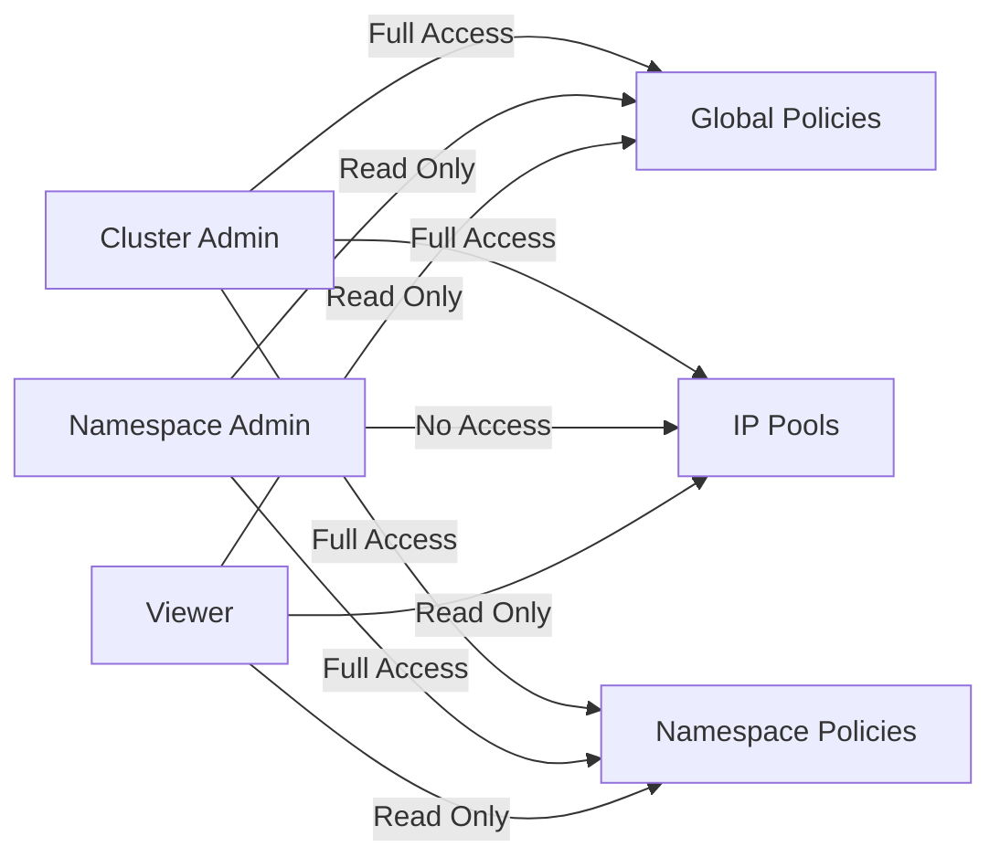

# How to Verify End-User RBAC in a Hard Way Calico Cluster Before Production

Author: [nawazdhandala](https://github.com/nawazdhandala)

Tags: Calico, RBAC, Kubernetes, Security, Production

Description: A guide to verifying that RBAC policies correctly control access to Calico network resources in a manually installed cluster, ensuring end users have appropriate permissions before production deployment.

---

## Introduction

In a hard-way Calico installation, RBAC configuration is your responsibility. Unlike operator-managed installations that create service accounts and roles automatically, manual installations require you to define and verify every permission boundary. Getting RBAC wrong means either blocking legitimate operations or exposing sensitive network configuration to unauthorized users.

This guide covers verifying RBAC for Calico-specific custom resources such as NetworkPolicy, GlobalNetworkPolicy, IPPool, and HostEndpoint. We test that cluster admins can manage all resources, namespace admins can manage policies within their scope, and regular users cannot access cluster-wide networking configuration.

Proper RBAC verification protects your cluster from accidental or malicious network policy changes that could disrupt connectivity or expose services to unauthorized traffic.

## Prerequisites

- A Kubernetes cluster with Calico installed via the hard way
- `kubectl` with cluster-admin access
- `calicoctl` configured for the cluster
- Test user accounts or service accounts for different roles
- Understanding of Kubernetes RBAC (Roles, ClusterRoles, RoleBindings, ClusterRoleBindings)

## Defining Calico RBAC Roles

Create RBAC roles that match your organization's access model. Start with three tiers: cluster network admin, namespace network admin, and read-only viewer.

```yaml
# calico-rbac-roles.yaml
# ClusterRole for full Calico network administration
apiVersion: rbac.authorization.k8s.io/v1
kind: ClusterRole
metadata:
  name: calico-network-admin
rules:
  # Full access to Calico custom resources
  - apiGroups: ["projectcalico.org"]
    resources:
      - globalnetworkpolicies
      - globalnetworksets
      - ippools
      - hostendpoints
      - felixconfigurations
      - bgppeers
      - bgpconfigurations
      - clusterinformations
    verbs: ["get", "list", "watch", "create", "update", "patch", "delete"]
  # Full access to namespace-scoped Calico resources
  - apiGroups: ["projectcalico.org"]
    resources:
      - networkpolicies
      - networksets
    verbs: ["get", "list", "watch", "create", "update", "patch", "delete"]
---
# Role for namespace-scoped network policy management
apiVersion: rbac.authorization.k8s.io/v1
kind: ClusterRole
metadata:
  name: calico-namespace-network-admin
rules:
  # Only namespace-scoped Calico resources
  - apiGroups: ["projectcalico.org"]
    resources:
      - networkpolicies
      - networksets
    verbs: ["get", "list", "watch", "create", "update", "patch", "delete"]
  # Read-only access to global resources for context
  - apiGroups: ["projectcalico.org"]
    resources:
      - globalnetworkpolicies
      - ippools
    verbs: ["get", "list", "watch"]
---
# Read-only viewer role
apiVersion: rbac.authorization.k8s.io/v1
kind: ClusterRole
metadata:
  name: calico-network-viewer
rules:
  - apiGroups: ["projectcalico.org"]
    resources: ["*"]
    verbs: ["get", "list", "watch"]
```

Apply the roles and create test bindings:

```bash
# Apply RBAC roles
kubectl apply -f calico-rbac-roles.yaml

# Create test service accounts for verification
kubectl create serviceaccount test-cluster-admin -n default
kubectl create serviceaccount test-ns-admin -n default
kubectl create serviceaccount test-viewer -n default

# Bind roles to test accounts
kubectl create clusterrolebinding test-cluster-admin-binding \
  --clusterrole=calico-network-admin \
  --serviceaccount=default:test-cluster-admin

kubectl create rolebinding test-ns-admin-binding \
  --clusterrole=calico-namespace-network-admin \
  --serviceaccount=default:test-ns-admin \
  --namespace=default

kubectl create clusterrolebinding test-viewer-binding \
  --clusterrole=calico-network-viewer \
  --serviceaccount=default:test-viewer
```

## Testing RBAC Permissions

Use `kubectl auth can-i` to systematically verify permissions for each role.

```bash
#!/bin/bash
# verify-calico-rbac.sh
# Verify RBAC permissions for each test role

echo "=== Cluster Admin Permissions ==="
# Should all return "yes"
kubectl auth can-i create globalnetworkpolicies.projectcalico.org \
  --as=system:serviceaccount:default:test-cluster-admin
kubectl auth can-i delete ippools.projectcalico.org \
  --as=system:serviceaccount:default:test-cluster-admin

echo ""
echo "=== Namespace Admin Permissions ==="
# Should return "yes" for namespace-scoped resources
kubectl auth can-i create networkpolicies.projectcalico.org \
  --as=system:serviceaccount:default:test-ns-admin -n default
# Should return "no" for global resources
kubectl auth can-i create globalnetworkpolicies.projectcalico.org \
  --as=system:serviceaccount:default:test-ns-admin

echo ""
echo "=== Viewer Permissions ==="
# Should return "yes" for read operations
kubectl auth can-i get globalnetworkpolicies.projectcalico.org \
  --as=system:serviceaccount:default:test-viewer
# Should return "no" for write operations
kubectl auth can-i create networkpolicies.projectcalico.org \
  --as=system:serviceaccount:default:test-viewer -n default
```



## Functional RBAC Testing

Beyond `auth can-i`, perform actual operations to confirm RBAC enforcement works end-to-end.

```yaml
# test-calico-policy.yaml
# Test policy for RBAC verification
apiVersion: projectcalico.org/v3
kind: NetworkPolicy
metadata:
  name: rbac-test-policy
  namespace: default
spec:
  selector: app == 'rbac-test'
  types:
    - Ingress
  ingress:
    - action: Allow
      source:
        selector: role == 'frontend'
```

```bash
# Test that namespace admin can create namespace-scoped policies
kubectl apply -f test-calico-policy.yaml \
  --as=system:serviceaccount:default:test-ns-admin
# Expected: policy created successfully

# Test that viewer cannot create policies
kubectl apply -f test-calico-policy.yaml \
  --as=system:serviceaccount:default:test-viewer 2>&1
# Expected: forbidden error

# Clean up test resources
kubectl delete networkpolicy.projectcalico.org rbac-test-policy -n default
```

## Verification

Run a complete RBAC verification matrix:

```bash
#!/bin/bash
# Generate a full RBAC verification report
echo "RBAC Verification Report - $(date)"
echo "================================="

for sa in test-cluster-admin test-ns-admin test-viewer; do
  echo ""
  echo "--- Service Account: ${sa} ---"
  for resource in globalnetworkpolicies networkpolicies ippools hostendpoints; do
    for verb in get create delete; do
      result=$(kubectl auth can-i ${verb} ${resource}.projectcalico.org \
        --as=system:serviceaccount:default:${sa} 2>&1)
      echo "${verb} ${resource}: ${result}"
    done
  done
done
```

## Troubleshooting

- **Unexpected "yes" for restricted users**: Check for overly broad ClusterRoleBindings. Run `kubectl get clusterrolebindings -o json` and filter by subject name to find all bindings for that account.
- **Cluster admin gets "no"**: Verify the ClusterRoleBinding exists and references the correct ClusterRole. Check for typos in API group names (`projectcalico.org` not `crd.projectcalico.org`).
- **RBAC works with kubectl but not calicoctl**: Ensure calicoctl is configured to use the same authentication context. When using Kubernetes API datastore, calicoctl respects Kubernetes RBAC.
- **Namespace admin can access other namespaces**: Verify you used RoleBinding (not ClusterRoleBinding) for namespace-scoped roles.

## Conclusion

Verifying RBAC in a hard-way Calico cluster is essential for maintaining security boundaries. By defining clear role tiers, testing with `kubectl auth can-i`, and performing functional verification, you ensure that your cluster's network configuration is protected from unauthorized changes. Run these verification scripts after any RBAC policy change or Calico upgrade.
