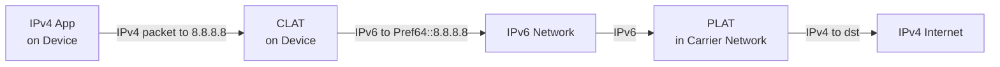

# How to Understand 464XLAT for IPv6-Only Mobile Networks

Author: [nawazdhandala](https://www.github.com/nawazdhandala)

Tags: IPv6, 464XLAT, Mobile Networks, CLAT, PLAT, IPv6 Transition

Description: A thorough explanation of 464XLAT, the translation architecture used by mobile carriers to deliver IPv6-only connectivity while maintaining compatibility with IPv4-only applications.

## What Is 464XLAT?

464XLAT (defined in RFC 6877) is an IPv6 transition architecture that combines two translation components to allow IPv4-only applications to run on IPv6-only mobile networks:

- **CLAT** (Customer-side Translator): runs on the device (phone, router)
- **PLAT** (Provider-side Translator): runs in the carrier's network (equivalent to NAT64)

The "464" name describes the translation path: **IPv4 → IPv6 → IPv4** - the application sends IPv4, the CLAT translates it to IPv6 for transport, and the PLAT translates it back to IPv4 to reach IPv4-only servers.

## Why 464XLAT Was Needed

Early mobile IPv6 deployments used NAT64+DNS64, which works for applications that use hostnames and DNS. However, many applications:

- Hard-code IPv4 literal addresses (for example, connecting directly to `8.8.8.8:53`)
- Use IPv4-only socket APIs
- Do not call DNS before connecting

These applications cannot benefit from DNS64 synthesis because they never make a DNS query. 464XLAT solves this by providing a local IPv4 address on the device itself, making the application think it has normal IPv4 connectivity.

## 464XLAT Architecture



The device has:
- An IPv6 address for native IPv6 connectivity (assigned by carrier)
- A special-purpose IPv4 address from `192.0.0.0/29` (defined in RFC 7335) for the CLAT interface

## Step-by-Step Packet Flow

1. IPv4 app sends packet to `8.8.8.8` using a local IPv4 source address from `192.0.0.0/29`
2. CLAT intercepts the packet on the local device
3. CLAT translates IPv4 to IPv6: source becomes a CLAT-generated IPv6 address, and destination becomes `Pref64::808:808` (for example, `64:ff9b::808:808` when the NAT64 prefix is `64:ff9b::/96`)
4. IPv6 packet travels over the carrier's IPv6-only network
5. PLAT (NAT64 gateway at the carrier) receives the IPv6 packet
6. PLAT translates IPv6 back to IPv4: extracts `8.8.8.8` from the embedded IPv4 bits in the NAT64 destination address
7. IPv4 packet reaches `8.8.8.8`
8. Response follows the reverse path

## DNS Discovery of PLAT Prefix (RFC 7050)

A common way to discover the PLAT's NAT64 prefix is RFC 7050. Some networks also advertise PREF64 in Router Advertisements (RFC 8781), but the DNS-based method works like this:

```bash
# The device queries for AAAA records for ipv4only.arpa

# The DNS64 recursive resolver returns synthesized addresses that reveal the prefix
dig AAAA ipv4only.arpa

# ipv4only.arpa has well-known A records 192.0.0.170 and 192.0.0.171
# Example if the network uses the well-known prefix: 64:ff9b::c000:00aa and 64:ff9b::c000:00ab
# Strip the known IPv4 bits to learn the NAT64 prefix (64:ff9b::/96 in this example)
```

This allows devices to automatically configure themselves with the correct PLAT prefix when DNS-based discovery is used.

## 464XLAT vs NAT64+DNS64

| Aspect | NAT64+DNS64 | 464XLAT |
|---|---|---|
| IPv4 literal support | No | Yes (via CLAT) |
| Requires DNS64 | Yes | Optional |
| Translation layers | 1 (IPv6→IPv4) | 2 (IPv4→IPv6→IPv4) |
| Complexity | Lower | Higher |
| Mobile deployment | Can work, but app compatibility is limited | Predominant for full IPv4 service continuity |
| Client OS support | Broad when apps use IPv6-capable APIs | Requires built-in CLAT support (for example, Android) |

## Real-World Deployment: Carrier Networks

464XLAT is widely deployed in mobile carrier networks; RFC 8683 describes NAT64/464XLAT as the predominant mechanism in the majority of cellular networks. The architecture allows them to:

- Allocate IPv6-only addresses to devices (no IPv4 address on the radio interface)
- Save IPv4 address space in the carrier network
- Provide client-server compatibility with IPv4-only services, including IPv4-literal applications
- Support large-scale IPv6 deployment on mobile

## Testing 464XLAT Behavior

On an Android device connected to a 464XLAT network, or on a Linux host running a CLAT implementation:

```bash
# Inspect interfaces; Android commonly creates a stacked CLAT interface named v4-<base>
ip link show

# Inspect IPv4 addresses and look for a 192.0.0.0/29 address on the CLAT/stacked interface
ip -4 addr show

# Test IPv4 connectivity through CLAT
ping -4 8.8.8.8

# Verify IPv6 native connectivity
ping -6 2001:4860:4860::8888

# Inspect DNS-based NAT64 prefix discovery
dig AAAA ipv4only.arpa
```

## Summary

464XLAT is the dominant IPv6 transition technology in mobile networks. It adds a CLAT component on devices that locally translates IPv4 to IPv6, enabling even IPv4-literal applications to work on IPv6-only networks. The PLAT (NAT64) in the carrier network translates back to IPv4 for internet connectivity. This two-stage translation is usually transparent to client applications.
