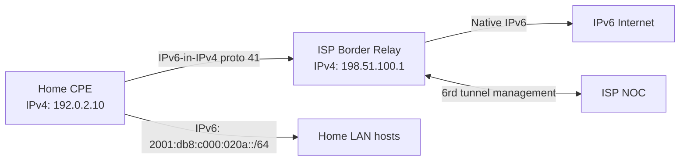

# How to Understand 6rd (IPv6 Rapid Deployment) for ISPs

Author: [nawazdhandala](https://www.github.com/nawazdhandala)

Tags: IPv6, 6rd, ISP, Tunneling, RFC 5969

Description: Learn how 6rd (IPv6 Rapid Deployment) works as an ISP-controlled IPv6-over-IPv4 tunneling mechanism, how addresses are derived, and when it was deployed.

## Overview

6rd (IPv6 Rapid Deployment) was first deployed by Free (a French ISP) in late 2007, documented in RFC 5569, and standardized in RFC 5969. It is an ISP-managed variant of 6to4 that eliminates the relay quality problem by using ISP-controlled border relays (BRs). The ISP assigns a 6rd prefix, and customer IPv6 prefixes embed some or all of the customer's IPv4 address within that prefix.

## How 6rd Differs from 6to4

| Feature | 6to4 | 6rd |
|---|---|---|
| Prefix | Fixed: 2002::/16 | ISP-assigned (any prefix) |
| Relay | Public anycast 192.88.99.1 | ISP-controlled Border Relay (BR) |
| Address assignment | Auto from public IPv4 | ISP prefix + IPv4 embedded |
| IPv4 support | Public IPs only | ISP controls (can include private IPv4) |
| Relay quality | Uncontrolled | ISP SLA |
| Status | Deprecated (RFC 7526) | Transitional - mostly replaced by dual-stack |

## Address Derivation

The ISP defines:
- A 6rd prefix (e.g., `2001:db8::/32`)
- `IPv4MaskLen`, the number of common high-order IPv4 bits stripped before embedding

The delegated prefix length is `6rdPrefixLen + (32 - IPv4MaskLen)`.

Example:
```text
6rd Prefix:    2001:db8::/32
IPv4MaskLen:   0 (embed all 32 bits of the CE IPv4 address)
Customer IPv4: 192.0.2.10 = c0:00:02:0a

CE delegated prefix:
  2001:db8:c000:020a::/64

6rd BR (relay) IPv4: 198.51.100.1
```

If the ISP sets `IPv4MaskLen` to 8 (for example, all CEs are in `10.0.0.0/8`), 24 IPv4 bits are embedded, so the delegated prefix becomes /56:
```text
6rd Prefix:    2001:db8::/32
IPv4MaskLen:   8 (the common high-order octet 10 is stripped)
Customer IPv4: 10.100.100.1

CE prefix:     2001:db8:6464:0100::/56
```

## 6rd Provisioning via DHCPv4

The ISP provisions 6rd parameters to CPE devices via DHCPv4 option 212 (RFC 5969):

```text
DHCP option 212 carries:
  - IPv4MaskLen: count of common high-order IPv4 bits (e.g., 0)
  - 6rdPrefixLen: e.g., 32
  - 6rdPrefix: e.g., 2001:db8::
  - 6rdBRIPv4Address(es): e.g., 198.51.100.1
```

CPE receives these and automatically configures the 6rd tunnel.

## 6rd Architecture



## CPE Configuration Example

A home router (CPE) implementing 6rd for a `/32` 6rd prefix with `IPv4MaskLen=0`:

```bash
# Linux CPE - manual 6rd configuration

# (normally auto-provisioned via DHCPv4 option 212)

IP4=192.0.2.10        # WAN IPv4 from ISP DHCP
BR=198.51.100.1       # ISP Border Relay IPv4
PREFIX=2001:db8       # 6rd /32 prefix written without the trailing ::
PLEN=32               # 6rd prefix length (bits)
IP4MASKLEN=0          # 0 means embed all 32 bits of the CE IPv4 address

IFS=. read -r o1 o2 o3 o4 <<< "$IP4"
HEX=$(printf '%02x%02x%02x%02x' "$o1" "$o2" "$o3" "$o4")

IFS=. read -r b1 b2 b3 b4 <<< "$BR"
BR_HEX=$(printf '%02x%02x%02x%02x' "$b1" "$b2" "$b3" "$b4")

# 6rd delegated prefix for this CPE
CE_PREFIX="${PREFIX}:${HEX:0:4}:${HEX:4:4}::/64"
BR6="${PREFIX}:${BR_HEX:0:4}:${BR_HEX:4:4}::"
echo "6rd CE prefix: $CE_PREFIX"

# Create tunnel
ip tunnel add 6rd mode sit remote any local "$IP4" ttl 64
ip tunnel 6rd dev 6rd 6rd-prefix ${PREFIX}::/$PLEN 6rd-relay_prefix 0.0.0.0/$IP4MASKLEN
ip link set 6rd up
ip addr add "${PREFIX}:${HEX:0:4}:${HEX:4:4}::1/128" dev 6rd
ip -6 route add "${PREFIX}::/$PLEN" dev 6rd
ip -6 route add ::/0 via "$BR6" dev 6rd
```

## Router Advertisement to Home Network

The CPE advertises the delegated /64 to home LAN devices:

```bash
# /etc/radvd.conf on CPE
interface eth0 {
    AdvSendAdvert on;
    MinRtrAdvInterval 30;
    MaxRtrAdvInterval 100;
    prefix 2001:db8:c000:020a::/64 {
        AdvOnLink on;
        AdvAutonomous on;   # Enable SLAAC
        AdvRouterAddr off;
    };
};
```

## Real-World 6rd Deployments

6rd was deployed or trialed by several operators during the early IPv6 transition:
- **Free (Iliad, France)** - early commercial deployment documented in RFC 5569, rolled out in late 2007
- **Comcast** - deployed 6rd in technology trials, but public rollout centered on native dual-stack
- **Other operators** - evaluated or deployed 6rd as a transitional mechanism before later moving to native IPv6

Most ISPs that deployed 6rd have since migrated to native dual-stack. 6rd is considered a transitional mechanism, not a permanent solution.

## Security Considerations

```bash
# 6rd traffic is protocol 41 - same as 6in4
# Filter non-authorized 6rd tunnels

# Block protocol 41 from sources other than ISP BR
iptables -A INPUT -p 41 -s 198.51.100.1 -j ACCEPT
iptables -A INPUT -p 41 -j DROP

# Block the 6rd domain prefix at an enterprise border if it is not used
ip6tables -I FORWARD -s 2001:db8::/32 -j DROP
```

## Summary

6rd (RFC 5969) solved 6to4's relay quality problem by using ISP-controlled Border Relays with operator-guaranteed uplinks. The ISP assigns a custom prefix (not the broken `2002::/16`) and embeds some or all of the customer's IPv4 address. CPE is provisioned via DHCPv4 option 212. Like 6to4, 6rd is a transitional mechanism - most ISPs have moved to native dual-stack. 6rd traffic uses IP protocol 41 (same as 6in4), so the same firewall blocking rules apply.
