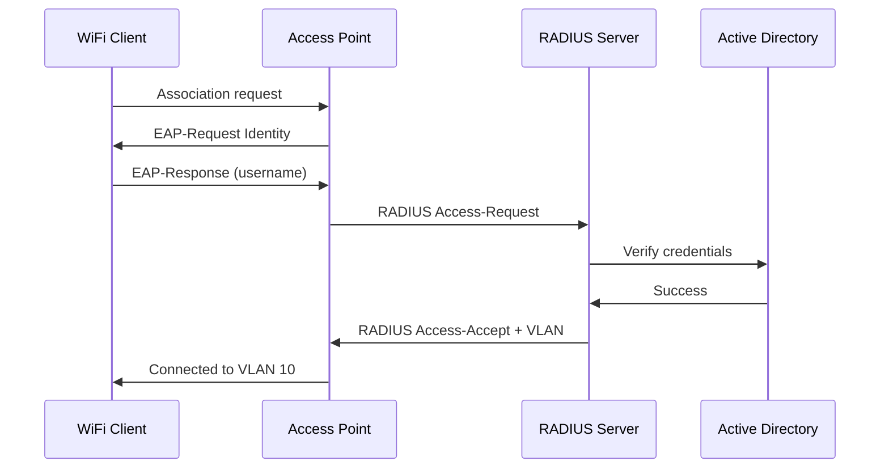

# How to Configure 802.1X Enterprise WiFi Authentication with RADIUS

Author: [nawazdhandala](https://www.github.com/nawazdhandala)

Tags: 802.1X, RADIUS, WiFi, Enterprise, Authentication, WPA2-Enterprise

Description: Learn how to configure 802.1X enterprise WiFi authentication using a RADIUS server (FreeRADIUS) to provide per-user credentials and dynamic VLAN assignment.

## What Is 802.1X WiFi Authentication?

802.1X (WPA2/WPA3-Enterprise) replaces shared passwords with per-user credentials. Each user authenticates with username/password or a certificate, and the RADIUS server can dynamically assign them to different VLANs based on their role.



## Step 1: Install FreeRADIUS

```bash
# Ubuntu/Debian

sudo apt-get install -y freeradius freeradius-utils

# Verify installation
freeradius -v

# Start service
sudo systemctl enable --now freeradius
```

## Step 2: Configure FreeRADIUS Clients

RADIUS clients are the devices that send authentication requests (access points or wireless controllers):

```bash
# /etc/freeradius/3.0/clients.conf

client access_point_1 {
    ipaddr          = 192.168.1.10
    secret          = my_radius_secret_key    # Must match AP config
    shortname       = office_ap_1
    nas_type        = other
}

client access_point_2 {
    ipaddr          = 192.168.1.11
    secret          = my_radius_secret_key
    shortname       = office_ap_2
    nas_type        = other
}
```

## Step 3: Add Users to FreeRADIUS

```bash
# /etc/freeradius/3.0/mods-config/files/authorize

# Basic user with password
alice  Cleartext-Password := "alice_password"
       Tunnel-Type = VLAN,
       Tunnel-Medium-Type = IEEE-802,
       Tunnel-Private-Group-ID = "10"    # Assign to VLAN 10

bob    Cleartext-Password := "bob_password"
       Tunnel-Type = VLAN,
       Tunnel-Medium-Type = IEEE-802,
       Tunnel-Private-Group-ID = "20"    # Assign to VLAN 20 (guest)

# Or test user for validation
test   Cleartext-Password := "password"
```

## Step 4: Configure EAP Authentication

```bash
# /etc/freeradius/3.0/mods-enabled/eap

eap {
    default_eap_type = peap    # Most common for username/password

    tls-config tls-common {
        private_key_password = whatever
        private_key_file = ${certdir}/server.key
        certificate_file = ${certdir}/server.pem
        ca_file = ${cadir}/ca.pem
        dh_file = ${certdir}/dh
        random_file = /dev/urandom
        fragment_size = 1024
        include_length = yes
        check_crl = no
    }

    peap {
        tls = tls-common
        default_eap_type = mschapv2
        use_tunneled_reply = yes
    }

    mschapv2 {
    }
}
```

## Step 5: Configure the Access Point

**Cisco Catalyst 9800 Wireless Controller:**
```text
radius server FREERADIUS
  address ipv4 192.168.1.200 auth-port 1812 acct-port 1813
  key my_radius_secret_key

aaa group server radius RADIUS-AUTH
  server name FREERADIUS

aaa authentication dot1x RADIUS-AUTH group RADIUS-AUTH

wlan enterprise-ssid 1 enterprise-ssid
  security dot1x authentication-list RADIUS-AUTH
  security wpa akm dot1x
  no shutdown

wireless profile policy enterprise-policy
  aaa-override
  no shutdown

wireless tag policy enterprise-tag
  wlan enterprise-ssid policy enterprise-policy

ap <ethernet-mac-addr>
  policy-tag enterprise-tag
```

**UniFi (config via controller UI):**
1. Settings → Networks → RADIUS Servers → Create
2. IP: 192.168.1.200, Port: 1812, Secret: `my_radius_secret_key`
3. Enable `RADIUS Assigned VLAN` support on the profile
4. WiFi → Create SSID → Security Protocol: WPA2 Enterprise or WPA3 Enterprise
5. Select the RADIUS profile

## Step 6: Test RADIUS Authentication

```bash
# Test authentication from the RADIUS server itself
radtest alice alice_password 127.0.0.1 0 testing123

# Expected output:
# Sent Access-Request Id 123 ...
# Received Access-Accept Id 123 ...
#   Tunnel-Type = VLAN
#   Tunnel-Medium-Type = IEEE-802
#   Tunnel-Private-Group-Id = "10"

# Run FreeRADIUS in debug mode for troubleshooting
sudo freeradius -X
```

## Conclusion

802.1X enterprise WiFi with RADIUS provides per-user authentication instead of shared passwords, with optional dynamic VLAN assignment. Install FreeRADIUS, define access point clients with shared secrets, add users with VLAN attributes, configure PEAP/MSCHAPv2 for EAP, and configure the access point to use RADIUS authentication. Test with `radtest` locally before deploying clients. This provides a significant security improvement over PSK-based WiFi in enterprise environments.
