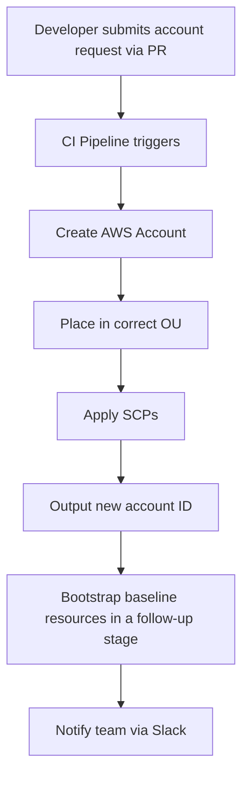

# How to Implement Account Vending Machine with OpenTofu

Author: [nawazdhandala](https://www.github.com/nawazdhandala)

Tags: OpenTofu, Account Vending Machine, AWS Organizations, Automation, Infrastructure as Code

Description: Learn how to build an Account Vending Machine with OpenTofu to automate the provisioning of new AWS accounts with standardized baselines.

An Account Vending Machine (AVM) automates the creation and bootstrapping of new AWS accounts. In practice, because AWS account creation is asynchronous and OpenTofu provider configurations must use values known before apply, account creation and post-creation bootstrapping usually run as separate stages: the first stage creates the account and places it in the right OU, and a follow-up stage assumes a role in that account to apply baseline security controls and shared infrastructure.

## Architecture



## Account Request File

```json
{
  "account_name": "mycompany-new-team-sandbox",
  "email": "aws+new-team@mycompany.com",
  "parent_ou_id": "ou-xxxx-yyyyyyyy",
  "cost_center": "engineering-new-team",
  "owner_email": "alice@mycompany.com",
  "vpc_cidr": "10.50.0.0/16"
}
```

## Account Vending Module

```hcl
# modules/account-vending/main.tf

# Step 1: Create the account
resource "aws_organizations_account" "new" {
  name      = var.account_name
  email     = var.email
  parent_id = var.parent_ou_id
  role_name = "OrganizationAccountAccessRole"

  tags = {
    CostCenter = var.cost_center
    Owner      = var.owner_email
    ManagedBy  = "opentofu-avm"
  }

  close_on_deletion = false
}

# Step 2: Export the new account ID for a follow-up bootstrap stage
output "account_id" {
  value = aws_organizations_account.new.id
}
```

## Root Configuration

```hcl
# main.tf - Vend accounts from request files
provider "aws" {
  region = "us-east-1"
}

locals {
  account_requests = {
    for filename in fileset(path.module, "accounts/*.json") :
    trimsuffix(trimprefix(filename, "accounts/"), ".json") => jsondecode(file("${path.module}/${filename}"))
  }
}

module "account_vending" {
  for_each = local.account_requests
  source   = "./modules/account-vending"

  account_name = each.value.account_name
  email        = each.value.email
  parent_ou_id = each.value.parent_ou_id
  cost_center  = each.value.cost_center
  owner_email  = each.value.owner_email
}
```

## CI/CD Trigger

```yaml
# .github/workflows/account-vending.yml
on:
  push:
    paths:
      - 'accounts/*.json'
    branches: [main]

jobs:
  vend:
    runs-on: ubuntu-latest
    steps:
      - uses: actions/checkout@v4
      - uses: opentofu/setup-opentofu@v1
      - name: Apply Account Vending
        run: |
          tofu init -input=false
          tofu apply -input=false -auto-approve
```

## Conclusion

An Account Vending Machine with OpenTofu codifies the account creation process into a repeatable, reviewable pipeline. Adding an account is as simple as adding a configuration file, creating a PR, getting it reviewed, and merging. The first pipeline handles account creation and OU placement, and the resulting account ID can then drive a follow-up bootstrap stage for baseline resource provisioning.
