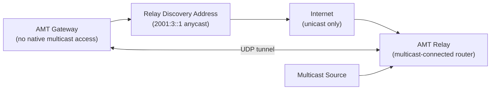

# How to Understand the AMT Address Space (2001:3::/32) - 200130

Author: [nawazdhandala](https://www.github.com/nawazdhandala)

Tags: IPv6, AMT, Automatic Multicast Tunneling, RFC 7450, Multicast, Networking

Description: Understand the AMT (Automatic Multicast Tunneling) address space 2001:3::/32 used to tunnel IPv6 multicast traffic over IPv4 unicast networks.

## Introduction

Automatic Multicast Tunneling (AMT), defined in RFC 7450, uses the `2001:3::/32` address block as the IPv6 relay discovery anycast prefix for public AMT relays. AMT encapsulates multicast traffic in UDP and uses unicast replication to deliver multicast from multicast-enabled networks to receivers that lack multicast connectivity to the source network.

## How AMT Works



## AMT Address Format

```text
2001:3::/32 - IPv6 AMT relay-discovery prefix
  Allocated by IANA for public AMT relay discovery
  Relay Discovery Address: 2001:3::1
  Remaining addresses in the prefix are reserved for future use

This is a special-purpose anycast discovery prefix.
It is not a general host, tunnel, or pseudo-interface addressing scheme.
```

## Checking for AMT Addresses

```python
import ipaddress

def is_amt_address(addr: str) -> bool:
    """Check if an IPv6 address is in the AMT relay-discovery prefix."""
    try:
        a = ipaddress.IPv6Address(addr)
        return a in ipaddress.IPv6Network("2001:3::/32")
    except ValueError:
        return False

print(is_amt_address("2001:3::1"))       # True
print(is_amt_address("2001:3::2"))       # True (still within the reserved prefix)
```

## Linux AMT Tunnel Setup

```bash
# Create an AMT gateway interface that uses the standard IPv6
# Relay Discovery Address for public relays.
sudo ip link add amt0 type amt \
  mode gateway \
  discovery 2001:3::1 \
  local 2001:db8::2 \
  dev eth0

# Bring the interface up
sudo ip link set amt0 up

# Verify the AMT interface configuration
ip -d link show amt0
```

## Filtering AMT Addresses

```bash
# Example boundary policy for networks that do not use public
# AMT relay discovery on this path.
ip6tables -A FORWARD -d 2001:3::/32 \
  -i eth-external -j LOG --log-prefix "AMT: "
ip6tables -A FORWARD -d 2001:3::/32 \
  -i eth-external -j DROP
```

## Conclusion

The `2001:3::/32` AMT prefix is the IPv6 anycast relay-discovery block defined by RFC 7450. AMT itself uses UDP encapsulation and unicast replication to deliver multicast where native multicast connectivity is unavailable. Apply boundary policy for this prefix according to whether your network uses public AMT relay discovery, and monitor relay availability with OneUptime for multicast service health.
