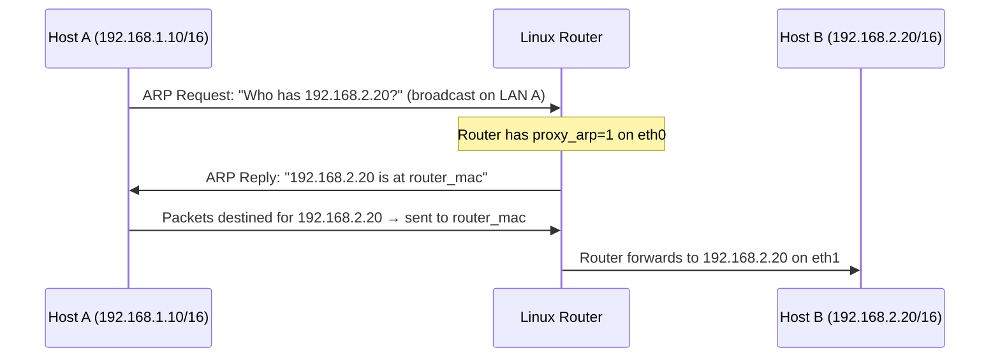

# How to Configure ARP Proxy for Subnets Without Routing

Author: [nawazdhandala](https://www.github.com/nawazdhandala)

Tags: Networking, ARP, Proxy ARP, Linux, Routing

Description: Learn how to use proxy ARP on a Linux router to provide connectivity to subnets that cannot be reached by standard routing.

## What Is Proxy ARP?

Proxy ARP allows a router to respond to ARP requests on behalf of hosts reachable through another interface. The router answers ARP queries with its own MAC address when it has a route to the destination, then forwards the actual packets.

**Use cases:**

- Connecting subnets without configuring routes on end hosts
- Migration scenarios where hosts cannot be immediately re-addressed
- Transparent routing between adjacent subnets
- Some VPN and tunneling scenarios

## How Proxy ARP Works



## Enabling Proxy ARP on Linux

```bash
# Enable proxy ARP on the interface facing Host A

echo 1 | sudo tee /proc/sys/net/ipv4/conf/eth0/proxy_arp > /dev/null

# Or with sysctl
sudo sysctl -w net.ipv4.conf.eth0.proxy_arp=1

# Enable on all interfaces (use with caution)
sudo sysctl -w net.ipv4.conf.all.proxy_arp=1
```

## Full Example: Two Subnets Without Routes on End Hosts

### Setup

```text
eth0: 192.168.1.1/24  (LAN A)
eth1: 192.168.2.1/24  (LAN B)
Host A: 192.168.1.10/16
Host B: 192.168.2.20/16
```

Hosts on both LANs use a /16 mask, so they treat 192.168.1.0/24 and 192.168.2.0/24 as part of the same logical 192.168.0.0/16 network and ARP for each other directly. If the hosts used /24 masks and a default gateway, standard routing would already work and proxy ARP would not be required.

### Configuration

```bash
# On the Linux router:

# Enable IP forwarding
sudo sysctl -w net.ipv4.ip_forward=1

# Enable proxy ARP on both interfaces
sudo sysctl -w net.ipv4.conf.eth0.proxy_arp=1
sudo sysctl -w net.ipv4.conf.eth1.proxy_arp=1
```

Now when Host A (192.168.1.10/16) ARPs for Host B (192.168.2.20):
- Router receives the ARP on eth0
- Router checks routing table: knows 192.168.2.0/24 is on eth1
- Router replies with its own MAC for eth0
- Host A sends traffic to Router, which forwards to Host B

## Proxy ARP Response Delay with proxy_delay

Linux provides a proxy response delay parameter:

```bash
# View current delay (value is in jiffies; default is 80)
sysctl net.ipv4.neigh.eth0.proxy_delay
```

## Persistent Configuration

```bash
sudo tee -a /etc/sysctl.conf > /dev/null << 'EOF'
net.ipv4.ip_forward = 1
net.ipv4.conf.eth0.proxy_arp = 1
net.ipv4.conf.eth1.proxy_arp = 1
EOF
sudo sysctl -p
```

## Caveats and Risks

1. **ARP table growth**: The router must maintain ARP entries for all hosts on both sides.
2. **Security concerns**: Proxy ARP can mask routing problems and complicate troubleshooting.
3. **Logical flatness**: Hosts can behave as if separate segments are one IP network, even though the Layer 2 broadcast domains stay separate.
4. **Not a substitute for routing**: Use proper routing configurations where possible.

## Verifying Proxy ARP

```bash
# From Host A, ping Host B and check if the neighbor entry uses the router's MAC
# On Host A:
ping -c 1 192.168.2.20
ip neigh show 192.168.2.20
# Should show the router MAC for 192.168.2.20 on eth0

# Confirm proxy ARP is responding (on router):
sudo tcpdump -n -e -i eth0 arp | grep "192.168.2.20"
```

## Key Takeaways

- Proxy ARP lets a router answer ARP requests for destinations that are reachable through another interface.
- Enable with `sudo sysctl -w net.ipv4.conf.eth0.proxy_arp=1` on Linux.
- IP forwarding must also be enabled for packets to actually be forwarded.
- Use proxy ARP sparingly; it masks routing complexity and can cause issues in large networks.

**Related Reading:**

- [How to Configure Proxy ARP on a Router](https://oneuptime.com/blog/post/2026-03-20-configure-proxy-arp-linux-ipv4/view)
- [How to Understand ARP in VLAN Environments](https://oneuptime.com/blog/post/2026-03-20-arp-in-vlan-environments/view)
- [How to Set Up IP Forwarding on Linux](https://oneuptime.com/blog/post/2026-03-20-ip-forwarding-linux/view)
