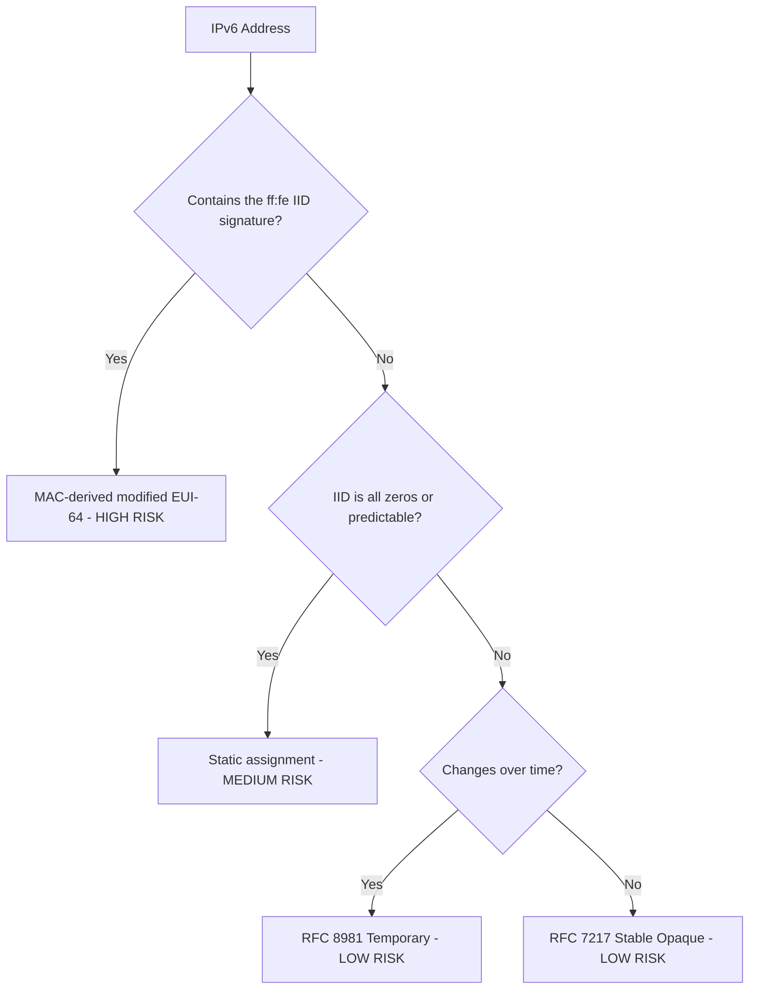

# How to Audit IPv6 Addresses for Tracking Risks

Author: [nawazdhandala](https://www.github.com/nawazdhandala)

Tags: IPv6, Security, Audit, Privacy, EUI-64, Networking

Description: Conduct a thorough audit of IPv6 addresses across your infrastructure to identify EUI-64 addresses and other tracking risks that could expose device identities.

## Introduction

An IPv6 address audit identifies which systems in your network are embedding a stable link-layer identifier such as a 48-bit MAC address in a modified EUI-64 Interface Identifier, which poses a persistent tracking risk. This guide covers manual inspection, scripted fleet audits, and network-level scanning approaches.

## Understanding the EUI-64 Signature

When a 48-bit MAC/EUI-48 address is converted into a modified EUI-64 Interface Identifier (IID), the 4th and 5th bytes of the IID are `ff:fe`.

In a fully expanded IPv6 address, this appears as `xxxx:xxff:fexx:xxxx` in the last four groups.

```bash
# Quick check: does an address use a MAC-derived modified EUI-64 IID?

ADDRESS="2001:db8::021a:2bff:fe3c:4d5e"
python3 - "$ADDRESS" <<'PY'
import ipaddress
import sys

addr = ipaddress.IPv6Address(sys.argv[1])
iid = addr.exploded.replace(":", "")[16:]

if iid[6:10] == "fffe":
    print(f"WARNING: MAC-derived modified EUI-64 address detected in {addr.compressed}")
else:
    print(f"OK: No MAC-derived modified EUI-64 signature found in {addr.compressed}")
PY
```

## Script: Audit All Addresses on a Single Host

```bash
#!/bin/bash
# audit_ipv6_host.sh
# Audit all global IPv6 addresses on the current host for MAC-derived modified EUI-64 IIDs

echo "=== IPv6 Address Tracking Audit ==="
echo "Host: $(hostname)"
echo "Date: $(date)"
echo ""

RISKS_FOUND=0

is_mac_derived_eui64() {
    python3 - "$1" <<'PY'
import ipaddress
import sys

iid = ipaddress.IPv6Address(sys.argv[1]).exploded.replace(":", "")[16:]
sys.exit(0 if iid[6:10] == "fffe" else 1)
PY
}

while read -r iface addr; do
    addr=${addr%/*}

    if is_mac_derived_eui64 "$addr"; then
        echo "[RISK] MAC-derived modified EUI-64 address on $iface: $addr"
        RISKS_FOUND=$((RISKS_FOUND + 1))
    else
        echo "[OK]   $iface: $addr"
    fi
done < <(ip -o -6 addr show scope global | awk '{print $2, $4}')

echo ""
echo "Total MAC-derived modified EUI-64 risk addresses found: $RISKS_FOUND"
```

## Script: Network-Wide Audit Using nmap

```bash
#!/bin/bash
# audit_ipv6_network.sh
# Probe a known list of IPv6 targets and check for MAC-derived modified EUI-64 IIDs

TARGETS_FILE="ipv6_targets.txt"

[[ -f "$TARGETS_FILE" ]] || {
    echo "Target list not found: $TARGETS_FILE" >&2
    exit 1
}

echo "Scanning IPv6 targets listed in $TARGETS_FILE..."
# IPv6 subnets are too large to sweep exhaustively in practice, so feed nmap
# a curated target list from DNS, logs, or inventory data.
SCAN_XML=$(mktemp)
trap 'rm -f "$SCAN_XML"' EXIT

if ! nmap -6 -sn -iL "$TARGETS_FILE" -oX "$SCAN_XML" >/dev/null 2>&1; then
    echo "nmap scan failed" >&2
    exit 1
fi

python3 - "$SCAN_XML" <<'PY'
import ipaddress
import sys
import xml.etree.ElementTree as ET

def is_mac_derived_eui64(addr: str) -> bool:
    iid = ipaddress.IPv6Address(addr).exploded.replace(":", "")[16:]
    return iid[6:10] == "fffe"

def recover_mac(addr: str) -> str:
    iid = ipaddress.IPv6Address(addr).exploded.replace(":", "")[16:]
    first_byte = int(iid[0:2], 16) ^ 0x02
    mac_bytes = [
        f"{first_byte:02x}",
        iid[2:4],
        iid[4:6],
        iid[10:12],
        iid[12:14],
        iid[14:16],
    ]
    return ":".join(mac_bytes)

root = ET.parse(sys.argv[1]).getroot()

for host in root.findall("host"):
    status = host.find("status")
    if status is None or status.get("state") != "up":
        continue

    for address in host.findall("address"):
        if address.get("addrtype") != "ipv6":
            continue

        addr = address.get("addr")
        if addr and is_mac_derived_eui64(addr):
            print(f"EUI-64 detected: {addr}")
            print(f"  Recovered MAC/EUI-48 candidate: {recover_mac(addr)}")
PY
```

## Python Audit Tool with CSV Report

```python
#!/usr/bin/env python3
# ipv6_audit.py
# Audit a list of IPv6 addresses and generate a CSV report

import csv
import ipaddress
import sys

def is_eui64(addr: str) -> bool:
    """Check if an IPv6 address uses a MAC-derived modified EUI-64 IID."""
    try:
        iid = ipaddress.IPv6Address(addr).exploded.replace(":", "")[16:]
    except ipaddress.AddressValueError:
        return False
    return iid[6:10] == "fffe"

def recover_mac(addr: str) -> str:
    """Recover the MAC/EUI-48 candidate from a modified EUI-64 IPv6 address."""
    iid = ipaddress.IPv6Address(addr).exploded.replace(":", "")[16:]
    first_byte = int(iid[0:2], 16) ^ 0x02
    mac_bytes = [
        f"{first_byte:02x}",
        iid[2:4],
        iid[4:6],
        # Skip ff:fe (iid[6:10])
        iid[10:12],
        iid[12:14],
        iid[14:16],
    ]
    return ":".join(mac_bytes)

def iter_addresses():
    """Read addresses from stdin or files passed on the command line."""
    if len(sys.argv) > 1:
        for path in sys.argv[1:]:
            with open(path, encoding="utf-8") as f:
                for line in f:
                    addr = line.strip()
                    if addr:
                        yield addr
    else:
        for line in sys.stdin:
            addr = line.strip()
            if addr:
                yield addr

with open("ipv6_audit_report.csv", "w", newline="") as f:
    writer = csv.writer(f)
    writer.writerow(["Address", "Is EUI-64", "Recovered MAC", "Risk Level"])
    for addr in iter_addresses():
        eui64 = is_eui64(addr)
        mac = recover_mac(addr) if eui64 else ""
        risk = "HIGH" if eui64 else "LOW"
        writer.writerow([addr, eui64, mac, risk])
        if eui64:
            print(f"RISK: {addr} -> MAC {mac}")

print("Report saved to ipv6_audit_report.csv")
```

## Interpreting Results



## Conclusion

Regular IPv6 address audits are essential to ensure that hardware MAC addresses are not being exposed through modified EUI-64 IIDs. The tools above provide a spectrum of approaches from quick one-liner checks to fleet-wide automated reporting. Schedule these audits regularly and integrate them into your security assessment process to maintain a strong IPv6 privacy posture.
