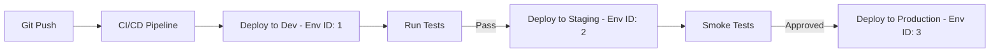

# How to Automate Multi-Environment Deployments with Portainer

Author: [nawazdhandala](https://www.github.com/nawazdhandala)

Tags: Portainer, CI/CD, Multi-Environment, DevOps, Deployment Automation, Docker

Description: Learn how to automate deployments across development, staging, and production Portainer environments using environment-specific configurations and CI/CD pipelines.

---

Multi-environment deployment automation ensures your application moves through development, staging, and production in a consistent, repeatable way. Portainer's environment model maps directly to this pattern: each environment (dev/staging/prod) has its own configuration, access controls, and stack variables. This guide shows how to automate across all three using the Portainer API.

---

## Environment Architecture



---

## Step 1: Set Up Environment-Specific Stack Variables

In Portainer, each environment has separate stack instances with different variables. The example below assumes Docker Swarm environments so `deploy.replicas` is applied during deployment.

```yaml
# docker-compose.yml - single file, environment-specific vars injected by Portainer

version: "3.8"

services:
  webapp:
    image: myrepo/myapp:${IMAGE_TAG}
    restart: unless-stopped
    environment:
      APP_ENV: ${APP_ENV}
      DB_HOST: ${DB_HOST}
      LOG_LEVEL: ${LOG_LEVEL}
      REPLICAS: ${REPLICAS}
    deploy:
      replicas: ${REPLICAS:-1}
```

In each Portainer environment, configure these stack variables:

| Variable | Dev | Staging | Production |
|---|---|---|---|
| `APP_ENV` | `development` | `staging` | `production` |
| `DB_HOST` | `db-dev.internal` | `db-stage.internal` | `db-prod.internal` |
| `LOG_LEVEL` | `debug` | `info` | `warn` |
| `REPLICAS` | `1` | `2` | `5` |

---

## Step 2: Multi-Environment Deployment Script

```bash
#!/usr/bin/env bash
set -euo pipefail

# deploy-all-envs.sh - promote a build through Portainer-managed Docker Swarm environments

PORTAINER_URL="https://portainer.example.com"
API_KEY="${PORTAINER_API_KEY}"
IMAGE_TAG="${1:-latest}"     # pass image tag as first argument
TARGET_ENV="${2:-dev}"       # dev, staging, or prod

# Portainer environment (endpoint) IDs
declare -A ENV_ENDPOINTS=(
  ["dev"]="3"
  ["staging"]="5"
  ["prod"]="8"
)

# Docker Swarm IDs for those Portainer environments
declare -A ENV_SWARMS=(
  ["dev"]="swarm-dev-id"
  ["staging"]="swarm-staging-id"
  ["prod"]="swarm-prod-id"
)

build_payload() {
  local mode="$1"
  local env_name="$2"
  local swarm_id="$3"
  local app_env db_host log_level replicas

  case "$env_name" in
    dev)
      app_env="development"
      db_host="db-dev.internal"
      log_level="debug"
      replicas="1"
      ;;
    staging)
      app_env="staging"
      db_host="db-stage.internal"
      log_level="info"
      replicas="2"
      ;;
    prod)
      app_env="production"
      db_host="db-prod.internal"
      log_level="warn"
      replicas="5"
      ;;
    *)
      echo "Unknown environment: $env_name" >&2
      exit 1
      ;;
  esac

  MODE="$mode" \
  IMAGE_TAG="$IMAGE_TAG" \
  APP_ENV="$app_env" \
  DB_HOST="$db_host" \
  LOG_LEVEL="$log_level" \
  REPLICAS="$replicas" \
  SWARM_ID="$swarm_id" \
  python3 - <<'PY'
import json
import os

payload = {
    "StackFileContent": open("docker-compose.yml", encoding="utf-8").read(),
    "Env": [
        {"name": "IMAGE_TAG", "value": os.environ["IMAGE_TAG"]},
        {"name": "APP_ENV", "value": os.environ["APP_ENV"]},
        {"name": "DB_HOST", "value": os.environ["DB_HOST"]},
        {"name": "LOG_LEVEL", "value": os.environ["LOG_LEVEL"]},
        {"name": "REPLICAS", "value": os.environ["REPLICAS"]},
    ],
}

if os.environ["MODE"] == "create":
    payload["Name"] = "webapp"
    payload["SwarmID"] = os.environ["SWARM_ID"]
else:
    payload["Prune"] = True
    payload["RepullImageAndRedeploy"] = True

print(json.dumps(payload))
PY
}

deploy_to_environment() {
  local env_name="$1"
  local env_id="$2"
  local swarm_id="$3"
  local stack_id payload

  echo "=== Deploying to $env_name (endpoint $env_id) ==="

  # Find the stack ID for this environment
  stack_id=$(curl --fail --silent --show-error --get \
    -H "X-API-Key: $API_KEY" \
    --data-urlencode "filters={\"EndpointID\":${env_id}}" \
    "$PORTAINER_URL/api/stacks" | \
    python3 -c "
import sys, json
stacks = json.load(sys.stdin)
for s in stacks:
    if s['Name'] == 'webapp':
        print(s['Id'])
        break
")

  if [ -z "$stack_id" ]; then
    echo "Stack not found for $env_name - deploying new stack"
    payload="$(build_payload create "$env_name" "$swarm_id")"

    # Create stack if it doesn't exist
    curl --fail --silent --show-error -X POST \
      -H "X-API-Key: $API_KEY" \
      -H "Content-Type: application/json" \
      -d "$payload" \
      "$PORTAINER_URL/api/stacks/create/swarm/string?endpointId=$env_id"
  else
    echo "Updating existing stack $stack_id"
    payload="$(build_payload update "$env_name" "$swarm_id")"

    curl --fail --silent --show-error -X PUT \
      -H "X-API-Key: $API_KEY" \
      -H "Content-Type: application/json" \
      -d "$payload" \
      "$PORTAINER_URL/api/stacks/$stack_id?endpointId=$env_id"
  fi

  echo "$env_name deployment triggered."
}

case "$TARGET_ENV" in
  dev|staging|prod)
    deploy_to_environment "$TARGET_ENV" "${ENV_ENDPOINTS[$TARGET_ENV]}" "${ENV_SWARMS[$TARGET_ENV]}"
    ;;
  *)
    echo "Usage: $0 <image-tag> [dev|staging|prod]" >&2
    exit 1
    ;;
esac

echo ""
echo "$TARGET_ENV deployment complete."
echo "Examples:"
echo "  $0 $IMAGE_TAG staging"
echo "  $0 $IMAGE_TAG prod"
```

---

## Step 3: GitHub Actions Multi-Environment Pipeline

```yaml
# .github/workflows/multi-env-deploy.yml
name: Multi-Environment Deploy

on:
  push:
    branches: [main]

jobs:
  build:
    runs-on: ubuntu-latest
    outputs:
      image_tag: ${{ steps.meta.outputs.version }}
    steps:
      - uses: actions/checkout@v4
      - id: meta
        run: echo "version=$(git rev-parse --short HEAD)" >> $GITHUB_OUTPUT
      - name: Log in to registry
        uses: docker/login-action@v4
        with:
          username: ${{ secrets.REGISTRY_USERNAME }}
          password: ${{ secrets.REGISTRY_PASSWORD }}
      - name: Build and push
        run: |
          docker build -t myrepo/myapp:${{ steps.meta.outputs.version }} .
          docker push myrepo/myapp:${{ steps.meta.outputs.version }}

  deploy-dev:
    needs: build
    runs-on: ubuntu-latest
    env:
      APP_ENV: development
      DB_HOST: db-dev.internal
      LOG_LEVEL: debug
      REPLICAS: "1"
    steps:
      - uses: actions/checkout@v4
      - name: Deploy to Dev
        run: |
          python3 -c "import json, os, pathlib; print(json.dumps({
              'StackFileContent': pathlib.Path('docker-compose.yml').read_text(encoding='utf-8'),
              'Env': [
                  {'name': 'IMAGE_TAG', 'value': '${{ needs.build.outputs.image_tag }}'},
                  {'name': 'APP_ENV', 'value': os.environ['APP_ENV']},
                  {'name': 'DB_HOST', 'value': os.environ['DB_HOST']},
                  {'name': 'LOG_LEVEL', 'value': os.environ['LOG_LEVEL']},
                  {'name': 'REPLICAS', 'value': os.environ['REPLICAS']},
              ],
              'Prune': True,
              'RepullImageAndRedeploy': True,
          }))" > payload.json

          curl --fail --silent --show-error -X PUT \
            -H "X-API-Key: ${{ secrets.PORTAINER_TOKEN }}" \
            -H "Content-Type: application/json" \
            --data @payload.json \
            "${{ secrets.PORTAINER_URL }}/api/stacks/${{ vars.DEV_STACK_ID }}?endpointId=${{ vars.DEV_ENV_ID }}"

  deploy-staging:
    needs: [build, deploy-dev]
    runs-on: ubuntu-latest
    environment: staging   # configure required reviewers on this environment for manual approval
    env:
      APP_ENV: staging
      DB_HOST: db-stage.internal
      LOG_LEVEL: info
      REPLICAS: "2"
    steps:
      - uses: actions/checkout@v4
      - name: Deploy to Staging
        run: |
          python3 -c "import json, os, pathlib; print(json.dumps({
              'StackFileContent': pathlib.Path('docker-compose.yml').read_text(encoding='utf-8'),
              'Env': [
                  {'name': 'IMAGE_TAG', 'value': '${{ needs.build.outputs.image_tag }}'},
                  {'name': 'APP_ENV', 'value': os.environ['APP_ENV']},
                  {'name': 'DB_HOST', 'value': os.environ['DB_HOST']},
                  {'name': 'LOG_LEVEL', 'value': os.environ['LOG_LEVEL']},
                  {'name': 'REPLICAS', 'value': os.environ['REPLICAS']},
              ],
              'Prune': True,
              'RepullImageAndRedeploy': True,
          }))" > payload.json

          curl --fail --silent --show-error -X PUT \
            -H "X-API-Key: ${{ secrets.PORTAINER_TOKEN }}" \
            -H "Content-Type: application/json" \
            --data @payload.json \
            "${{ secrets.PORTAINER_URL }}/api/stacks/${{ vars.STAGING_STACK_ID }}?endpointId=${{ vars.STAGING_ENV_ID }}"

  deploy-prod:
    needs: [build, deploy-staging]
    runs-on: ubuntu-latest
    environment: production  # configure required reviewers on this environment for manual approval
    env:
      APP_ENV: production
      DB_HOST: db-prod.internal
      LOG_LEVEL: warn
      REPLICAS: "5"
    steps:
      - uses: actions/checkout@v4
      - name: Deploy to Production
        run: |
          python3 -c "import json, os, pathlib; print(json.dumps({
              'StackFileContent': pathlib.Path('docker-compose.yml').read_text(encoding='utf-8'),
              'Env': [
                  {'name': 'IMAGE_TAG', 'value': '${{ needs.build.outputs.image_tag }}'},
                  {'name': 'APP_ENV', 'value': os.environ['APP_ENV']},
                  {'name': 'DB_HOST', 'value': os.environ['DB_HOST']},
                  {'name': 'LOG_LEVEL', 'value': os.environ['LOG_LEVEL']},
                  {'name': 'REPLICAS', 'value': os.environ['REPLICAS']},
              ],
              'Prune': True,
              'RepullImageAndRedeploy': True,
          }))" > payload.json

          curl --fail --silent --show-error -X PUT \
            -H "X-API-Key: ${{ secrets.PORTAINER_TOKEN }}" \
            -H "Content-Type: application/json" \
            --data @payload.json \
            "${{ secrets.PORTAINER_URL }}/api/stacks/${{ vars.PROD_STACK_ID }}?endpointId=${{ vars.PROD_ENV_ID }}"
```

---

## Summary

Multi-environment deployments with Portainer use the same Docker Compose files with environment-specific variables injected per environment. The Portainer API allows CI/CD pipelines to deploy and update stacks programmatically across dev, staging, and production environments. GitHub Actions `environment:` blocks can provide the human approval gates between environments when those GitHub environments are configured with protection rules such as required reviewers.
