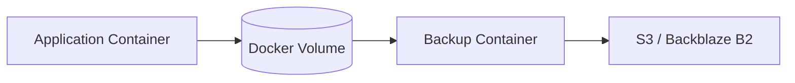

# How to Set Up Automated Container Volume Backups via Portainer

Author: [nawazdhandala](https://www.github.com/nawazdhandala)

Tags: Portainer, Docker, Backup, Volumes, Automation, Storage

Description: Automate Docker volume backups using a sidecar backup container deployed via Portainer, ensuring persistent data is regularly archived without manual intervention.

---

Docker volumes are the primary storage mechanism for stateful containers, but they are not backed up automatically. This guide shows how to deploy an automated volume backup solution via Portainer using the `offen/docker-volume-backup` tool, which supports S3, SFTP, and other destinations.

## Architecture



## Step 1: Deploy Volume Backup via Portainer Stack

Go to **Stacks > Add Stack**. The backup container mounts the target volume and ships its contents on a schedule:

```yaml
# volume-backup-stack.yml

version: "3.8"

services:
  app:
    image: postgres:16
    environment:
      - POSTGRES_DB=mydb
      - POSTGRES_USER=user
      - POSTGRES_PASSWORD=secret
    volumes:
      - postgres-data:/var/lib/postgresql/data
    labels:
      - "docker-volume-backup.stop-during-backup=postgres"
    restart: unless-stopped

  volume-backup:
    image: offen/docker-volume-backup:v2
    environment:
      # S3 destination configuration
      - AWS_S3_BUCKET_NAME=my-volume-backups
      - AWS_ACCESS_KEY_ID=<your-access-key>
      - AWS_SECRET_ACCESS_KEY=<your-secret-key>
      - AWS_ENDPOINT=s3.amazonaws.com
      # Backup schedule - every night at 03:00
      - "BACKUP_CRON_EXPRESSION=0 3 * * *"
      # Retention policy
      - BACKUP_RETENTION_DAYS=30
      - BACKUP_PRUNING_PREFIX=postgres-data-
      # Stop the app container during backup to ensure consistency
      - BACKUP_STOP_DURING_BACKUP_LABEL=postgres
      # Prefix for backup archive files
      - BACKUP_FILENAME=postgres-data-%Y-%m-%dT%H-%M-%S.{{ .Extension }}
    volumes:
      # Mount the volume to back up (read-only)
      - postgres-data:/backup/postgres-data:ro
      # Docker socket for container stop/start during backup
      - /var/run/docker.sock:/var/run/docker.sock:ro
    restart: unless-stopped

volumes:
  postgres-data:
```

## Step 2: Configure Backup Labels

Add the following label to any container whose volume should be quiesced during backup:

```yaml
labels:
  - "docker-volume-backup.stop-during-backup=postgres"
```

The backup container will stop labeled containers, archive the mounted volume contents, then restart them. Downtime depends on how long the backup takes for your workload and dataset size.

## Step 3: Verify Backup Archives

After the first scheduled run, check your S3 bucket for archive files:

```bash
# List backup objects in S3
aws s3 ls s3://my-volume-backups/
```

Each backup is a compressed tar archive with a timestamp in the filename.

## Step 4: Test Restore

To restore a volume from a backup:

```bash
# Download the archive
aws s3 cp s3://my-volume-backups/postgres-data-2026-03-20T03-00-00.tar.gz ./

# Create a fresh volume and restore
docker run --rm \
  -v postgres-data-restore:/backup/postgres-data \
  -v $(pwd):/archive:ro \
  alpine tar -xvzf /archive/postgres-data-2026-03-20T03-00-00.tar.gz
```

## Step 5: Monitor Backup Status

The backup container writes logs visible in Portainer's **Container Logs** view. For proactive alerting, configure a notification URL:

```yaml
environment:
  - NOTIFICATION_URLS=generic+https://your-webhook.example.com
  - NOTIFICATION_LEVEL=error  # Only alert on failures
```

## Summary

Automated volume backups via Portainer require no external schedulers or scripts - just a sidecar container running alongside your applications. By combining volume mounts, Docker socket access, and configurable schedules, you get consistent backups shipped to S3-compatible storage with minimal setup effort.
