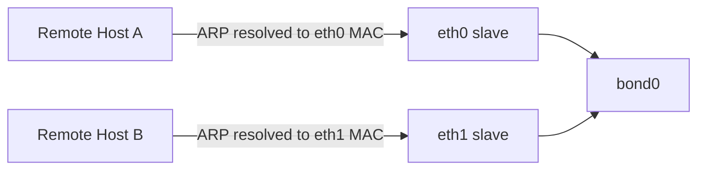

# How to Configure Balance-ALB Bonding (Mode 6) on Linux

Author: [nawazdhandala](https://www.github.com/nawazdhandala)

Tags: Linux, Network Bonding, Balance-ALB, Mode 6, Adaptive Load Balancing, Networking

Description: Configure Linux balance-ALB bonding (mode 6) for adaptive load balancing of both transmit and receive traffic without requiring switch configuration.

## Introduction

Balance-ALB (Adaptive Load Balancing, mode 6) extends balance-TLB (mode 5) by also load-balancing incoming IPv4 traffic. It achieves receive load balancing by negotiating different MAC addresses for different IPv4 peers using ARP negotiation. No switch configuration is required, making it the most capable no-switch-config bonding mode.

## How Balance-ALB Works

- **Transmit**: distributed across slaves based on current load (same as TLB)
- **Receive**: for IPv4 peers, the bond replies to ARP requests with different slave MAC addresses, distributing incoming IPv4 traffic



## Configure Balance-ALB

```bash
# Load bonding module

modprobe bonding

# Create bond in balance-alb mode
ip link add bond0 type bond mode balance-alb

# Set MII monitoring
ip link set bond0 type bond miimon 100

# Add slave interfaces
ip link set eth0 down
ip link set eth1 down
ip link set eth0 master bond0
ip link set eth1 master bond0

# Bring up the bond
ip link set bond0 up
ip addr add 192.168.1.100/24 dev bond0
ip route add default via 192.168.1.1
```

## Verify Balance-ALB

```bash
cat /proc/net/bonding/bond0
# Bonding Mode: adaptive load balancing
# Primary Slave: None
# Currently Active Slave: eth0
```

## Persistent Configuration

```yaml
# Netplan
network:
  version: 2
  ethernets:
    eth0: {dhcp4: false}
    eth1: {dhcp4: false}
  bonds:
    bond0:
      interfaces: [eth0, eth1]
      addresses: [192.168.1.100/24]
      routes:
        - to: default
          via: 192.168.1.1
      parameters:
        mode: balance-alb
        mii-monitor-interval: 100
```

```bash
# nmcli
nmcli connection add \
    type bond \
    con-name bond-alb \
    ifname bond0 \
    mode balance-alb \
    miimon 100 \
    ip4 192.168.1.100/24 \
    gw4 192.168.1.1

nmcli connection add type ethernet con-name bond-alb-eth0 ifname eth0 master bond0
nmcli connection add type ethernet con-name bond-alb-eth1 ifname eth1 master bond0
```

## Monitor Load Distribution

```bash
# Check how traffic is distributed across slaves
watch -n 2 "ip -s link show eth0; ip -s link show eth1"

# View per-slave ARP assignments
cat /proc/net/bonding/bond0
```

## Bonding Mode Comparison

| Mode | Transmit LB | Receive LB | Switch Config | Best Use Case |
|---|---|---|---|---|
| 0 (balance-rr) | Round-robin | No | Static agg. | High throughput |
| 1 (active-backup) | No | No | None | Simple HA |
| 2 (balance-xor) | Hash-based | No | Static agg. | Deterministic hashing |
| 4 (802.3ad) | Hash-based | Peer-dependent | LACP | Enterprise HA+LB |
| 5 (balance-tlb) | Load-based | No | None | TX load balance |
| 6 (balance-alb) | Load-based | ARP-based (IPv4) | None | TX + IPv4 RX LB |

## Conclusion

Balance-ALB provides the most comprehensive load balancing of all bonding modes that don't require switch configuration. It distributes transmit traffic across slaves and can distribute IPv4 receive traffic across slaves using ARP-negotiation. Use mode 6 when you want transmit load balancing plus ARP-based IPv4 receive load balancing but cannot configure the switch for LACP.
