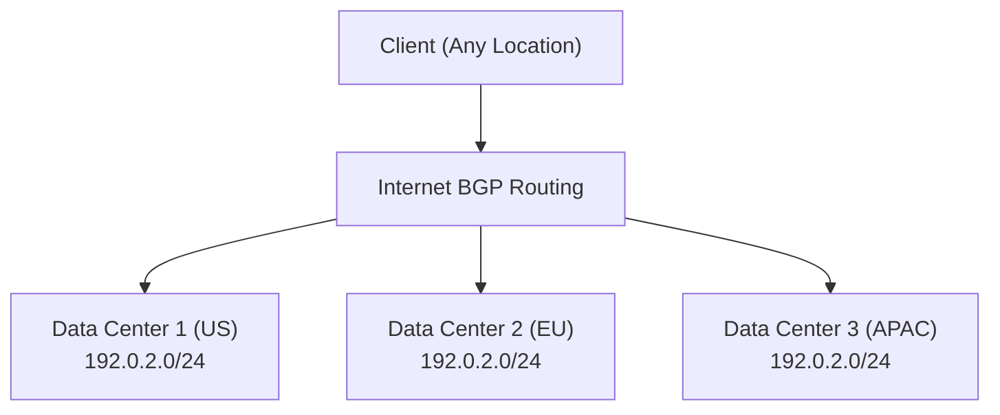

# How to Implement BGP Anycast for DNS or CDN Load Distribution

Author: [nawazdhandala](https://www.github.com/nawazdhandala)

Tags: BGP, Anycast, DNS, CDN, Load Distribution, Networking

Description: Learn how to implement BGP anycast to route clients to the nearest server automatically, enabling geographic load distribution for DNS resolvers and CDN edge nodes.

## What Is BGP Anycast?

In anycast routing, multiple servers in different locations share the same IP address or prefix. BGP advertises this prefix from each location, and clients are automatically routed to the instance that routing policy selects as best, which is often the topologically nearest instance. This is how large DNS providers (1.1.1.1, 8.8.8.8) and CDNs achieve global reach from a single IP.

## Architecture



In this example, each data center advertises the same `192.0.2.0/24` prefix. A client in Europe may reach DC2; a client in Asia may reach DC3. Replace the TEST-NET example addresses in this post with address space you control in production.

## Step 1: Configure the Anycast IP on Each Server

On each server that will participate in anycast, assign the anycast IP to the loopback interface:

```bash
# On each server (Linux)

# Add the anycast IP to the loopback - use /32 to avoid ARP issues
sudo ip addr add 192.0.2.1/32 dev lo label lo:anycast

# Make it persistent (Debian/Ubuntu - /etc/network/interfaces)
# auto lo:anycast
# iface lo:anycast inet static
#   address 192.0.2.1
#   netmask 255.255.255.255

# The service (DNS, HTTP) binds to this IP
# For DNS: add listen-on { 192.0.2.1; }; in named.conf
```

## Step 2: Configure BGP to Advertise the Anycast Prefix

On each site's border router, advertise the anycast prefix to upstream ISPs:

```text
! On the US site border router
router bgp 65001
 bgp router-id 1.1.1.1

 neighbor 203.0.113.1 remote-as 65100   ! US ISP
 neighbor 203.0.113.1 description US-ISP-Upstream

 address-family ipv4 unicast
  neighbor 203.0.113.1 activate
  ! Advertise the anycast prefix
  network 192.0.2.0 mask 255.255.255.0
 exit-address-family
```

If your BGP implementation requires the prefix to exist in the routing table for `network` origination, create a static discard route:

```text
! Back the network statement with a discard route
ip route 192.0.2.0 255.255.255.0 Null0
```

Install or remove this route as part of your health-state automation; leaving it in place when the local service is down will blackhole traffic.

## Step 3: Use Health Checks to Withdraw the Prefix

The key to safe anycast is withdrawing the prefix when local servers are unhealthy. Start with a local health check that exits successfully only when the service is healthy:

```bash
#!/bin/bash
# anycast_healthcheck.sh - Exit 0 only when the local DNS service is healthy
DNS_IP="192.0.2.1"

# Check that the local DNS service returns an answer
if dig +timeout=2 +tries=1 +short @${DNS_IP} health.example.com A | grep -q .; then
    logger "Anycast: Service healthy"
    exit 0
else
    logger "Anycast: Service UNHEALTHY"
    exit 1
fi
```

Use the result to remove the route that backs your `network` statement, or to withdraw the prefix directly from a BGP speaker such as ExaBGP. If you are not using ExaBGP's built-in healthcheck, run this check every 30 seconds with a cron job or systemd timer.

## Step 4: Use ExaBGP for Dynamic Prefix Injection

ExaBGP allows programmatic BGP prefix injection, and its built-in `healthcheck` helper is safer than a custom announce/withdraw loop:

```text
process anycast-dns {
    run python3 -m exabgp healthcheck --cmd "/usr/local/bin/anycast_healthcheck.sh" --ip 192.0.2.0/24 --no-ip-setup --withdraw-on-down --debounce --interval 30;
}
```

## Step 5: Test Anycast Routing

From clients in different locations, trace the route to the anycast IP:

```bash
# From a US client - replace with your production anycast IP
traceroute 192.0.2.1
# Should reach the US data center

# From a European client - replace with your production anycast IP
traceroute 192.0.2.1
# Should reach the EU data center
```

## Conclusion

BGP anycast is a powerful mechanism for geographic load distribution and automatic failover. Assign the anycast IP to server loopbacks, advertise the prefix via BGP from each location, and implement health checks that withdraw the prefix when services are degraded. Used correctly, anycast provides automatic failover and efficient global distribution, subject to BGP convergence and routing policy.
