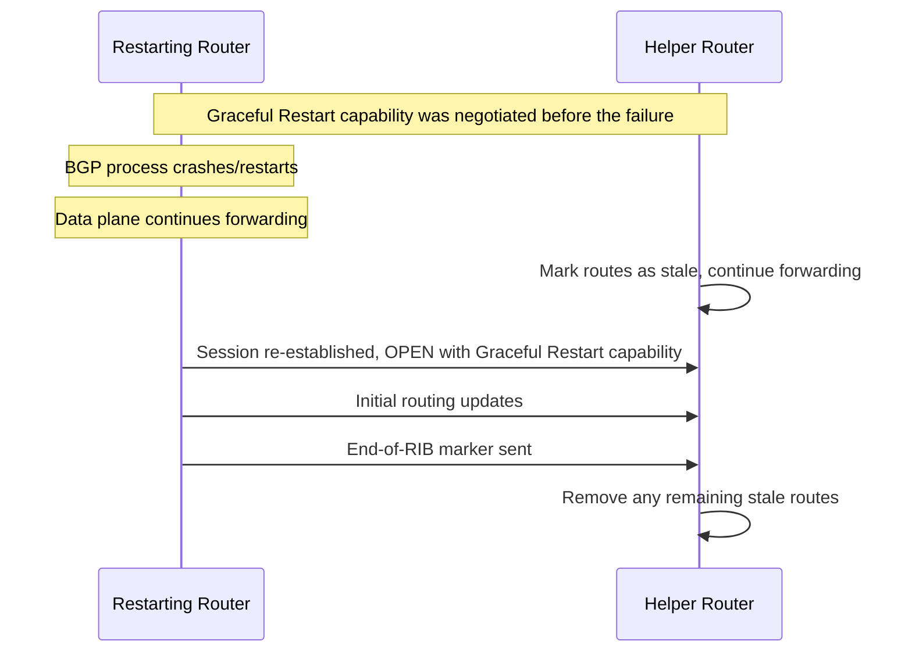

# How to Implement BGP Graceful Restart for Non-Stop Forwarding

Author: [nawazdhandala](https://www.github.com/nawazdhandala)

Tags: BGP, Graceful Restart, Non-Stop Forwarding, Cisco IOS, High Availability

Description: Learn how to configure BGP Graceful Restart to maintain packet forwarding during BGP session restarts, reducing traffic disruption during router software upgrades.

## What Is BGP Graceful Restart?

BGP Graceful Restart (GR), defined in RFC 4724, allows a router that is restarting its BGP process to signal its neighbors to retain previously learned routes temporarily while the session is re-established. Without GR, a BGP restart causes neighbors to withdraw those routes immediately, which can interrupt traffic until the session comes back up.

Non-Stop Forwarding (NSF) is the Cisco high-availability behavior that works with GR on platforms that can preserve forwarding state during a control-plane or route-processor switchover.

## How Graceful Restart Works



## Step 1: Enable BGP Graceful Restart

On Cisco IOS/IOS XE, graceful restart is configured under BGP router configuration mode and negotiated per address family with each neighbor:

```text
router bgp 65001
 ! Enable graceful restart globally
 bgp graceful-restart

 ! Optionally set the restart time (seconds router takes to restart)
 bgp graceful-restart restart-time 120

 ! Optionally set the stalepath time (how long helper keeps stale routes)
 bgp graceful-restart stalepath-time 360
```

The `restart-time` is advertised to helpers so they know how long to retain stale routes. The `stalepath-time` is the local maximum for keeping stale routes before purging them.

## Step 2: Verify Graceful Restart Capability Is Negotiated

```text
Router# show ip bgp neighbors 203.0.113.1

! Look for:
! Address family IPv4 Unicast: advertised and received
! Graceful Restart Capability: advertised
! Graceful-Restart is enabled, restart-time 120 seconds, stalepath-time 360 secs
```

Both the restarting router and the helper must support and advertise the GR capability.

## Step 3: Verify NSF Support on Cisco Platforms

On Cisco IOS/IOS XE, `bgp graceful-restart` also enables BGP NSF awareness on the peer. Actual nonstop forwarding during a switchover still depends on the restarting router supporting NSF/SSO in hardware and software:

```text
! Enable graceful restart / BGP NSF awareness
router bgp 65001
 bgp graceful-restart
```

Use the same `show ip bgp neighbors` output from Step 2 to verify that graceful restart is active for the neighbor.

## Step 4: Configure Graceful Restart on FRRouting

For Linux routers running FRR, advertise preserved forwarding state only if the forwarding plane really stays programmed during restart:

```bash
# In /etc/frr/bgpd.conf or via vtysh

router bgp 65001
 bgp graceful-restart
 ! Use only when forwarding state is actually preserved during restart
 bgp graceful-restart preserve-fw-state
 bgp graceful-restart restart-time 120
 bgp graceful-restart stalepath-time 360
```

## Step 5: Test Graceful Restart

Test GR behavior in a lab by triggering an actual BGP process or daemon restart and observing stale route handling on the helper router:

```text
! Trigger an actual BGP restart in the lab
! A soft reset does not invoke graceful restart

! On the helper router, stale routes appear with an "S" flag
Helper# show ip bgp

! Confirm the neighbor comes back with GR enabled
Helper# show ip bgp neighbors 1.1.1.1

! During the restart window, routes stay in the table as stale
! and are removed or refreshed after End-of-RIB is received
```

## Caveats and Limitations

- GR only helps if the **data plane** remains operational during the control plane restart
- If the router completely reboots (power cycle), forwarding also stops
- Not all neighbor implementations support the GR helper role
- Stale routes may cause suboptimal forwarding if the network changed during the restart
- Default timers may need tuning for your maintenance window duration

## Conclusion

BGP Graceful Restart significantly reduces traffic disruption during planned BGP process restarts and software upgrades. Enable it with `bgp graceful-restart`, set appropriate `restart-time` and `stalepath-time` values, and verify both sides have negotiated the capability before relying on it for production maintenance windows.
