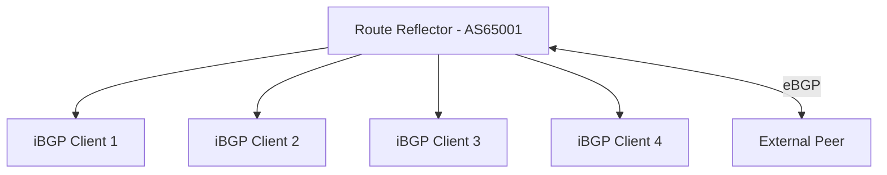

# How to Configure BGP IPv6 with Route Reflectors

Author: [nawazdhandala](https://www.github.com/nawazdhandala)

Tags: BGP, IPv6, Route Reflector, IBGP, Routing

Description: Learn how to configure BGP IPv6 route reflectors to scale iBGP within an AS without requiring a full mesh of BGP sessions.

## Overview

iBGP requires a full mesh of sessions between all routers by default. Route Reflectors (RRs) eliminate this requirement by allowing one or more RR routers to reflect routes from iBGP clients to all other clients, requiring only N sessions to the RR instead of N(N-1)/2 full-mesh sessions.

## Route Reflector Architecture



Without RR: 4 clients need 4×3/2 = 6 iBGP sessions
With RR: 4 clients each need 1 session to the RR = 4 sessions total

## Configuring the Route Reflector (FRRouting)

```bash
vtysh
configure terminal

router bgp 65001
 bgp router-id 10.0.0.1

 ! Optional: set cluster ID for redundant RRs
 bgp cluster-id 1.1.1.1

 ! Define iBGP client sessions
 neighbor 2001:db8:0:1::1 remote-as 65001
 neighbor 2001:db8:0:1::1 update-source lo

 neighbor 2001:db8:0:2::1 remote-as 65001
 neighbor 2001:db8:0:2::1 update-source lo

 neighbor 2001:db8:0:3::1 remote-as 65001
 neighbor 2001:db8:0:3::1 update-source lo

 address-family ipv6 unicast

  neighbor 2001:db8:0:1::1 activate
  neighbor 2001:db8:0:1::1 route-reflector-client   ! Mark as RR client

  neighbor 2001:db8:0:2::1 activate
  neighbor 2001:db8:0:2::1 route-reflector-client

  neighbor 2001:db8:0:3::1 activate
  neighbor 2001:db8:0:3::1 route-reflector-client

 exit-address-family

end
write memory
```

## Configuring the Route Reflector Clients

Client configuration is identical to standard iBGP - clients don't know they are using an RR:

```bash
vtysh
configure terminal

router bgp 65001
 bgp router-id 10.0.1.1

 ! Only needs a session to the Route Reflector
 neighbor 2001:db8:0:ff::1 remote-as 65001
 neighbor 2001:db8:0:ff::1 update-source lo

 address-family ipv6 unicast
  neighbor 2001:db8:0:ff::1 activate
  ! next-hop-self is usually NOT needed for RR clients
  ! The RR preserves the original next hop by default
 exit-address-family

end
write memory
```

## Cisco Route Reflector Configuration

```text
Router(config)# router bgp 65001
Router(config-router)# bgp router-id 10.0.0.1

Router(config-router)# neighbor 2001:db8:0:1::1 remote-as 65001
Router(config-router)# neighbor 2001:db8:0:1::1 update-source Loopback0

Router(config-router)# address-family ipv6 unicast
Router(config-router-af)# neighbor 2001:db8:0:1::1 activate
Router(config-router-af)# neighbor 2001:db8:0:1::1 route-reflector-client
```

## RR CLUSTER_LIST and ORIGINATOR_ID

Route reflectors add two BGP attributes to prevent loops:
- **ORIGINATOR_ID**: The router ID of the originating iBGP speaker
- **CLUSTER_LIST**: List of RR cluster IDs the route has passed through

If a router receives a route with its own ORIGINATOR_ID or cluster ID in CLUSTER_LIST, it ignores it.

## Redundant Route Reflectors

Deploy two RRs for redundancy:

```bash
! Both RRs should be in the same cluster
! In RR1 config:
bgp cluster-id 1.1.1.1

! In RR2 config:
bgp cluster-id 1.1.1.1

! Both RRs peer with each other (non-client iBGP)
! And both peer with all clients as route-reflector-client
```

## Verifying Route Reflector Operation

```bash
# Check that routes have ORIGINATOR_ID and CLUSTER_LIST

vtysh -c "show bgp ipv6 unicast 2001:db8:100::/48"
# Look for:
# Originator: 10.0.1.1
# Cluster list: 1.1.1.1

# Verify client sessions are established on the RR
vtysh -c "show bgp ipv6 unicast summary established"
```

## Summary

BGP IPv6 route reflectors scale iBGP by centralizing route distribution. Configure the RR with `route-reflector-client` for each client neighbor. Clients connect only to the RR, not to each other. Use `bgp cluster-id` for redundant RR pairs. Verify with `show bgp ipv6 unicast` on the RR to confirm all client routes are present.
