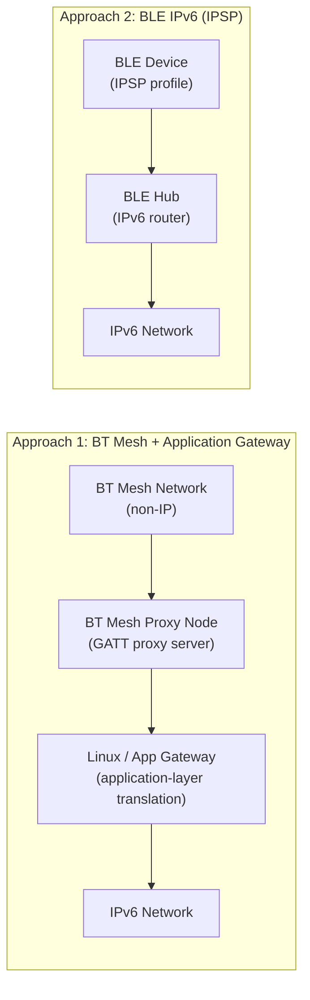

# How to Configure Bluetooth Mesh with IPv6

Author: [nawazdhandala](https://www.github.com/nawazdhandala)

Tags: IPv6, Bluetooth, BLE Mesh, IoT, Networking, Smart Building

Description: Understand the relationship between Bluetooth Mesh and IPv6, including IP Proxy node configuration for connecting Bluetooth Mesh networks to IPv6 infrastructure.

## Introduction

Bluetooth Mesh (BT Mesh) is a networking standard for Bluetooth Low Energy (BLE) devices that enables many-to-many communication. Unlike Thread (which is natively IPv6), Bluetooth Mesh uses its own non-IP network layer and does not carry IPv6 packets directly. The Mesh Proxy feature lets a GATT client exchange mesh PDUs with the network, while native IPv6-over-BLE is standardized separately through the Internet Protocol Support Profile (IPSP) and 6LoWPAN.

## Two Approaches to BLE + IPv6



## Approach 1: Bluetooth Mesh with an Application Gateway

Bluetooth Mesh Proxy Nodes expose mesh messages over GATT. If you need to connect a Bluetooth Mesh deployment to IPv6 systems, the IPv6 translation happens in an application gateway on the host, not in the Mesh Proxy feature itself:

### Setting Up a Linux Bluetooth Mesh Host

```bash
# On Debian/Ubuntu, install BlueZ and the Bluetooth Mesh tools
# (package names vary by distribution)
sudo apt-get install bluez bluez-meshd

# Check the installed BlueZ version
bluetoothctl --version

# Start the regular Bluetooth daemon and the Bluetooth Mesh daemon
sudo systemctl enable --now bluetooth
sudo systemctl enable --now bluetooth-mesh

# Use mesh-cfgclient to create a mesh network and provision nodes
mesh-cfgclient
> create
> discover-unprovisioned on
> list-unprovisioned
> provision <device-UUID>
```

### Linux Host Integration via Mesh Proxy

Bluetooth Mesh proxying does not create a Linux `bt0` IPv6 interface and does not use the `bluetooth_6lowpan` kernel module. The Mesh Proxy service carries mesh proxy PDUs over GATT, so any bridge from mesh data to IPv6 happens in user space on the Linux host or gateway application.

## Approach 2: IPv6 Directly on BLE (IPSP)

The Internet Protocol Support Profile (IPSP) enables IPv6 directly over BLE using 6LoWPAN. This is the standardized way to carry IPv6 packets over a BLE link:

### RIOT OS BLE IPSP Device

```makefile
# Makefile - RIOT OS application for IPv6 over BLE
BOARD = nrf52dk
USEMODULE += shell
USEMODULE += shell_cmds_default
USEMODULE += ps
USEMODULE += auto_init_gnrc_netif
USEMODULE += gnrc_ipv6_default
USEMODULE += gnrc_icmpv6_echo
USEMODULE += nimble_netif

# Linux 6LoWPAN interop currently requires SLAAC in RIOT
CFLAGS += -DCONFIG_GNRC_IPV6_NIB_SLAAC=1
```

```c
// main.c - BLE device with IPv6 connectivity via IPSP
#include <stdio.h>

#include "msg.h"
#include "shell.h"

#define MAIN_QUEUE_SIZE     (8)
static msg_t _main_msg_queue[MAIN_QUEUE_SIZE];

int main(void) {
    msg_init_queue(_main_msg_queue, MAIN_QUEUE_SIZE);

    puts("RIOT IPv6-over-BLE node");
    puts("Run 'ble info' to print the BLE address.");
    puts("Run 'ble adv RIOT-GNRC' to advertise the IP Support Service.");

    char line_buf[SHELL_DEFAULT_BUFSIZE];
    shell_run(NULL, line_buf, SHELL_DEFAULT_BUFSIZE);

    return 0;
}
```

### Hub Configuration (Raspberry Pi with BLE radio)

```bash
# Configure the Raspberry Pi as a BLE IPv6 hub

# Mount debugfs if it is not already mounted
sudo mount -t debugfs none /sys/kernel/debug

# Enable 6LoWPAN over BLE
sudo modprobe bluetooth_6lowpan
echo 1 | sudo tee /sys/kernel/debug/bluetooth/6lowpan_enable

# Connect to an IPSP device
# RIOT's nimble_netif advertises with a random BLE address by default, so use type 2
echo "connect <BLE-MAC-ADDRESS> 2" | sudo tee /sys/kernel/debug/bluetooth/6lowpan_control

# Assign a global IPv6 address within the BLE prefix
sudo ip -6 addr add 2001:db8:1:1::1/64 dev bt0

# Enable forwarding
sudo sysctl -w net.ipv6.conf.all.forwarding=1

# Start radvd for the BLE segment
sudo tee /etc/radvd.conf > /dev/null << 'EOF'
interface bt0 {
    AdvSendAdvert on;
    prefix 2001:db8:1:1::/64 {
        AdvOnLink off;
        AdvAutonomous on;
        AdvRouterAddr on;
    };
    abro 2001:db8:1:1::1 {
        AdvVersionLow 10;
        AdvVersionHigh 2;
        AdvValidLifeTime 2;
    };
};
EOF
sudo systemctl restart radvd
```

## Verifying BLE IPv6 Connectivity

```bash
# On the hub, check the BLE 6LoWPAN interface and its IPv6 addresses
ip link show bt0
ip -6 addr show dev bt0

# Inspect IPv6 neighbors learned on the BLE link
ip -6 neigh show dev bt0

# Ping a connected BLE IPSP device
ping -6 -I bt0 <DEVICE-IPv6-ADDRESS>

# Check routing table includes BLE prefix
ip -6 route show dev bt0

# From the BLE device (RIOT OS shell), test connectivity back to the hub
# > ping 2001:db8:1:1::1
```

## Conclusion

Bluetooth Mesh and IPv6 intersect in two different ways: Bluetooth Mesh can be reached from Linux or mobile hosts through the Mesh Proxy feature, while native IPv6 over BLE uses IPSP and 6LoWPAN. The IPSP approach is the standardized path when you need real IPv6 packets and addresses on the BLE link. For smart building deployments that already use Bluetooth Mesh, connect IP systems through an application gateway rather than expecting the Mesh Proxy feature itself to route IPv6.
