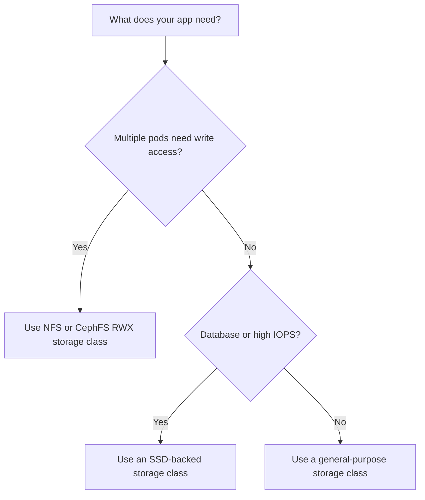

# How to Browse Storage Classes in Portainer

Author: [nawazdhandala](https://www.github.com/nawazdhandala)

Tags: Portainer, Kubernetes, Storage Class, Persistent Storage, DevOps

Description: Learn how to view and understand Kubernetes Storage Classes in Portainer to choose the right storage for your workloads.

## What Are Storage Classes?

A StorageClass defines how Kubernetes should provision persistent storage. When a PVC requests storage with a specific `storageClassName`, the StorageClass's provisioner automatically creates a matching Persistent Volume.

Different storage classes offer different performance and access characteristics, depending on how your cluster administrator or cloud provider configured them:
- **Standard/general-purpose**: Balanced storage for typical workloads.
- **SSD-backed**: Higher-performance storage for low-latency or high-IOPS workloads.
- **NFS or other shared file storage**: Network-shared storage for `ReadWriteMany` workloads.

## Viewing Storage Classes in Portainer

1. Select your Kubernetes environment.
2. In the sidebar, go to **Volumes**.
3. Click the **Storage** tab.

Portainer lists the storage classes available in your cluster along with the disk space used by each volume. You can expand a storage class to see the volumes it contains.

## Storage Class Details Explained

| Field | Description |
|-------|-------------|
| **Provisioner** | The driver or provisioner that creates volumes (e.g., `ebs.csi.aws.com`) |
| **Reclaim Policy** | What happens to dynamically provisioned PVs after their PVCs are deleted (`Retain` or `Delete`) |
| **Volume Binding Mode** | `Immediate` provisions or binds when the PVC is created; `WaitForFirstConsumer` delays this until a Pod using the PVC is created |
| **Allow Volume Expansion** | Whether PVCs using this class can be resized, if the driver supports expansion |

## Viewing Storage Classes via CLI

```bash
# List all storage classes
kubectl get storageclass

# Get detailed information about a storage class
kubectl describe storageclass standard

# Get storage class YAML
kubectl get storageclass standard -o yaml
```

## Cloud Provider Storage Classes

Each cloud provider offers different storage class options:

```yaml
# AWS EBS Storage Class (SSD gp3)
apiVersion: storage.k8s.io/v1
kind: StorageClass
metadata:
  name: gp3-ssd
provisioner: ebs.csi.aws.com
parameters:
  type: gp3              # AWS gp3 SSD volume
  encrypted: "true"      # Encrypt volumes at rest
reclaimPolicy: Delete
allowVolumeExpansion: true
volumeBindingMode: WaitForFirstConsumer  # Avoid cross-AZ issues
```

```yaml
# GKE SSD Storage Class
apiVersion: storage.k8s.io/v1
kind: StorageClass
metadata:
  name: fast-ssd
provisioner: pd.csi.storage.gke.io
parameters:
  type: pd-ssd           # GCP SSD persistent disk
reclaimPolicy: Delete
allowVolumeExpansion: true
volumeBindingMode: WaitForFirstConsumer
```

## Setting a Default Storage Class

```bash
# Mark a storage class as the default
kubectl patch storageclass standard \
  -p '{"metadata": {"annotations":{"storageclass.kubernetes.io/is-default-class":"true"}}}'

# Remove default annotation from the previous default
kubectl patch storageclass old-default \
  -p '{"metadata": {"annotations":{"storageclass.kubernetes.io/is-default-class":"false"}}}'
```

## Choosing the Right Storage Class



## Conclusion

Storage classes are the foundation of dynamic storage provisioning in Kubernetes. Portainer's storage view gives you a clear view of the storage classes available in your cluster, helping you choose the right class when creating PVCs for your applications.
