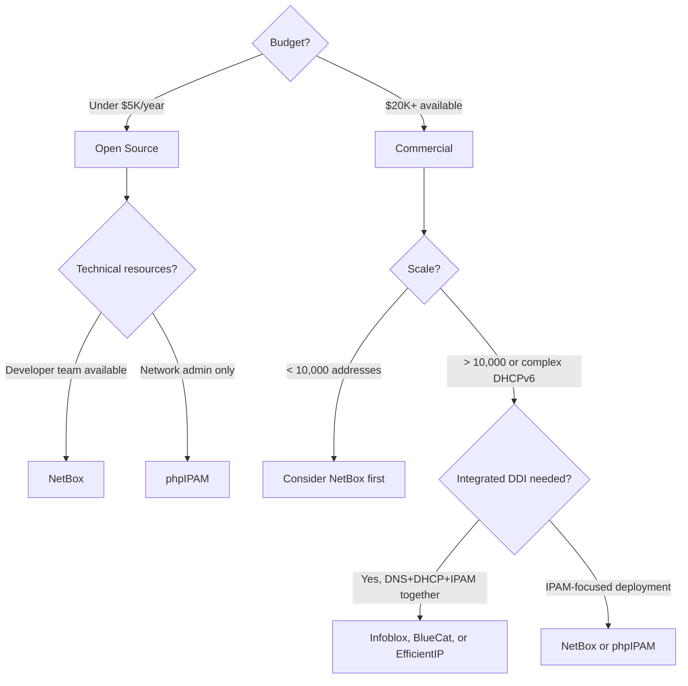

# How to Choose an IPAM Tool for IPv6

Author: [nawazdhandala](https://www.github.com/nawazdhandala)

Tags: IPv6, IPAM, NetBox, Infoblox, Network Management

Description: Compare IPAM tools for IPv6 management including open source options (NetBox, phpIPAM) and commercial solutions (Infoblox, BlueCat, EfficientIP) across key IPv6 capabilities.

## Introduction

Choosing an IPAM tool for IPv6 requires evaluating IPv6-specific features: hierarchical prefix management, DHCPv6 integration, IPv6 address discovery, prefix delegation tracking, and REST API automation. This comparison covers the most commonly deployed IPAM tools and their IPv6 capabilities.

## Tool Comparison Matrix

| Feature | NetBox | phpIPAM | Infoblox | BlueCat | EfficientIP |
|---------|--------|---------|----------|---------|-------------|
| License | Open source | Open source | Commercial | Commercial | Commercial |
| IPv6 prefix management | Excellent | Good | Excellent | Excellent | Excellent |
| DHCPv6 integration | External integrations | Not built-in | Built-in | Built-in | Built-in |
| DNS integration | External integrations | Built-in (PowerDNS) | Built-in | Built-in | Built-in |
| Prefix delegation tracking | Manual | Manual | Automated | Manual | Automated |
| REST API | Excellent | Good | Good | Good | Good |
| IPv6 address discovery | External tools | Limited | Yes | Yes | With add-ons |
| Scalability | High | Medium | Very High | Very High | Very High |
| Learning curve | Medium | Low | High | High | High |
| Cost (annual, mid-size) | $0 + ops | $0 + ops | Contact vendor | Contact vendor | Contact vendor |

## Open Source: NetBox

**Best for:** Organizations with developer resources, need for automation, smaller to mid-size deployments

```bash
# Install NetBox with Docker Compose

git clone -b release https://github.com/netbox-community/netbox-docker.git
cd netbox-docker
cp docker-compose.override.yml.example docker-compose.override.yml
docker compose pull
docker compose up -d
docker compose exec netbox /opt/netbox/netbox/manage.py createsuperuser

# Access at http://localhost:8000
```

**IPv6 Strengths:**
- Prefix hierarchy with parent/child relationships
- Custom fields for IPv6 metadata
- Excellent REST and GraphQL APIs
- Active development community

**IPv6 Limitations:**
- No built-in DHCPv6 server integration
- SLAAC address discovery requires external tools
- Manual prefix delegation entry

## Open Source: phpIPAM

**Best for:** Small organizations wanting a simple web UI with basic IPv6 IPAM and REST API access

```bash
# Quick setup with Docker Compose
cat > docker-compose.yml <<'EOF'
services:
  phpipam-web:
    image: phpipam/phpipam-www:latest
    ports:
      - "80:80"
    environment:
      - IPAM_DATABASE_HOST=phpipam-mariadb
      - IPAM_DATABASE_PASS=my_secret_phpipam_pass
      - IPAM_DATABASE_WEBHOST=%
    depends_on:
      - phpipam-mariadb
    cap_add:
      - NET_ADMIN
      - NET_RAW

  phpipam-cron:
    image: phpipam/phpipam-cron:latest
    environment:
      - IPAM_DATABASE_HOST=phpipam-mariadb
      - IPAM_DATABASE_PASS=my_secret_phpipam_pass
      - SCAN_INTERVAL=1h
    depends_on:
      - phpipam-mariadb
    cap_add:
      - NET_ADMIN
      - NET_RAW

  phpipam-mariadb:
    image: mariadb:latest
    environment:
      - MYSQL_ROOT_PASSWORD=my_secret_mysql_root_pass
EOF

docker compose up -d
```

**IPv6 Strengths:**
- Simple UI for creating IPv6 subnets
- Full REST API
- PowerDNS integration
- Free to use

**IPv6 Limitations:**
- No built-in DHCPv6 server integration
- No prefix delegation visualization
- REST API only (no GraphQL API)

## Commercial: Infoblox

**Best for:** Enterprise environments needing integrated DDI (DNS, DHCP, IPAM)

**Key IPv6 Features:**
- Automated DHCPv6 lease integration
- DNS64/NAT64 management
- IPv6 discovery for DHCPv6, SLAAC, and manually configured devices
- IPv6 IPAM policies enforced through API

```python
# Infoblox API example for IPv6 prefix creation
import requests

INFOBLOX_URL = "https://infoblox.example.com/wapi/v2.13.7"
AUTH = ("admin", "password")

# Create IPv6 network
response = requests.post(
    f"{INFOBLOX_URL}/ipv6network",
    json={
        "network": "2001:db8:0001::/48",
        "comment": "HQ Site Prefix",
        "extattrs": {
            "Site": {"value": "headquarters"},
            "Environment": {"value": "production"}
        }
    },
    auth=AUTH,
    timeout=30,
)
response.raise_for_status()
print(response.json())
```

## Decision Framework

Use this decision tree to select an IPAM tool:



## Evaluation Criteria Scoring

| Criterion | Weight | NetBox | phpIPAM | Infoblox |
|-----------|--------|--------|---------|----------|
| IPv6 prefix management | 30% | 9 | 7 | 10 |
| DHCPv6 integration | 20% | 5 | 6 | 10 |
| REST API quality | 25% | 10 | 6 | 8 |
| Cost | 15% | 10 | 10 | 3 |
| Support/documentation | 10% | 8 | 7 | 9 |
| **Weighted score** | | **8.50** | **7.00** | **8.35** |

## Conclusion

For most organizations, NetBox is the best starting point for IPv6 IPAM - its excellent REST API enables automation, its prefix hierarchy supports the IPv6 address plan structure, and its open source license eliminates licensing costs. Choose a commercial DDI solution (Infoblox, BlueCat, EfficientIP) only when you need integrated DNS and DHCPv6 management at enterprise scale, automated IPv6 address discovery, or vendor-backed SLA support. Evaluate phpIPAM for small organizations that need a simple UI without developer resources for NetBox customization.
