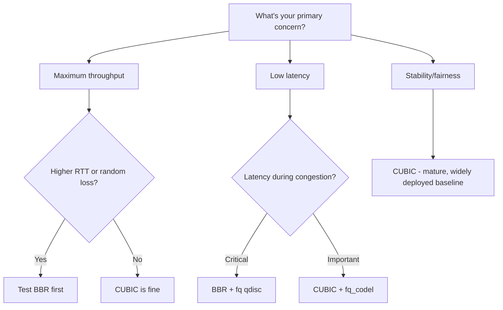

# How to Choose the Right TCP Congestion Control for Your Workload

Author: [nawazdhandala](https://www.github.com/nawazdhandala)

Tags: TCP, Congestion Control, BBR, CUBIC, Linux, Performance

Description: Select the optimal TCP congestion control algorithm for your specific workload by analyzing network characteristics, latency requirements, and traffic patterns.

## Introduction

There is no single best TCP congestion control algorithm for all workloads. The right choice depends on your network's RTT, loss rate, bandwidth, and whether you need fairness between flows or maximum single-flow throughput. This guide provides a decision framework based on workload characteristics.

## Decision Framework



## By Network Type

```bash
# Check your network characteristics first

ping -c 20 target-host
iperf3 -c target-host -t 10

# === Datacenter / LAN ===
# RTT: < 5ms, Loss: near 0%, Bandwidth: 10-100 Gbps
# Usually: CUBIC (works well; benchmark BBR if you want to compare)
# Config:
sysctl -w net.ipv4.tcp_congestion_control=cubic

# === Internet / WAN ===
# RTT: 20-100ms, Loss: 0-1%, Bandwidth: 1-10 Gbps
# Strong candidate: BBR (often better on higher-RTT or randomly lossy paths)
# Config:
modprobe tcp_bbr
sysctl -w net.ipv4.tcp_congestion_control=bbr
sysctl -w net.core.default_qdisc=fq  # Default for newly created qdiscs
tc qdisc replace dev IFACE root fq   # Apply fq immediately to an existing interface

# === Long-haul / Satellite ===
# RTT: 100-600ms, Loss: variable, Bandwidth: varies
# Strong candidate: BBR (CUBIC can need extremely low loss rates to sustain high throughput on very high-BDP paths)
# Config: Same as WAN above

# === Mobile / WiFi ===
# RTT: 20-100ms, Loss: 1-5% (from wireless, not congestion)
# Problem: CUBIC is loss-based, so wireless loss still reduces CWND
# Strong candidate: BBR (uses delivery-rate and RTT measurements rather than loss as its primary signal)
# Config: BBR, often paired with fq on busy hosts
```

## By Application Type

```bash
# === Bulk File Transfer ===
# Goal: maximize throughput
# Usually: BBR on WAN, CUBIC on LAN
# Key settings:
sysctl -w net.ipv4.tcp_slow_start_after_idle=0  # Don't reset CWND
# Large buffers for BDP

# === Web Serving (many short connections) ===
# Goal: minimize TTFB (time to first byte), good concurrency
# Best: benchmark CUBIC and BBR; short flows often depend more on initial window
# Example BBR config:
sysctl -w net.ipv4.tcp_congestion_control=bbr
ip route change default via GATEWAY_IP initcwnd 10  # Per-route override; test carefully

# === Video Streaming ===
# Goal: stable, sufficient throughput; tolerate some latency
# Strong candidate: BBR (pacing helps avoid bursty sending on busy links)
# Note: BBR's packet pacing naturally helps streaming

# === Database / Transactional ===
# Goal: low latency, reliable connections
# Best: CUBIC or BBR both fine; focus on keepalives and connection pooling

# === Gaming / Real-time ===
# Goal: minimum and stable latency
# Best: BBR with fq, or consider QUIC/UDP instead of TCP
```

## Testing Your Choice

```bash
#!/bin/bash
# Comprehensive algorithm comparison for your specific workload
# Run as root; this changes the system-wide algorithm for new TCP connections

SERVER="10.20.0.5"
ALGORITHMS=("cubic" "bbr")

for algo in "${ALGORITHMS[@]}"; do
    # Check availability
    if ! grep -qw "$algo" /proc/sys/net/ipv4/tcp_available_congestion_control 2>/dev/null; then
        modprobe tcp_$algo 2>/dev/null
    fi

    if ! sysctl -w net.ipv4.tcp_congestion_control="$algo" >/dev/null 2>&1; then
        echo "Skipping $algo (not available)"
        continue
    fi

    echo "=== $algo ==="
    # Throughput
    iperf3 -c "$SERVER" -t 20 2>/dev/null | grep "sender"
    # Latency under load
    ping -c 20 -i 1 "$SERVER" >/tmp/ping_$algo.txt 2>&1 &
    ping_pid=$!
    iperf3 -c "$SERVER" -t 20 >/dev/null 2>&1
    wait "$ping_pid"
    grep "rtt" /tmp/ping_$algo.txt | tail -1
done
```

## Conclusion

For many internet-facing services in 2026, BBR is a strong candidate to test on Linux, often paired with `fq` on busy hosts. It often improves throughput on higher-RTT or randomly lossy paths and can reduce latency under load due to pacing. CUBIC remains an excellent, widely deployed baseline and is still well-suited to pure LAN/datacenter scenarios. Run the comparison script on your actual network before making a production change.
