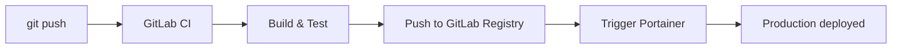

# How to Set Up CI/CD with Portainer and GitLab CI

Author: [nawazdhandala](https://www.github.com/nawazdhandala)

Tags: Portainer, GitLab CI, CI/CD, Docker, Automation

Description: Learn how to create a GitLab CI/CD pipeline that builds Docker images and automatically deploys them via Portainer.

## Pipeline Architecture



Portainer stack webhooks are only available in Portainer Business Edition and on non-Edge environments.

## GitLab CI/CD Variables

In your GitLab project, go to **Settings > CI/CD > Variables** and add:

```text
PORTAINER_WEBHOOK_URL           - Your production Portainer stack webhook URL (masked)
PORTAINER_STAGING_WEBHOOK_URL   - Your staging Portainer stack webhook URL (masked)
PORTAINER_URL                   - Base Portainer URL, e.g. https://portainer.example.com
PORTAINER_API_TOKEN             - Your Portainer API access token (masked)
```

## Complete .gitlab-ci.yml

```yaml
# .gitlab-ci.yml

stages:
  - test
  - build
  - deploy

variables:
  DOCKER_HOST: tcp://docker:2375
  DOCKER_TLS_CERTDIR: ""
  # Use the GitLab Container Registry
  IMAGE_TAG: $CI_REGISTRY_IMAGE:$CI_COMMIT_SHORT_SHA
  IMAGE_LATEST: $CI_REGISTRY_IMAGE:latest

# Run tests in parallel with a lightweight image
test:
  stage: test
  image: python:3.12-slim
  script:
    - pip install -r requirements.txt
    - pytest tests/ -v
  rules:
    - if: $CI_PIPELINE_SOURCE == "merge_request_event"
    - if: $CI_COMMIT_BRANCH == $CI_DEFAULT_BRANCH

# Build and push the Docker image
# Requires a runner configured in privileged mode for docker:dind
build:
  stage: build
  image: docker:24.0.5-cli
  services:
    - docker:24.0.5-dind
  before_script:
    # Authenticate with the GitLab Container Registry
    - echo "$CI_REGISTRY_PASSWORD" | docker login $CI_REGISTRY -u $CI_REGISTRY_USER --password-stdin
  script:
    # Build with layer caching
    - docker pull $IMAGE_LATEST || true
    - docker build --cache-from $IMAGE_LATEST --label "git-commit=$CI_COMMIT_SHA" --label "build-date=$(date -Is)" -t $IMAGE_TAG -t $IMAGE_LATEST .
    # Push both the SHA tag and latest
    - docker push $IMAGE_TAG
    - docker push $IMAGE_LATEST
  rules:
    - if: $CI_COMMIT_BRANCH == $CI_DEFAULT_BRANCH
    - if: $CI_COMMIT_TAG

# Deploy to production via Portainer webhook
deploy:production:
  stage: deploy
  image: curlimages/curl:latest
  environment:
    name: production
    url: https://myapp.mycompany.com
  script:
    # Trigger Portainer webhook with the specific image tag
    - |
      HTTP_STATUS=$(curl -s -o /dev/null -w "%{http_code}" \
        -X POST "${PORTAINER_WEBHOOK_URL}?tag=${CI_COMMIT_SHORT_SHA}")

      if [ "$HTTP_STATUS" != "200" ]; then
        echo "Deployment failed: HTTP $HTTP_STATUS"
        exit 1
      fi
      echo "Deployed tag: ${CI_COMMIT_SHORT_SHA}"
  rules:
    - if: $CI_COMMIT_BRANCH == $CI_DEFAULT_BRANCH
      when: manual

# Auto-deploy to staging
deploy:staging:
  stage: deploy
  image: curlimages/curl:latest
  environment:
    name: staging
    url: https://staging.mycompany.com
  script:
    - |
      HTTP_STATUS=$(curl -s -o /dev/null -w "%{http_code}" \
        -X POST "${PORTAINER_STAGING_WEBHOOK_URL}?tag=${CI_COMMIT_SHORT_SHA}")
      [ "$HTTP_STATUS" = "200" ] && echo "Staging deployed" || exit 1
  rules:
    - if: $CI_COMMIT_BRANCH == $CI_DEFAULT_BRANCH
```

## Using Portainer's API for Advanced Deployments

For more control over file-based stacks managed in Portainer (e.g., updating the compose file itself):

```yaml
deploy:advanced:
  stage: deploy
  image: alpine:3.21
  before_script:
    - apk add --no-cache curl jq
  script:
    # Get the stack ID and environment ID
    - |
      STACK_JSON=$(curl -fsSL "${PORTAINER_URL}/api/stacks" \
        -H "X-API-Key: ${PORTAINER_API_TOKEN}")

      STACK_ID=$(echo "$STACK_JSON" | jq -r '.[] | select(.Name == "my-app") | .Id')
      ENDPOINT_ID=$(echo "$STACK_JSON" | jq -r '.[] | select(.Name == "my-app") | .EndpointId')

      [ "$STACK_ID" != "null" ] || (echo "Stack not found" && exit 1)
      [ "$ENDPOINT_ID" != "null" ] || (echo "Endpoint not found" && exit 1)

    # Update the stack
    - |
      jq -n \
        --rawfile stack_file docker-compose.yml \
        --arg app_version "${CI_COMMIT_SHORT_SHA}" \
        '{
          StackFileContent: $stack_file,
          Env: [{name: "APP_VERSION", value: $app_version}],
          RepullImageAndRedeploy: true
        }' > payload.json

      curl -fsSL -X PUT "${PORTAINER_URL}/api/stacks/${STACK_ID}?endpointId=${ENDPOINT_ID}" \
        -H "X-API-Key: ${PORTAINER_API_TOKEN}" \
        -H "Content-Type: application/json" \
        --data @payload.json
```

## Conclusion

GitLab CI with Portainer provides a powerful, self-hosted CI/CD stack. The GitLab Container Registry, CI/CD pipelines, and Portainer webhooks combine for a zero-external-dependency deployment pipeline entirely within your own infrastructure.
