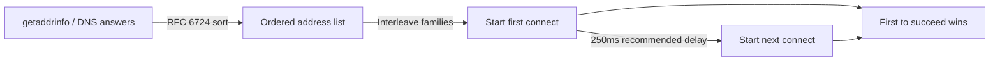

# How to Understand How Clients Choose Between IPv4 and IPv6

Author: [nawazdhandala](https://www.github.com/nawazdhandala)

Tags: IPv6, Dual-Stack, Address Selection, RFC 6724, Happy Eyeballs

Description: An explanation of the mechanisms clients use to choose between IPv4 and IPv6 when both are available, including RFC 6724 address selection and the Happy Eyeballs algorithm.

## The Address Selection Problem

In a dual-stack network, a client might have:
- Multiple IPv6 addresses (global unicast, link-local, ULA, privacy extensions)
- One or more IPv4 addresses

When connecting to a hostname that has both A and AAAA records, the client must choose:
1. Which **destination** to try (IPv4 or IPv6)
2. Which **source address** to use

## RFC 6724: Default Address Selection

RFC 6724 (updating RFC 3484) defines the standard algorithm for default address selection on dual-stack hosts. It applies **policies** via a policy table to rank destination/source address pairs.

On Linux, related address-selection state can be inspected with:

```bash
# Show the kernel's IPv6 address labels

ip addrlabel list

# On glibc-based systems, show getaddrinfo() policy overrides
cat /etc/gai.conf
```

## The gai.conf Policy Table

The `getaddrinfo()` library call on glibc-based systems can use `/etc/gai.conf` to override address sorting. The RFC 6724 default policy table ranks:

```text
# RFC 6724 default labels and precedence
label       ::1/128       0
label       ::/0          1
label       2002::/16     2
label       ::/96         3
label       ::ffff:0:0/96 4
label       2001::/32     5
label       fc00::/7      13
label       fec0::/10     11
label       3ffe::/16     12

precedence  ::1/128       50
precedence  ::/0          40
precedence  ::ffff:0:0/96 35
precedence  2002::/16     30
precedence  2001::/32     5
precedence  fc00::/7      3
precedence  ::/96         1
precedence  fec0::/10     1
precedence  3ffe::/16     1
```

## The Destination Address Selection Rules

RFC 6724 defines 10 rules applied in order. Key rules are:

**Rule 1: Avoid unusable destinations** - Prefer destinations that are reachable and have a usable source address.

**Rule 4: Prefer home address** - If Mobile IPv6 is used, prefer the home address.

**Rule 5: Prefer matching label** - Prefer destination addresses where the src/dst labels match.

**Rule 6: Prefer higher precedence** - Use the policy table to break ties.

**Rule 8: Prefer smaller scope** - Prefer smaller-scope destinations when otherwise appropriate.

**Rule 9: Use longest matching prefix** - When comparing same-family destinations, prefer the one whose chosen source shares the longest prefix.

**Rule 10: Otherwise leave the order unchanged** - Keep the original resolver order as the final tiebreaker.

## Why IPv6 Is Preferred by Default

The RFC 6724 default policy table assigns:
- `::` (IPv6 global) precedence **40**
- `::ffff:0:0/96` (IPv4-mapped = IPv4) precedence **35**

IPv6 has higher precedence (40 > 35), so dual-stack clients usually try IPv6 before IPv4 when a matching IPv6 source address is available.

## Happy Eyeballs: The Connection Layer

RFC 6724 sorts destination addresses, but Happy Eyeballs (RFC 8305) uses that ordering and then races connection attempts across the list:



## Checking Current Address Selection Behavior

```bash
# See how getaddrinfo resolves a hostname and what order
python3 -c "
import socket
results = socket.getaddrinfo('example.com', 80)
for family, type, proto, canonname, sockaddr in results:
    print(f'{family.name}: {sockaddr[0]}')
"
# This shows the order returned by getaddrinfo() after local policy is applied

# Test which address curl actually uses
curl -w "%{remote_ip}\n" -o /dev/null -s https://example.com
```

## Modifying Address Selection Preferences

To change the address selection policy (e.g., prefer IPv4 globally on a glibc-based system):

```bash
# On glibc, adding any 'precedence' line replaces the default precedence table.
# Copy the full default table into /etc/gai.conf, then give ::ffff:0:0/96 a
# higher precedence than ::/0 if you want IPv4-mapped addresses preferred.
sudo vim /etc/gai.conf

# Or force IPv4 preference for specific application
curl -4 https://example.com

# In Python: specify address family
python3 - <<'PY'
import socket
sock = socket.socket(socket.AF_INET, socket.SOCK_STREAM)  # IPv4 only
PY
```

## Windows Address Selection

Windows implements address selection via the prefix policy table:

```powershell
# View Windows prefix policy table
netsh interface ipv6 show prefixpolicies

# Test a connection and see the remote address chosen
Test-NetConnection -ComputerName example.com -Port 80 -InformationLevel Detailed

# Modify a prefix policy entry (example: raise IPv4-mapped precedence)
netsh interface ipv6 set prefixpolicy prefix=::ffff:0:0/96 precedence=45 label=4
```

## Summary

Clients choose between IPv4 and IPv6 through a two-layer process: RFC 6724 sorts destination addresses and helps choose source addresses, and Happy Eyeballs (RFC 8305) can interleave address families and race connection attempts. On glibc-based Linux, `/etc/gai.conf` can override address selection policy. Modern dual-stack clients usually prefer IPv6 in their initial ordering, but may quickly try IPv4 as well when Happy Eyeballs is in use.
