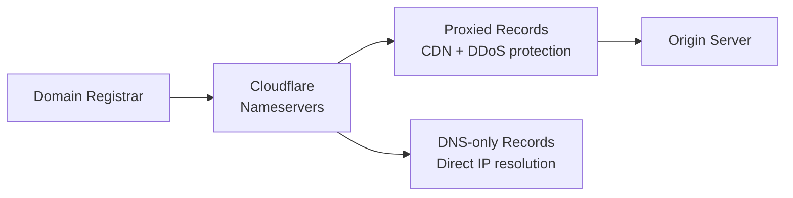

# How to Manage Cloudflare DNS with OpenTofu

Author: [nawazdhandala](https://www.github.com/nawazdhandala)

Tags: OpenTofu, Cloudflare, DNS, CDN, Security, Infrastructure as Code

Description: Learn how to manage Cloudflare DNS zones and records using OpenTofu with the Cloudflare provider, including proxied records, page rules, and zone settings configuration.

---

Cloudflare combines DNS management with CDN, DDoS protection, and WAF in a single platform. The Cloudflare OpenTofu provider manages DNS records, zone settings, page rules, and security configurations as code.

## Cloudflare DNS Architecture



## Provider Configuration

```hcl
# providers.tf

terraform {
  required_providers {
    cloudflare = {
      source  = "cloudflare/cloudflare"
      version = "~> 5.0"
    }
  }
}

provider "cloudflare" {
  api_token = var.cloudflare_api_token
}
```

## Zone and DNS Records

```hcl
# dns.tf
data "cloudflare_zones" "main" {
  name = var.domain_name
}

# Proxied A record - goes through Cloudflare CDN and DDoS protection
resource "cloudflare_dns_record" "root" {
  zone_id = data.cloudflare_zones.main.result[0].id
  name    = var.domain_name
  type    = "A"
  content = var.origin_ip
  proxied = true  # Route through Cloudflare
  ttl     = 1     # TTL 1 = Auto when proxied

  lifecycle {
    # Prevent accidental deletion
    prevent_destroy = var.environment == "production"
  }
}

resource "cloudflare_dns_record" "www" {
  zone_id = data.cloudflare_zones.main.result[0].id
  name    = "www.${var.domain_name}"
  type    = "CNAME"
  content = var.domain_name
  proxied = true
  ttl     = 1
}

resource "cloudflare_dns_record" "api" {
  zone_id = data.cloudflare_zones.main.result[0].id
  name    = "api.${var.domain_name}"
  type    = "CNAME"
  content = var.domain_name
  proxied = true
  ttl     = 1
}

# Non-proxied record for services that don't need CDN
resource "cloudflare_dns_record" "mail" {
  zone_id = data.cloudflare_zones.main.result[0].id
  name    = "mail.${var.domain_name}"
  type    = "A"
  content = var.mail_server_ip
  proxied = false  # Direct DNS - email servers can't use CDN proxy
  ttl     = 300
}

resource "cloudflare_dns_record" "mail2" {
  zone_id = data.cloudflare_zones.main.result[0].id
  name    = "mail2.${var.domain_name}"
  type    = "A"
  content = var.mail_server_ip
  proxied = false
  ttl     = 300
}

# MX records
resource "cloudflare_dns_record" "mx" {
  for_each = {
    "10" = "mail.${var.domain_name}"
    "20" = "mail2.${var.domain_name}"
  }

  zone_id  = data.cloudflare_zones.main.result[0].id
  name     = var.domain_name
  type     = "MX"
  content  = each.value
  priority = tonumber(each.key)
  ttl      = 300
}

# SPF, DKIM, DMARC
resource "cloudflare_dns_record" "spf" {
  zone_id = data.cloudflare_zones.main.result[0].id
  name    = var.domain_name
  type    = "TXT"
  content = "v=spf1 include:_spf.google.com ~all"
  ttl     = 300
}
```

## Zone Settings

```hcl
# zone_settings.tf
resource "cloudflare_zone_setting" "ssl" {
  zone_id    = data.cloudflare_zones.main.result[0].id
  setting_id = "ssl"
  value      = "strict"
}

resource "cloudflare_zone_setting" "min_tls_version" {
  zone_id    = data.cloudflare_zones.main.result[0].id
  setting_id = "min_tls_version"
  value      = "1.2"
}

resource "cloudflare_zone_setting" "tls_1_3" {
  zone_id    = data.cloudflare_zones.main.result[0].id
  setting_id = "tls_1_3"
  value      = "on"
}

resource "cloudflare_zone_setting" "always_use_https" {
  zone_id    = data.cloudflare_zones.main.result[0].id
  setting_id = "always_use_https"
  value      = "on"
}

resource "cloudflare_zone_setting" "automatic_https_rewrites" {
  zone_id    = data.cloudflare_zones.main.result[0].id
  setting_id = "automatic_https_rewrites"
  value      = "on"
}

resource "cloudflare_zone_setting" "brotli" {
  zone_id    = data.cloudflare_zones.main.result[0].id
  setting_id = "brotli"
  value      = "on"
}

resource "cloudflare_zone_setting" "http2" {
  zone_id    = data.cloudflare_zones.main.result[0].id
  setting_id = "http2"
  value      = "on"
}

resource "cloudflare_zone_setting" "http3" {
  zone_id    = data.cloudflare_zones.main.result[0].id
  setting_id = "http3"
  value      = "on"
}

resource "cloudflare_zone_setting" "security_level" {
  zone_id    = data.cloudflare_zones.main.result[0].id
  setting_id = "security_level"
  value      = var.environment == "production" ? "medium" : "essentially_off"
}

resource "cloudflare_zone_setting" "browser_cache_ttl" {
  zone_id    = data.cloudflare_zones.main.result[0].id
  setting_id = "browser_cache_ttl"
  value      = 14400
}
```

## Page Rules

```hcl
resource "cloudflare_page_rule" "cache_assets" {
  zone_id  = data.cloudflare_zones.main.result[0].id
  priority = 1
  status   = "active"

  targets = [{
    target = "url"
    constraint = {
      operator = "matches"
      value    = "https://${var.domain_name}/assets/*"
    }
  }]

  actions = [
    {
      id    = "cache_level"
      value = "cache_everything"
    },
    {
      id    = "edge_cache_ttl"
      value = 86400  # 1 day
    }
  ]
}

resource "cloudflare_page_rule" "no_cache_api" {
  zone_id  = data.cloudflare_zones.main.result[0].id
  priority = 2
  status   = "active"

  targets = [{
    target = "url"
    constraint = {
      operator = "matches"
      value    = "https://api.${var.domain_name}/*"
    }
  }]

  actions = [{
    id    = "cache_level"
    value = "bypass"
  }]
}
```

## Best Practices

- Use `proxied = true` for HTTP/HTTPS records to get Cloudflare DDoS protection and CDN without additional configuration.
- Never proxy non-HTTP services (mail, FTP, VPN) - use `proxied = false` for those records.
- Set `min_tls_version = "1.2"` and `always_use_https = "on"` for all production zones.
- Use the Cloudflare API token (not Global API Key) with minimal scopes required by your configuration - for this example, `Zone Read`, `DNS Write`, `Page Rules Write`, and `Zone Settings Write`.
- Add `prevent_destroy = true` lifecycle rules on critical DNS records in production zones.
