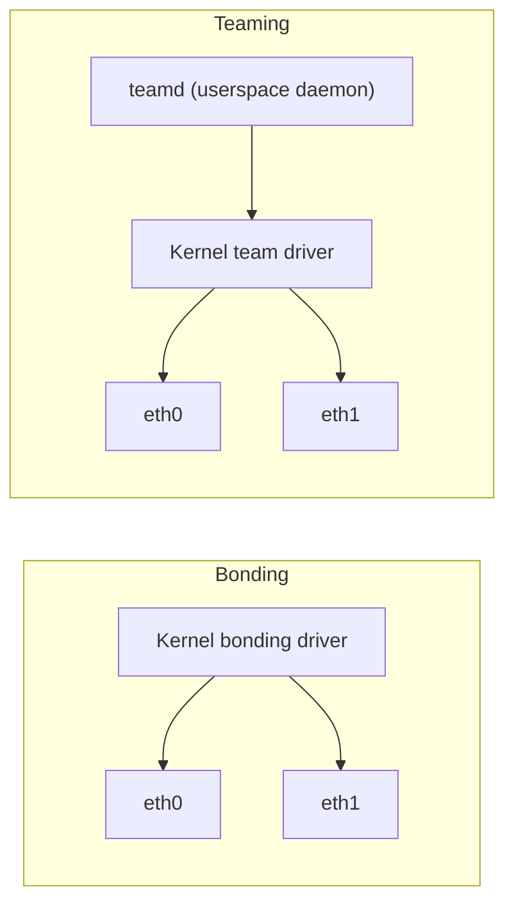

# How to Compare Bonding vs Teaming on Linux

Author: [nawazdhandala](https://www.github.com/nawazdhandala)

Tags: Linux, Network Bonding, Network Teaming, Teamd, Comparison, Networking, High Availability

Description: Compare Linux network bonding and network teaming architectures, configuration approaches, and use cases to choose the right link aggregation solution.

## Introduction

Linux offers two mechanisms for link aggregation and redundancy: the traditional kernel bonding driver and the newer network teaming (teamd). Red Hat introduced teaming as a more flexible, userspace-driven alternative to bonding. However, teaming is deprecated in Red Hat Enterprise Linux 9 and removed in RHEL 10, so bonding is the safer default on modern RHEL systems. Understanding the differences helps you choose the right tool for your environment.

## Architecture Comparison



| Aspect | Bonding | Teaming |
|---|---|---|
| Architecture | Pure kernel | Kernel + userspace daemon (teamd) |
| Configuration tool | ip, nmcli, Netplan | nmcli, teamd JSON config |
| Flexibility | Moderate | Higher (multiple runners and link-watchers) |
| Monitoring | MII or ARP | ethtool, arp_ping, or nsna_ping |
| Dependencies | Minimal extra userspace dependencies | Requires `teamd`/`libteam` in addition to kernel support |
| Support | Broad distro support | More limited distro and tooling support |
| Status | Current | Deprecated in RHEL 9; removed in RHEL 10 |

## Bonding Configuration Example

```bash
# Simple active-backup bond

nmcli connection add type bond con-name bond0 ifname bond0 \
    bond.options "mode=active-backup,miimon=100"
nmcli connection add type ethernet con-name bond-eth0 ifname eth0 controller bond0
nmcli connection add type ethernet con-name bond-eth1 ifname eth1 controller bond0

nmcli connection up bond0
```

## Teaming Configuration Example

```bash
# Create a team in active-backup mode
nmcli connection add type team con-name team0 ifname team0 \
    team.runner activebackup

# Set the link watcher
nmcli connection modify team0 team.link-watchers "name=ethtool"

# Add port interfaces
nmcli connection add type ethernet con-name team-eth0 ifname eth0 controller team0
nmcli connection add type ethernet con-name team-eth1 ifname eth1 controller team0

nmcli connection up team0
```

## Available Teaming Runners

```jsonc
// Active-backup runner
{"runner": {"name": "activebackup"}}

// Broadcast
{"runner": {"name": "broadcast"}}

// LACP (802.3ad equivalent)
{"runner": {"name": "lacp"}}

// Random port selection
{"runner": {"name": "random"}}

// Round-robin
{"runner": {"name": "roundrobin"}}

// Load-based transmit balancing
{"runner": {"name": "loadbalance"}}
```

## Teaming Link Watch Options

Teaming offers more link monitoring options than bonding:

```jsonc
// Ethtool (equivalent to bonding MII)
{"link_watch": {"name": "ethtool"}}

// ARP ping
{"link_watch": {"name": "arp_ping", "source_host": "192.0.2.1", "target_host": "192.0.2.2"}}

// NSNA ping (IPv6 neighbor solicitation)
{"link_watch": {"name": "nsna_ping", "target_host": "fe80::210:18ff:feaa:bbcc"}}
```

## When to Choose Bonding

- You need broad distribution support
- You want a pure kernel solution with minimal dependencies
- You're running non-RHEL distributions
- You're using Netplan (Ubuntu)

## When to Choose Teaming

- You need compatibility with an existing `teamd`-based deployment
- You need specific team features such as `arp_ping` or `nsna_ping` link watchers
- You're on a distribution release that still ships `teamd`/`libteam`
- You need more flexible runner logic

## Conclusion

Network bonding is the more portable, widely-supported, and pure-kernel solution. Network teaming offers more flexible runner and link-watcher options but requires `teamd`. On Ubuntu, bonding with Netplan is the natural choice. On RHEL 8, both can be configured with `nmcli`, but teaming is deprecated in RHEL 9 and removed in RHEL 10. For new deployments, bonding remains the recommended approach due to its wider tool support and ongoing platform support.
