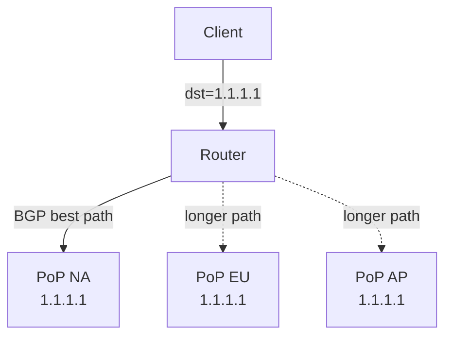

# How to Configure Anycast with IPv4 Using BGP

Author: [nawazdhandala](https://www.github.com/nawazdhandala)

Tags: Anycast, BGP, IPv4, Networking, High Availability, DNS

Description: Anycast assigns the same IP address to multiple servers in different locations, and BGP routing ensures clients are directed to the nearest instance, enabling high availability and geographic load...

## What Is Anycast?

In anycast, multiple nodes share the same IP address. BGP advertises the same prefix from multiple points of presence (PoPs). Routers use BGP best-path selection and routing policy to send each client to the topologically preferred instance.



## How Cloudflare, Google DNS Use Anycast

DNS resolvers like `8.8.8.8` (Google) and `1.1.1.1` (Cloudflare) are anycast addresses. Multiple servers globally share these IPs; BGP routing sends each DNS query to the nearest location advertising the anycast address, subject to routing policy and network conditions.

## Setting Up a Simple Anycast with FRRouting

On each PoP server, assign the anycast IP to the loopback:

```bash
# On each anycast node (e.g., PoP in New York and London)

# Add anycast IP to loopback - /32 host route
sudo ip addr add 203.0.113.10/32 dev lo

# Verify
ip addr show lo | grep 203.0.113.10
```

Configure BGP on each node using FRRouting to advertise the /32 in a lab or controlled network. On the public Internet, operators typically announce a covering IPv4 prefix such as a /24 because longer prefixes are commonly filtered:

```nginx
# /etc/frr/frr.conf on each PoP node
router bgp 65001
  bgp router-id 10.0.1.1       ! unique per node
  no bgp ebgp-requires-policy  ! lab example; otherwise define inbound/outbound policy
  neighbor 10.0.0.1 remote-as 65000   ! upstream BGP peer

  address-family ipv4 unicast
    network 203.0.113.10/32     ! advertise anycast IP when it exists in the RIB
  exit-address-family
!
```

```bash
# Apply FRRouting config
sudo systemctl restart frr
vtysh -c "show bgp ipv4 unicast 203.0.113.10/32"
```

## Health Check Integration

A simple anycast design can withdraw the route if the service is unhealthy:

```bash
#!/bin/bash
# health_check.sh - run every 30s via a systemd timer
ANYCAST_IP="203.0.113.10"
IFACE="lo"

if curl -sf http://127.0.0.1/health > /dev/null 2>&1; then
    # Ensure the anycast IP is present
    ip addr show "$IFACE" | grep -q "$ANYCAST_IP" || \
        ip addr add "$ANYCAST_IP/32" dev "$IFACE"
else
    # Remove anycast IP - BGP will withdraw the route
    ip addr show "$IFACE" | grep -q "$ANYCAST_IP" && \
        ip addr del "$ANYCAST_IP/32" dev "$IFACE"
    echo "Service unhealthy - removed anycast IP"
fi
```

## Anycast vs Load Balancer

| Property | Anycast | Traditional Load Balancer |
|----------|---------|--------------------------|
| Geographic distribution | Yes (via routing across multiple sites) | Usually single-site or regional unless paired with global traffic steering |
| Failover mechanism | BGP route withdrawal | Health checks |
| Session stickiness | Limited; it can change if routing changes | Yes (configurable) |
| DDoS mitigation | Can help spread traffic across PoPs | Depends on deployment and capacity |

## Key Takeaways

- Anycast assigns one IP to multiple locations; BGP routes each client to a topologically preferred instance.
- Assign the anycast IP to loopback as a /32 and advertise it via BGP in a lab or controlled network; public Internet deployments typically announce a covering /24.
- Withdraw the BGP route when service is unhealthy to redirect traffic to other PoPs.
- Anycast is not suitable for stateful sessions without additional session-sharing mechanisms.
