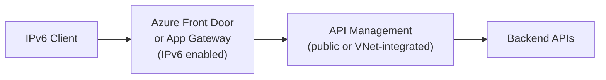

# How to Configure Azure API Management with IPv6

Author: [nawazdhandala](https://www.github.com/nawazdhandala)

Tags: Azure, API Management, IPv6, Networking, VNet, Terraform

Description: Configure Azure API Management to accept IPv6 traffic by deploying it behind an IPv6-enabled Application Gateway or configuring dual-stack VNet integration.

## Introduction

Azure API Management (APIM) does not natively expose an IPv6 endpoint on its own. IPv6 access is achieved by fronting APIM with an Azure Application Gateway or Azure Front Door, both of which support IPv6.

## Architecture Overview



## Option 1: Azure Front Door (Recommended for Global IPv6)

Azure Front Door Standard/Premium provides a public endpoint that can be reached over IPv6. For classic APIM tiers, a network-injected APIM instance must be in external mode when used as a public Front Door origin. Front Door Premium can also connect to APIM by using Private Link.

```bash
# Create a Front Door profile

az afd profile create \
  --profile-name my-afd-profile \
  --resource-group my-rg \
  --sku Standard_AzureFrontDoor

# Create an endpoint
az afd endpoint create \
  --profile-name my-afd-profile \
  --endpoint-name my-api-endpoint \
  --resource-group my-rg \
  --enabled-state Enabled

# Add an origin group pointing to the APIM gateway
az afd origin-group create \
  --profile-name my-afd-profile \
  --origin-group-name apim-origins \
  --resource-group my-rg \
  --probe-request-type GET \
  --probe-path /status-0123456789abcdef \
  --probe-protocol Https \
  --probe-interval-in-seconds 30

az afd origin create \
  --profile-name my-afd-profile \
  --origin-group-name apim-origins \
  --origin-name apim-origin \
  --resource-group my-rg \
  --host-name myapim.azure-api.net \
  --origin-host-header myapim.azure-api.net \
  --https-port 443

# Create a route so the endpoint forwards traffic to APIM
az afd route create \
  --profile-name my-afd-profile \
  --endpoint-name my-api-endpoint \
  --route-name apim-route \
  --resource-group my-rg \
  --origin-group apim-origins \
  --supported-protocols Http Https \
  --https-redirect Enabled \
  --link-to-default-domain Enabled \
  --forwarding-protocol HttpsOnly
```

Use the endpoint hostname that Front Door assigns to the endpoint when you validate IPv6 reachability.

## Option 2: Application Gateway v2 with IPv6 Frontend

Application Gateway IPv6 support requires a new v2 gateway in a dual-stack VNet. Existing IPv4-only gateways can't be upgraded to dual stack. After the gateway exists, add an IPv6 public IP, an IPv6 frontend IP configuration, and a listener/rule bound to that frontend.

```bash
# Create an IPv6 public IP for the Application Gateway frontend
az network public-ip create \
  --name my-ipv6-pip \
  --resource-group my-rg \
  --location eastus \
  --sku Standard \
  --allocation-method Static \
  --version IPv6

# Add an IPv6 frontend IP configuration to the dual-stack gateway
az network application-gateway frontend-ip create \
  --gateway-name my-appgw \
  --resource-group my-rg \
  --name appgw-frontend-ipv6 \
  --public-ip-address my-ipv6-pip

# Create a frontend port and bind a listener/routing rule to the IPv6 frontend
az network application-gateway frontend-port create \
  --gateway-name my-appgw \
  --resource-group my-rg \
  --name https-port \
  --port 443

az network application-gateway listener create \
  --gateway-name my-appgw \
  --resource-group my-rg \
  --name apim-ipv6-listener \
  --frontend-ip appgw-frontend-ipv6 \
  --frontend-port https-port \
  --ssl-cert my-frontend-cert

# Reuse your existing APIM backend pool and backend HTTP settings
az network application-gateway rule create \
  --gateway-name my-appgw \
  --resource-group my-rg \
  --name apim-ipv6-rule \
  --http-listener apim-ipv6-listener \
  --rule-type Basic \
  --address-pool appGatewayBackendPool \
  --http-settings appGatewayBackendHttpSettings
```

## Terraform: APIM with Front Door IPv6

```hcl
locals {
  apim_gateway_host = trimsuffix(trimprefix(azurerm_api_management.main.gateway_url, "https://"), "/")
}

resource "azurerm_cdn_frontdoor_profile" "apim_fd" {
  name                = "apim-frontdoor"
  resource_group_name = azurerm_resource_group.main.name
  sku_name            = "Standard_AzureFrontDoor"
}

resource "azurerm_cdn_frontdoor_endpoint" "apim_endpoint" {
  name                     = "apim-endpoint"
  cdn_frontdoor_profile_id = azurerm_cdn_frontdoor_profile.apim_fd.id
}

resource "azurerm_cdn_frontdoor_origin_group" "apim" {
  name                     = "apim-origins"
  cdn_frontdoor_profile_id = azurerm_cdn_frontdoor_profile.apim_fd.id

  health_probe {
    path                = "/status-0123456789abcdef"
    protocol            = "Https"
    request_type        = "GET"
    interval_in_seconds = 30
  }

  load_balancing {}
}

resource "azurerm_cdn_frontdoor_origin" "apim" {
  name                          = "apim-origin"
  cdn_frontdoor_origin_group_id = azurerm_cdn_frontdoor_origin_group.apim.id
  enabled                       = true
  certificate_name_check_enabled = true
  host_name                     = local.apim_gateway_host
  origin_host_header            = local.apim_gateway_host
  https_port                    = 443
  priority                      = 1
  weight                        = 1000
}

resource "azurerm_cdn_frontdoor_route" "apim" {
  name                          = "apim-route"
  cdn_frontdoor_endpoint_id     = azurerm_cdn_frontdoor_endpoint.apim_endpoint.id
  cdn_frontdoor_origin_group_id = azurerm_cdn_frontdoor_origin_group.apim.id
  cdn_frontdoor_origin_ids      = [azurerm_cdn_frontdoor_origin.apim.id]
  supported_protocols           = ["Http", "Https"]
  forwarding_protocol           = "HttpsOnly"
  https_redirect_enabled        = true
  patterns_to_match             = ["/*"]
  link_to_default_domain        = true
}
```

## Step 3: Verify IPv6 Access

```bash
# Use the exact Front Door endpoint hostname assigned to your endpoint
AFD_HOST="my-api-endpoint-<hash>.z01.azurefd.net"

# Check that the Front Door hostname resolves to IPv6
dig AAAA "$AFD_HOST"

# Test API over IPv6
curl -6 "https://$AFD_HOST/my-api/v1/health"

# Test with APIM subscription key
curl -6 "https://$AFD_HOST/my-api/v1/resource" \
  -H "Ocp-Apim-Subscription-Key: your-key"
```

## Handle IPv6 Client IPs in APIM Policies

```xml
<!-- APIM inbound policy to log client IP -->
<inbound>
    <set-variable name="clientAddress"
        value="@(context.Request.Headers.GetValueOrDefault(&quot;X-Azure-ClientIP&quot;, context.Request.Headers.GetValueOrDefault(&quot;X-Forwarded-For&quot;, context.Request.IpAddress)))" />
    <!-- Behind Front Door or Application Gateway, prefer forwarded client IP headers -->
    <trace source="client-ip">
        <message>@($"Client address: {context.Variables["clientAddress"]}")</message>
    </trace>
    <base />
</inbound>
```

## Conclusion

Azure API Management achieves IPv6 access through Front Door (global) or Application Gateway v2 (regional). Both approaches require no changes to APIM itself. Use OneUptime to monitor both the Front Door IPv6 endpoint and internal APIM health checks simultaneously.
