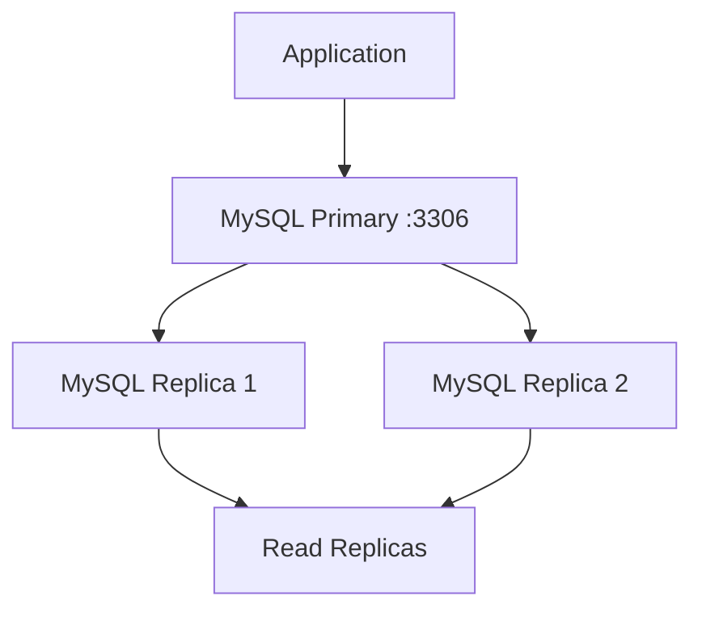

# How to Deploy a MySQL Cluster with Portainer

Author: [nawazdhandala](https://www.github.com/nawazdhandala)

Tags: Portainer, MySQL, Database Cluster, Docker Swarm, High Availability, Replication

Description: Learn how to deploy a highly available MySQL cluster using Group Replication or primary-replica setup via Portainer stacks.

---

MySQL replication in Docker requires careful orchestration of replication, networking, and health checks. Portainer stacks make it straightforward to define and deploy a primary-replica MySQL setup.

## Architecture Overview



## Primary-Replica Setup

For a standalone Portainer stack, deploy a primary MySQL node with binary logging enabled:

```yaml
version: "3.8"

services:
  mysql-primary:
    image: mysql:8.0
    environment:
      MYSQL_ROOT_PASSWORD: rootpassword
      MYSQL_DATABASE: appdb
      MYSQL_USER: appuser
      MYSQL_PASSWORD: apppassword
    command: >
      --server-id=1
      --log-bin=mysql-bin
      --binlog-format=ROW
      --gtid-mode=ON
      --enforce-gtid-consistency=ON
    volumes:
      - mysql_primary_data:/var/lib/mysql
    networks:
      - mysql_cluster
    healthcheck:
      test: ["CMD", "mysqladmin", "ping", "-h", "localhost", "-u", "root", "-prootpassword"]
      interval: 10s
      timeout: 5s
      retries: 5

  mysql-replica:
    image: mysql:8.0
    environment:
      MYSQL_ROOT_PASSWORD: rootpassword
    command: >
      --server-id=2
      --log-bin=mysql-bin
      --binlog-format=ROW
      --gtid-mode=ON
      --enforce-gtid-consistency=ON
      --read-only=ON
    volumes:
      - mysql_replica_data:/var/lib/mysql
    networks:
      - mysql_cluster
    depends_on:
      mysql-primary:
        condition: service_healthy

volumes:
  mysql_primary_data:
  mysql_replica_data:

networks:
  mysql_cluster:
    driver: bridge
```

## Configuring Replication

After the stack starts, configure replication from the primary node:

```bash
# On the primary: create a replication user

docker exec -i $(docker ps -qf name=mysql-primary) mysql -uroot -prootpassword -e "
CREATE USER 'replicator'@'%' IDENTIFIED BY 'replpassword';
GRANT REPLICATION SLAVE ON *.* TO 'replicator'@'%';
FLUSH PRIVILEGES;
"

# On the replica: point it at the primary
docker exec -i $(docker ps -qf name=mysql-replica) mysql -uroot -prootpassword -e "
CHANGE REPLICATION SOURCE TO
  SOURCE_HOST='mysql-primary',
  SOURCE_USER='replicator',
  SOURCE_PASSWORD='replpassword',
  SOURCE_AUTO_POSITION=1,
  GET_SOURCE_PUBLIC_KEY=1;
START REPLICA;
"
```

## Verifying Replication Status

Check that the replica is in sync:

```bash
# Check replica status
docker exec -i $(docker ps -qf name=mysql-replica) mysql -uroot -prootpassword -e "SHOW REPLICA STATUS\G" | grep -E "Replica_IO_Running|Replica_SQL_Running|Seconds_Behind_Source"

# Expected output:
# Replica_IO_Running: Yes
# Replica_SQL_Running: Yes
# Seconds_Behind_Source: 0
```

## Adding a ProxySQL Load Balancer

Route writes to primary and reads to replicas automatically:

```yaml
  proxysql:
    image: proxysql/proxysql:latest
    ports:
      - "6033:6033"   # MySQL protocol port
      - "6032:6032"   # Admin port
    volumes:
      - ./proxysql.cnf:/etc/proxysql.cnf
    networks:
      - mysql_cluster
    depends_on:
      - mysql-primary
      - mysql-replica
```

A minimal `proxysql.cnf` for a fresh ProxySQL instance routes writes (hostgroup 10) to primary and reads (hostgroup 20) to replicas:

```ini
datadir="/var/lib/proxysql"

admin_variables=
{
  admin_credentials="admin:admin;radmin:radmin"
  mysql_ifaces="0.0.0.0:6032"
}

mysql_variables=
{
  interfaces="0.0.0.0:6033"
  threads=4
  max_connections=2048
  default_schema="information_schema"
}

mysql_servers=
(
  {
    address="mysql-primary"
    port=3306
    hostgroup=10
    max_connections=100
  },
  {
    address="mysql-replica"
    port=3306
    hostgroup=20
    max_connections=100
    weight=1000
  }
)

mysql_users=
(
  {
    username="appuser"
    password="apppassword"
    default_hostgroup=10
    transaction_persistent=1
    active=1
  }
)

mysql_query_rules=
(
  {
    rule_id=1
    active=1
    match_pattern="^SELECT.*FOR UPDATE$"
    destination_hostgroup=10
    apply=1
  },
  {
    rule_id=2
    active=1
    match_pattern="^SELECT"
    destination_hostgroup=20
    apply=1
  }
)
```

## Scaling Read Replicas in Swarm

In Docker Swarm mode, use an `overlay` network instead of the `bridge` network above, and add more replica services rather than increasing `deploy.replicas`, because each replica needs its own `server-id`, persistent volume, and replication configuration:

```yaml
  mysql-replica-2:
    image: mysql:8.0
    environment:
      MYSQL_ROOT_PASSWORD: rootpassword
    command: >
      --server-id=3
      --log-bin=mysql-bin
      --binlog-format=ROW
      --gtid-mode=ON
      --enforce-gtid-consistency=ON
      --read-only=ON
    volumes:
      - mysql_replica2_data:/var/lib/mysql
    networks:
      - mysql_cluster
    deploy:
      restart_policy:
        condition: on-failure
```

## Monitoring with OneUptime

OneUptime can monitor the cluster endpoint and alert if the primary becomes unavailable, or if replica lag exceeds a threshold via a custom probe script.
