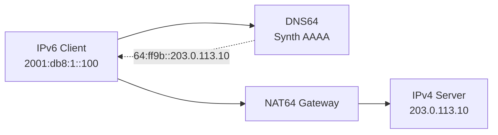

# How to Deploy NAT64/DNS64 at ISP Scale

Author: [nawazdhandala](https://www.github.com/nawazdhandala)

Tags: IPv6, NAT64, DNS64, ISP, IPv4 Transition, Jool

Description: Deploy NAT64 and DNS64 at ISP scale to enable IPv6-only subscribers to access IPv4-only services using Jool and BIND.

## What is NAT64/DNS64?

NAT64 translates IPv6 packets to IPv4, enabling IPv6-only clients to reach IPv4-only servers. DNS64 synthesizes AAAA records for hosts that only have A records, pointing to the NAT64 gateway's IPv6 prefix.



## Well-Known NAT64 Prefix

The well-known NAT64 prefix is `64:ff9b::/96`. IPv4 addresses are embedded in the last 32 bits:
- IPv4 `203.0.113.10` → IPv6 `64:ff9b::203.0.113.10` = `64:ff9b::cb00:710a`

## Deploying Jool (NAT64)

Jool is an open-source NAT64 implementation for Linux:

```bash
# Install Jool on Ubuntu/Debian
apt install linux-headers-$(uname -r)

apt install jool-dkms jool-tools

# Load the Jool kernel module
modprobe jool

# Create a NAT64 instance
jool instance add "nat64-main" --netfilter --pool6 64:ff9b::/96

# Add IPv4 pool addresses (public IPv4 pool for NAT)
jool -i nat64-main pool4 add --tcp 203.0.113.0/24 1-65535
jool -i nat64-main pool4 add --udp 203.0.113.0/24 1-65535
jool -i nat64-main pool4 add --icmp 203.0.113.0/24 0-65535

# Verify the instance is running
jool instance display
jool -i nat64-main session display
```

## Enable IP Forwarding

```bash
# Enable IPv4 and IPv6 forwarding on the NAT64 server
sysctl -w net.ipv4.ip_forward=1
sysctl -w net.ipv6.conf.all.forwarding=1

# Make persistent
echo "net.ipv4.ip_forward=1" >> /etc/sysctl.conf
echo "net.ipv6.conf.all.forwarding=1" >> /etc/sysctl.conf
```

## Deploying DNS64 with BIND

Configure BIND to synthesize AAAA records for IPv4-only hosts:

```text
// /etc/bind/named.conf.options
acl rfc1918 { 10/8; 192.168/16; 172.16/12; };

options {
    // DNS64 - synthesize AAAA for IPv4-only hosts
    dns64 64:ff9b::/96 {
        clients { any; };
        mapped { !rfc1918; any; };  // Don't synthesize for RFC1918 IPv4
        exclude { 64:ff9b::/96; ::ffff:0.0.0.0/96; };  // Ignore translated and IPv4-mapped AAAA answers when synthesizing
    };

    // Resolver address
    listen-on-v6 { 2001:db8:53::1; };
};
```

Restart BIND:

```bash
systemctl restart bind9.service

# Test DNS64 synthesis
dig AAAA ipv4only.arpa +short @2001:db8:53::1
# Expected: 64:ff9b::c000:aa and 64:ff9b::c000:ab
```

## Routing NAT64 Traffic

Ensure the `64:ff9b::/96` prefix is routed to the NAT64 server inside your ISP:

```text
# Announce NAT64 prefix from NAT64 servers via internal BGP
router bgp 65001
 address-family ipv6
  network 64:ff9b::/96
```

## Scaling NAT64

For ISP scale, run multiple NAT64 instances with anycast:

- Deploy NAT64 servers in each PoP
- Announce `64:ff9b::/96` from all PoPs via internal BGP anycast
- Each server uses a subset of the IPv4 pool, and those pool addresses route back to the owning server

## Monitoring NAT64

```bash
# Monitor active NAT64 sessions
jool -i nat64-main stats display | grep JSTAT_SESSIONS

# Check pool4 utilization (TCP table shown here)
jool -i nat64-main pool4 display --tcp
```

## Conclusion

NAT64/DNS64 enables IPv6-only subscribers to reach IPv4 services. Jool provides a production-ready NAT64 implementation for Linux, and BIND's DNS64 support handles automatic AAAA synthesis. For ISP scale, deploy both across multiple PoPs, anycast the NAT64 prefix inside the ISP, and ensure each translator owns routable pool4 space.
