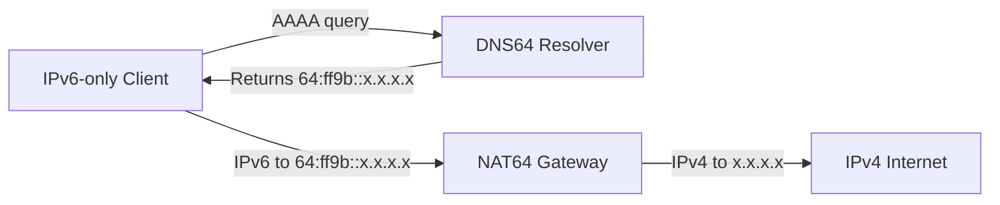

# How to Deploy NAT64 and DNS64 Together

Author: [nawazdhandala](https://www.github.com/nawazdhandala)

Tags: IPv6, NAT64, DNS64, IPv6 Transition, Network Architecture

Description: A complete guide to deploying NAT64 and DNS64 as a coordinated pair to provide IPv6-only clients seamless access to the IPv4 internet.

## Overview

NAT64 and DNS64 work together as a pair. DNS64 gives IPv6-only clients a synthesized IPv6 address to connect to, and NAT64 translates the resulting connection to the real IPv4 destination. Neither works well in isolation for IPv6-only clients.



## Architecture Options

**Option 1: Combined node** - DNS64 and NAT64 run on the same Linux host. Simplest for small deployments.

**Option 2: Separate nodes** - DNS64 runs on dedicated resolver infrastructure; NAT64 runs on a router/gateway. Better for production scale.

## Step 1: Deploy the NAT64 Gateway with Jool

On the NAT64 gateway host:

```bash
# Install Jool

apt install jool-dkms jool-tools

# Load the kernel module
modprobe jool

# Create a NAT64 instance
# If you also need to translate non-global IPv4 destinations, use a network-specific /96 instead of 64:ff9b::/96.
jool instance add --iptables --pool6 64:ff9b::/96

# Add IPv4 pool - replace with your public IPv4 range
jool pool4 add --tcp 203.0.113.0/28 61001-65535
jool pool4 add --udp 203.0.113.0/28 61001-65535
jool pool4 add --icmp 203.0.113.0/28 0-65535

# Configure iptables to route traffic through Jool
ip6tables -t mangle -A PREROUTING -d 64:ff9b::/96 -j JOOL --instance default
iptables -t mangle -A PREROUTING -d 203.0.113.0/28 -p tcp --dport 61001:65535 -j JOOL --instance default
iptables -t mangle -A PREROUTING -d 203.0.113.0/28 -p udp --dport 61001:65535 -j JOOL --instance default
iptables -t mangle -A PREROUTING -d 203.0.113.0/28 -p icmp -j JOOL --instance default

# Enable forwarding
sysctl -w net.ipv6.conf.all.forwarding=1
sysctl -w net.ipv4.ip_forward=1
```

## Step 2: Deploy the DNS64 Resolver with BIND

On the DNS64 resolver host (or the same host):

```bash
# Install BIND
apt install bind9

# Replace named.conf.options with a minimal DNS64 resolver configuration
cat > /etc/bind/named.conf.options << 'EOF'
options {
    directory "/var/cache/bind";
    dnssec-validation auto;
    statistics-file "/var/cache/bind/named.stats";

    allow-recursion { 2001:db8:100::/64; localhost; localnets; };
    allow-query-cache { 2001:db8:100::/64; localhost; localnets; };

    dns64 64:ff9b::/96 {
        clients { 2001:db8:100::/64; localhost; localnets; };
        mapped { !10.0.0.0/8; !172.16.0.0/12; !192.168.0.0/16; any; };
    };
};
EOF

# Restart BIND
named-checkconf && systemctl restart bind9
```

## Step 3: Configure IPv6-Only Clients

Configure IPv6-only clients to use the DNS64 resolver. The simplest approach is via DHCPv6 or Router Advertisements:

```bash
# Install radvd
apt install radvd

# radvd configuration to advertise the client prefix and DNS64 resolver via RDNSS (RFC 8106)
# /etc/radvd.conf
cat > /etc/radvd.conf << 'EOF'
interface eth0 {
    AdvSendAdvert on;
    MinRtrAdvInterval 3;
    MaxRtrAdvInterval 10;

    RDNSS 2001:db8:100::53 {
        AdvRDNSSLifetime 1800;
    };

    prefix 2001:db8:100::/64 {
        AdvOnLink on;
        AdvAutonomous on;
    };
};
EOF

systemctl restart radvd
```

## Step 4: Verify End-to-End Connectivity

From an IPv6-only client:

```bash
# Step 1: Verify DNS64 synthesizes AAAA records for an IPv4-only test name
dig +short AAAA ipv4only.arpa @2001:db8:100::53

# Step 2: Verify NAT64 translates traffic
# Ping a known reachable IPv4 address via the NAT64 prefix
ping6 64:ff9b::8.8.8.8

# Step 3: Test an IPv4-only HTTP service by name
curl -6 http://http.badssl.com
```

## Step 5: Monitor the Deployment

```bash
# Check NAT64 session table to confirm active translations
jool session display --tcp --numeric | head -20

# Dump BIND statistics
rndc stats && tail -50 /var/cache/bind/named.stats

# Test multiple synthesized destinations
for TARGET in 64:ff9b::8.8.8.8 64:ff9b::1.1.1.1; do
    ping6 -c 3 "$TARGET"
done
```

## Troubleshooting the Combined Deployment

| Symptom | Likely Cause | Fix |
|---|---|---|
| DNS64 returns synthesized AAAA but ping fails | NAT64 gateway not reachable | Check route to NAT64 gateway from client |
| DNS64 returns no synthesized AAAA for `ipv4only.arpa` | Wrong DNS server used or DNS64 not enabled | Verify client is using the DNS64 resolver and that the `dns64` block is loaded |
| NAT64 translates but no response | IPv4 pool exhausted or blocked | Check pool4, check upstream IPv4 firewall |
| Connection hangs after TCP handshake | MTU issue | Verify PMTUD is working, allow ICMPv6 Packet Too Big, and apply TCP MSS clamping if needed |

## Ensuring the Prefix Is Consistent

The single most important requirement is that DNS64 and NAT64 use **identical prefixes**. A mismatch means DNS64 synthesizes addresses the NAT64 gateway doesn't translate:

```bash
# Verify NAT64 prefix
jool global display | grep pool6
# Output: 64:ff9b::/96

# Verify DNS64 prefix in BIND
grep dns64 /etc/bind/named.conf.options
# Output: dns64 64:ff9b::/96 { ... }
```

## Summary

Deploying NAT64+DNS64 together requires: a NAT64 gateway (Jool recommended), a DNS64 resolver (BIND, Unbound, or CoreDNS), consistent prefix configuration between both, and clients configured to use the DNS64 resolver. Test end-to-end with `dig AAAA ipv4only.arpa` followed by a `ping6` or an application test against an IPv4-only service to confirm full connectivity.
