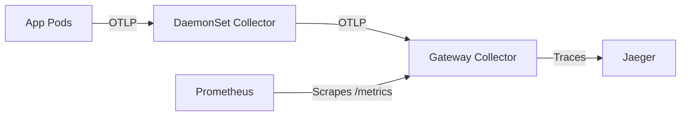

# How to Deploy OpenTelemetry Collector on Rancher

Author: [nawazdhandala](https://www.github.com/nawazdhandala)

Tags: Rancher, OpenTelemetry, Observability, Trace, Metric, Log

Description: Deploy the OpenTelemetry Collector on Rancher as a DaemonSet and Gateway, configure pipelines to route telemetry to multiple backends.

## Introduction

The OpenTelemetry Collector is a vendor-agnostic agent that receives, processes, and exports telemetry data (traces, metrics, logs). Deploying it as a DaemonSet ensures every node collects telemetry, while a central Gateway collector aggregates traces for Jaeger and exposes a Prometheus scrape endpoint for metrics.

## Collector Architecture



## Step 1: Add the OpenTelemetry Repository

```bash
helm repo add open-telemetry https://open-telemetry.github.io/opentelemetry-helm-charts
helm repo update
```

## Step 2: Deploy the DaemonSet Collector

The DaemonSet collector runs on every node and collects node-level and pod-level telemetry.

```yaml
# otel-daemonset-values.yaml

mode: daemonset   # One pod per node

image:
  repository: ghcr.io/open-telemetry/opentelemetry-collector-releases/opentelemetry-collector-k8s

command:
  name: otelcol-k8s

presets:
  kubeletMetrics:
    enabled: true

ports:
  jaeger-compact:
    enabled: false
  jaeger-thrift:
    enabled: false
  jaeger-grpc:
    enabled: false
  zipkin:
    enabled: false

config:
  receivers:
    jaeger: null
    prometheus: null
    zipkin: null
    otlp:
      protocols:
        grpc:
          endpoint: 0.0.0.0:4317    # Accept traces/metrics from apps
        http:
          endpoint: 0.0.0.0:4318

  processors:
    batch:
      timeout: 10s
    memory_limiter:
      check_interval: 1s
      limit_mib: 400
      spike_limit_mib: 80

  exporters:
    debug: null
    otlp/gateway:
      endpoint: otel-gateway-collector.observability.svc.cluster.local:4317
      tls:
        insecure: true

  service:
    pipelines:
      logs: null
      traces:
        receivers: [otlp]
        processors: [memory_limiter, batch]
        exporters: [otlp/gateway]
      metrics:
        receivers: [otlp, kubeletstats]
        processors: [memory_limiter, batch]
        exporters: [otlp/gateway]
```

```bash
kubectl create namespace observability

helm install otel-daemonset open-telemetry/opentelemetry-collector \
  --namespace observability \
  --values otel-daemonset-values.yaml
```

## Step 3: Deploy the Gateway Collector

The Gateway aggregates telemetry, forwards traces to Jaeger, and exposes metrics for Prometheus scraping.

```yaml
# otel-gateway-values.yaml
mode: deployment
replicaCount: 2
fullnameOverride: otel-gateway-collector

image:
  repository: ghcr.io/open-telemetry/opentelemetry-collector-releases/opentelemetry-collector-contrib

command:
  name: otelcol-contrib

ports:
  otlp-http:
    enabled: false
  jaeger-compact:
    enabled: false
  jaeger-thrift:
    enabled: false
  jaeger-grpc:
    enabled: false
  zipkin:
    enabled: false
  prometheus:
    enabled: true
    containerPort: 8889
    servicePort: 8889
    protocol: TCP

config:
  receivers:
    jaeger: null
    prometheus: null
    zipkin: null
    otlp:
      protocols:
        grpc:
          endpoint: 0.0.0.0:4317

  exporters:
    debug: null
    otlp/jaeger:
      endpoint: jaeger-collector.observability.svc.cluster.local:4317
      tls:
        insecure: true
    prometheus:
      endpoint: 0.0.0.0:8889

  service:
    pipelines:
      logs: null
      traces:
        receivers: [otlp]
        exporters: [otlp/jaeger]
      metrics:
        receivers: [otlp]
        exporters: [prometheus]
```

```bash
helm install otel-gateway open-telemetry/opentelemetry-collector \
  --namespace observability \
  --values otel-gateway-values.yaml
```

Prometheus should scrape the Gateway collector endpoints on port `8889`.

## Step 4: Instrument Applications

Configure applications to send telemetry to the DaemonSet collector using the node IP:

```yaml
# Application pod spec
env:
  - name: HOST_IP
    valueFrom:
      fieldRef:
        fieldPath: status.hostIP
  - name: OTEL_EXPORTER_OTLP_PROTOCOL
    value: grpc
  - name: OTEL_EXPORTER_OTLP_ENDPOINT
    value: "http://$(HOST_IP):4317"
  - name: OTEL_SERVICE_NAME
    value: "my-service"
```

## Conclusion

The OpenTelemetry Collector on Rancher provides a flexible telemetry pipeline that decouples application instrumentation from backend storage. Changing your trace or metrics backend requires only a collector configuration update-no application code changes needed.
