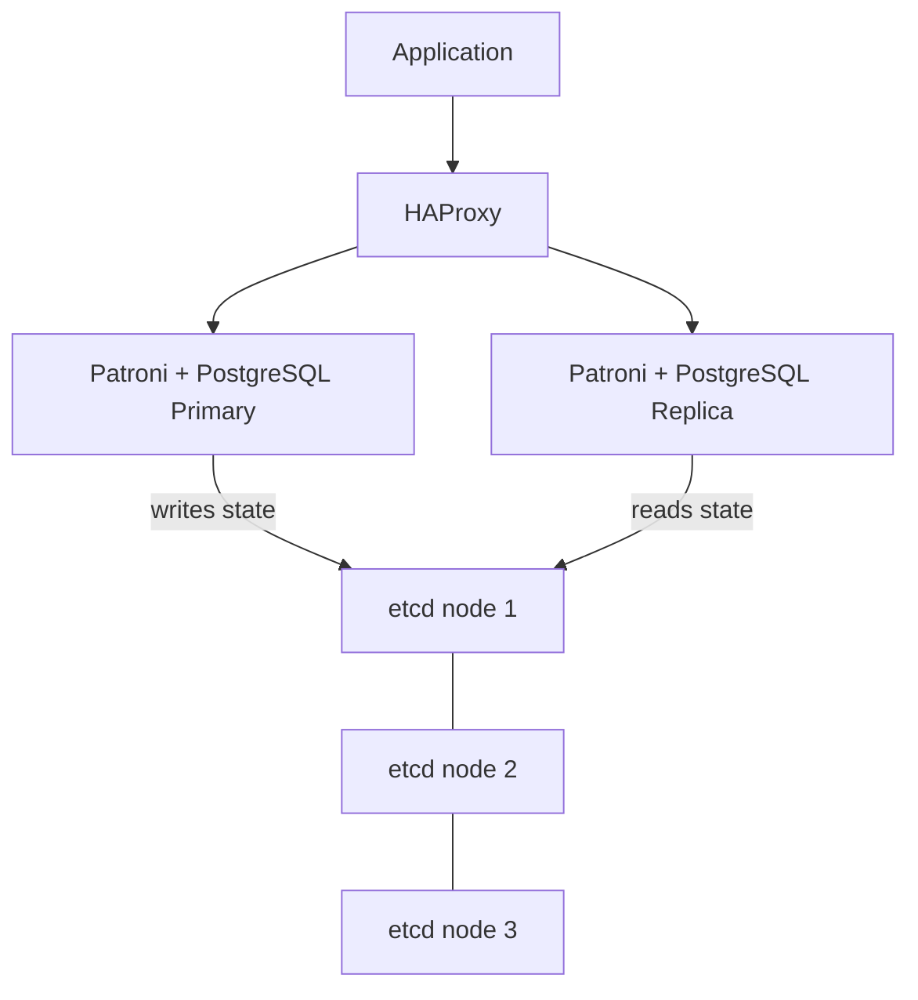

# How to Deploy a PostgreSQL Cluster with Patroni via Portainer

Author: [nawazdhandala](https://www.github.com/nawazdhandala)

Tags: Portainer, PostgreSQL, Patroni, High Availability, Database Cluster, etcd

Description: Learn how to deploy a highly available PostgreSQL cluster using Patroni for automatic failover, managed through Portainer stacks.

---

Patroni is a Python-based HA template for PostgreSQL that uses a distributed configuration store (etcd, ZooKeeper, or Consul) to manage primary election and automatic failover. Running it in Docker via Portainer requires an etcd cluster alongside PostgreSQL nodes.

## Architecture



## etcd Cluster

Deploy a three-node etcd cluster as a prerequisite:

```yaml
version: "3.8"

services:
  etcd1:
    image: gcr.io/etcd-development/etcd:v3.5.29
    command:
      - /usr/local/bin/etcd
      - --name=etcd1
      - --data-dir=/etcd-data
      - --listen-client-urls=http://0.0.0.0:2379
      - --advertise-client-urls=http://etcd1:2379
      - --listen-peer-urls=http://0.0.0.0:2380
      - --initial-advertise-peer-urls=http://etcd1:2380
      - --initial-cluster=etcd1=http://etcd1:2380,etcd2=http://etcd2:2380,etcd3=http://etcd3:2380
      - --initial-cluster-token=patroni-etcd-cluster
      - --initial-cluster-state=new
    volumes:
      - etcd1_data:/etcd-data
    networks:
      - patroni_net

  etcd2:
    image: gcr.io/etcd-development/etcd:v3.5.29
    command:
      - /usr/local/bin/etcd
      - --name=etcd2
      - --data-dir=/etcd-data
      - --listen-client-urls=http://0.0.0.0:2379
      - --advertise-client-urls=http://etcd2:2379
      - --listen-peer-urls=http://0.0.0.0:2380
      - --initial-advertise-peer-urls=http://etcd2:2380
      - --initial-cluster=etcd1=http://etcd1:2380,etcd2=http://etcd2:2380,etcd3=http://etcd3:2380
      - --initial-cluster-token=patroni-etcd-cluster
      - --initial-cluster-state=new
    volumes:
      - etcd2_data:/etcd-data
    networks:
      - patroni_net

  etcd3:
    image: gcr.io/etcd-development/etcd:v3.5.29
    command:
      - /usr/local/bin/etcd
      - --name=etcd3
      - --data-dir=/etcd-data
      - --listen-client-urls=http://0.0.0.0:2379
      - --advertise-client-urls=http://etcd3:2379
      - --listen-peer-urls=http://0.0.0.0:2380
      - --initial-advertise-peer-urls=http://etcd3:2380
      - --initial-cluster=etcd1=http://etcd1:2380,etcd2=http://etcd2:2380,etcd3=http://etcd3:2380
      - --initial-cluster-token=patroni-etcd-cluster
      - --initial-cluster-state=new
    volumes:
      - etcd3_data:/etcd-data
    networks:
      - patroni_net
```

## Patroni PostgreSQL Nodes

Add two PostgreSQL nodes managed by Patroni:

```yaml
  pg1:
    image: patroni/patroni:latest
    hostname: pg1
    environment:
      PATRONI_NAME: pg1
      PATRONI_SCOPE: patroni-cluster
      PATRONI_POSTGRESQL_DATA_DIR: /data/pg1
      PATRONI_POSTGRESQL_LISTEN: 0.0.0.0:5432
      PATRONI_POSTGRESQL_CONNECT_ADDRESS: pg1:5432
      PATRONI_RESTAPI_LISTEN: 0.0.0.0:8008
      PATRONI_RESTAPI_CONNECT_ADDRESS: pg1:8008
      PATRONI_ETCD3_HOSTS: "etcd1:2379,etcd2:2379,etcd3:2379"
      PATRONI_SUPERUSER_USERNAME: postgres
      PATRONI_SUPERUSER_PASSWORD: supersecret
      PATRONI_REPLICATION_USERNAME: replicator
      PATRONI_REPLICATION_PASSWORD: replsecret
    volumes:
      - pg1_data:/data
    ports:
      - "8008:8008"
    networks:
      - patroni_net

  pg2:
    image: patroni/patroni:latest
    hostname: pg2
    environment:
      PATRONI_NAME: pg2
      PATRONI_SCOPE: patroni-cluster
      PATRONI_POSTGRESQL_DATA_DIR: /data/pg2
      PATRONI_POSTGRESQL_LISTEN: 0.0.0.0:5432
      PATRONI_POSTGRESQL_CONNECT_ADDRESS: pg2:5432
      PATRONI_RESTAPI_LISTEN: 0.0.0.0:8008
      PATRONI_RESTAPI_CONNECT_ADDRESS: pg2:8008
      PATRONI_ETCD3_HOSTS: "etcd1:2379,etcd2:2379,etcd3:2379"
      PATRONI_SUPERUSER_USERNAME: postgres
      PATRONI_SUPERUSER_PASSWORD: supersecret
      PATRONI_REPLICATION_USERNAME: replicator
      PATRONI_REPLICATION_PASSWORD: replsecret
    volumes:
      - pg2_data:/data
    ports:
      - "8009:8008"
    networks:
      - patroni_net

volumes:
  etcd1_data:
  etcd2_data:
  etcd3_data:
  pg1_data:
  pg2_data:

networks:
  patroni_net:
    driver: bridge
```

## Checking Cluster State

Use the Patroni REST API to inspect cluster health:

```bash
# Check cluster members and identify the leader

curl -s http://localhost:8008/cluster | jq '.members[] | {name, role, state}'

# Trigger a manual switchover
curl -s -XPOST http://localhost:8008/switchover \
  -H "Content-Type: application/json" \
  -d '{"leader":"pg1","candidate":"pg2"}'
```

## HAProxy for Transparent Failover

Route client connections through HAProxy using Patroni's health endpoints:

```bash
# haproxy.cfg snippet
backend postgresql_primary
  mode tcp
  option httpchk GET /primary
  server pg1 pg1:5432 check port 8008
  server pg2 pg2:5432 check port 8008

backend postgresql_replicas
  mode tcp
  option httpchk GET /replica
  server pg1 pg1:5432 check port 8008
  server pg2 pg2:5432 check port 8008
```

HAProxy queries `/primary` on port 8008: Patroni returns HTTP 200 only on the current primary, so write connections always land on the right node.

## Automatic Failover

Patroni automatically promotes an eligible replica when the primary fails:

1. The leader lock in etcd expires when the primary stops renewing it.
2. Eligible replicas enter Patroni's leader race and check whether they are healthy enough to promote.
3. The first eligible replica to acquire the leader lock promotes itself to primary.
4. HAProxy health checks detect the change and reroute traffic.

With Patroni defaults of `ttl=30` and `loop_wait=10`, failover is typically measured in tens of seconds rather than instantly.
