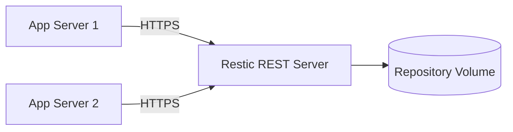

# How to Deploy Restic with REST Server via Portainer - Rest Server

Author: [nawazdhandala](https://www.github.com/nawazdhandala)

Tags: Portainer, Restic, Backup, Docker, Storage, Security

Description: Deploy the Restic REST Server as a Docker container via Portainer to host a local backup repository, then configure Restic clients to push encrypted backups to it.

---

Restic is a fast, secure backup tool that deduplicates and encrypts data before storing it. The Restic REST Server provides an HTTP backend for remote repositories, making it easy to centralize backups from multiple hosts. Deploying the REST server via Portainer gives you a managed backup target with persistent storage.

## Architecture



## Step 1: Deploy Restic REST Server via Portainer

Go to **Stacks > Add Stack** in Portainer, and make sure the Docker host already has a TLS certificate and key available at `/opt/restic-rest/certs`:

```yaml
# restic-rest-server-stack.yml

version: "3.8"

services:
  restic-rest:
    image: restic/rest-server:latest
    environment:
      # Enable TLS and use the mounted certificate and key
      - OPTIONS=--tls --tls-cert /certs/fullchain.pem --tls-key /certs/privkey.pem --tls-min-ver 1.3
    ports:
      - "8000:8000"   # Restic REST API endpoint
    volumes:
      # Repository data storage
      - restic-data:/data
      # TLS certificate and key on the Docker host
      - /opt/restic-rest/certs:/certs:ro
    restart: unless-stopped

volumes:
  restic-data:
```

## Step 2: Create Repository Users

Access the container via Portainer's **Console** tab and create a backup user:

```bash
# Inside the container - create a backup user
create_user backupuser backup-password
```

## Step 3: Initialize the Repository from a Client

From any host running the Restic CLI:

```bash
# Initialize a new repository against the REST server
export RESTIC_REPOSITORY=rest:https://backupuser:backup-password@<server-name-or-ip>:8000/myrepo
export RESTIC_PASSWORD=encryption-passphrase

# If the server certificate is already trusted by the client, you can omit --cacert
restic --cacert /path/to/ca.crt init
```

## Step 4: Run Backups

```bash
# Back up /opt/appdata to the remote repository
restic --cacert /path/to/ca.crt backup /opt/appdata

# List available snapshots
restic --cacert /path/to/ca.crt snapshots

# Restore a specific snapshot
restic --cacert /path/to/ca.crt restore latest --target /tmp/restore
```

## Step 5: Automate with Portainer Edge Jobs

If your client host is managed as a Portainer Edge environment, create a wrapper script and schedule it as an Edge Job:

```bash
#!/bin/sh
export RESTIC_REPOSITORY=rest:https://backupuser:backup-password@<server-name-or-ip>:8000/myrepo
export RESTIC_PASSWORD=encryption-passphrase

# If the server certificate is already trusted by the client, you can omit --cacert
restic --cacert /path/to/ca.crt backup /opt/appdata
restic --cacert /path/to/ca.crt forget --keep-daily 7 --keep-weekly 4 --prune
```

## Managing Retention

Restic's `forget` and `prune` commands implement retention policies:

```bash
# Keep 7 daily, 4 weekly, 6 monthly snapshots; remove the rest
restic --cacert /path/to/ca.crt forget --keep-daily 7 --keep-weekly 4 --keep-monthly 6 --prune
```

## Summary

The Restic REST Server on Portainer gives you a self-hosted, TLS-secured backup repository. Clients encrypt data before transmission, so the server never sees plaintext. Combined with Restic's deduplication, storage usage stays minimal even with frequent backups.
