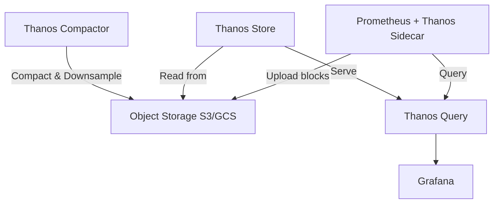

# How to Deploy Thanos on Rancher for Long-Term Metrics

Author: [nawazdhandala](https://www.github.com/nawazdhandala)

Tags: Rancher, Thanos, Prometheus, Long-Term Metrics, Object Storage, Observability

Description: Deploy Thanos on Rancher to extend Prometheus with long-term metrics storage using object storage, global query views, and downsampling.

## Introduction

Prometheus has a limited local retention window (15 days by default unless you change retention settings). Thanos extends Prometheus with potentially unlimited long-term storage by uploading metric blocks to object storage (S3, GCS, or Azure Blob), and provides a unified query interface across multiple Prometheus instances.

## Thanos Architecture



## Prerequisites

- Prometheus already running in the cluster through Rancher Monitoring / `kube-prometheus-stack`
- S3-compatible object storage bucket
- `helm` and `kubectl` configured

## Step 1: Add Bitnami Repository

```bash
helm repo add bitnami https://charts.bitnami.com/bitnami
helm repo update
```

## Step 2: Create Object Storage Secret

```yaml
# thanos-objstore-secret.yaml

apiVersion: v1
kind: Secret
metadata:
  name: thanos-objstore-secret
  namespace: monitoring
stringData:
  objstore.yml: |
    type: S3
    config:
      bucket: my-thanos-metrics
      endpoint: s3.us-east-1.amazonaws.com
      region: us-east-1
      access_key: YOUR_ACCESS_KEY
      secret_key: YOUR_SECRET_KEY
```

```bash
kubectl apply -f thanos-objstore-secret.yaml
```

## Step 3: Configure Prometheus with Thanos Sidecar

If Prometheus is managed by Rancher Monitoring / `kube-prometheus-stack`, add the Thanos sidecar to your existing Prometheus deployment:

```yaml
# prometheus-values.yaml (additions for Thanos)
prometheus:
  thanosService:
    enabled: true

  prometheusSpec:
    enableAdminAPI: true
    externalLabels:
      cluster: my-rancher-cluster
    thanos:
      image: quay.io/thanos/thanos:v0.39.2
      version: v0.39.2
      objectStorageConfig:
        existingSecret:
          name: thanos-objstore-secret
          key: objstore.yml
```

## Step 4: Deploy Thanos Components

```yaml
# thanos-values.yaml
existingObjstoreSecret: thanos-objstore-secret

query:
  enabled: true
  replicaCount: 2
  dnsDiscovery:
    enabled: true
    sidecarsService: rancher-monitoring-thanos-discovery # Replace if your Prometheus release name differs
    sidecarsNamespace: monitoring

queryFrontend:
  enabled: true

storegateway:
  enabled: true
  persistence:
    enabled: true
    size: 20Gi

compactor:
  enabled: true
  retentionResolutionRaw: 90d    # Keep raw data for 90 days
  retentionResolution5m: 1y      # Keep 5m downsampled data for 1 year
  retentionResolution1h: 10y     # Keep 1h downsampled data for 10 years
```

```bash
helm install thanos bitnami/thanos \
  --namespace monitoring \
  --values thanos-values.yaml
```

## Step 5: Configure Grafana to Use Thanos

Point Grafana at the Thanos Query Frontend instead of Prometheus directly:

```yaml
# Grafana data source configuration
datasources:
  - name: Thanos
    type: prometheus
    url: http://thanos-query-frontend.monitoring.svc.cluster.local:9090
    isDefault: true
```

## Conclusion

Thanos on Rancher provides long-term metric retention through object storage, global query federation across multiple Prometheus instances, and intelligent downsampling to keep long-term queries fast. The compactor handles block consolidation automatically, keeping object storage costs manageable.
