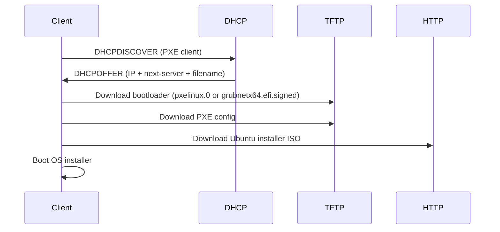

# How to Use DHCP with PXE Boot for Network Installation

Author: [nawazdhandala](https://www.github.com/nawazdhandala)

Tags: DHCP, PXE Boot, Network Installation, Sysadmin, Linux

Description: PXE (Pre-boot Execution Environment) uses DHCP options 66 and 67 to deliver TFTP server address and boot filename to network-booting clients, enabling automated OS installation without physical media.

## How PXE Boot Works



## ISC dhcpd Configuration for PXE

```text
# /etc/dhcp/dhcpd.conf

subnet 10.0.0.0 netmask 255.255.255.0 {
    range 10.0.0.100 10.0.0.150;
    option routers 10.0.0.1;

    # Legacy BIOS PXE clients
    next-server 10.0.0.10;          # TFTP server IP
    filename "pxelinux.0";          # Initial bootloader
}
```

## Setting Up the TFTP Server

```bash
# Install TFTP server
sudo apt install tftpd-hpa

# Configure
sudo tee /etc/default/tftpd-hpa << 'EOF'
TFTP_USERNAME="tftp"
TFTP_DIRECTORY="/var/lib/tftpboot"
TFTP_ADDRESS="0.0.0.0:69"
TFTP_OPTIONS="--secure"
EOF

# Install PXE bootloader files
sudo apt install pxelinux syslinux-common
sudo cp /usr/lib/PXELINUX/pxelinux.0 /var/lib/tftpboot/
sudo cp /usr/lib/syslinux/modules/bios/{ldlinux,libcom32,libutil,menu,vesamenu}.c32 /var/lib/tftpboot/

sudo systemctl enable --now tftpd-hpa
```

## PXE Menu Configuration

```bash
sudo mkdir -p /var/lib/tftpboot/pxelinux.cfg
sudo tee /var/lib/tftpboot/pxelinux.cfg/default << 'EOF'
DEFAULT menu.c32
PROMPT 0
TIMEOUT 300

MENU TITLE PXE Boot Menu

LABEL ubuntu-22.04
    MENU LABEL Ubuntu 22.04 Server Install
    KERNEL ubuntu-22.04/vmlinuz
    INITRD ubuntu-22.04/initrd
    APPEND root=/dev/ram0 ramdisk_size=1500000 cloud-config-url=/dev/null ip=dhcp url=http://10.0.0.10/ubuntu-22.04/ubuntu-22.04.5-live-server-amd64.iso

LABEL local
    MENU LABEL Boot from local disk
    LOCALBOOT 0
EOF
```

## Downloading and Staging Ubuntu Installer Files

```bash
# Install a simple HTTP server for the live-server ISO
sudo apt install apache2
sudo systemctl enable --now apache2

# Download Ubuntu 22.04 live-server ISO
sudo mkdir -p /var/lib/tftpboot/ubuntu-22.04 /var/www/html/ubuntu-22.04
wget -O /tmp/ubuntu-22.04.5-live-server-amd64.iso \
  https://releases.ubuntu.com/jammy/ubuntu-22.04.5-live-server-amd64.iso

# Extract kernel and initrd for PXE
sudo mount -o loop /tmp/ubuntu-22.04.5-live-server-amd64.iso /mnt
sudo cp /mnt/casper/{vmlinuz,initrd} /var/lib/tftpboot/ubuntu-22.04/
sudo umount /mnt

# Serve the ISO over HTTP so the installer can fetch it
sudo cp /tmp/ubuntu-22.04.5-live-server-amd64.iso /var/www/html/ubuntu-22.04/
```

## Key Takeaways

- `next-server` and `filename` are the DHCP/BOOTP boot parameters most commonly used for PXE. DHCP options 66 and 67 are the corresponding TFTP server name and bootfile name options.
- Legacy BIOS PXE clients can use `pxelinux.0`; UEFI PXE clients typically use a GRUB EFI binary such as `grubnetx64.efi.signed` and a different boot menu format.
- On Ubuntu 22.04 Server, stage `vmlinuz` and `initrd` from the live-server ISO and let the installer fetch the ISO over HTTP.
- PXE boot can be combined with Ubuntu `autoinstall` configuration for unattended deployment.
