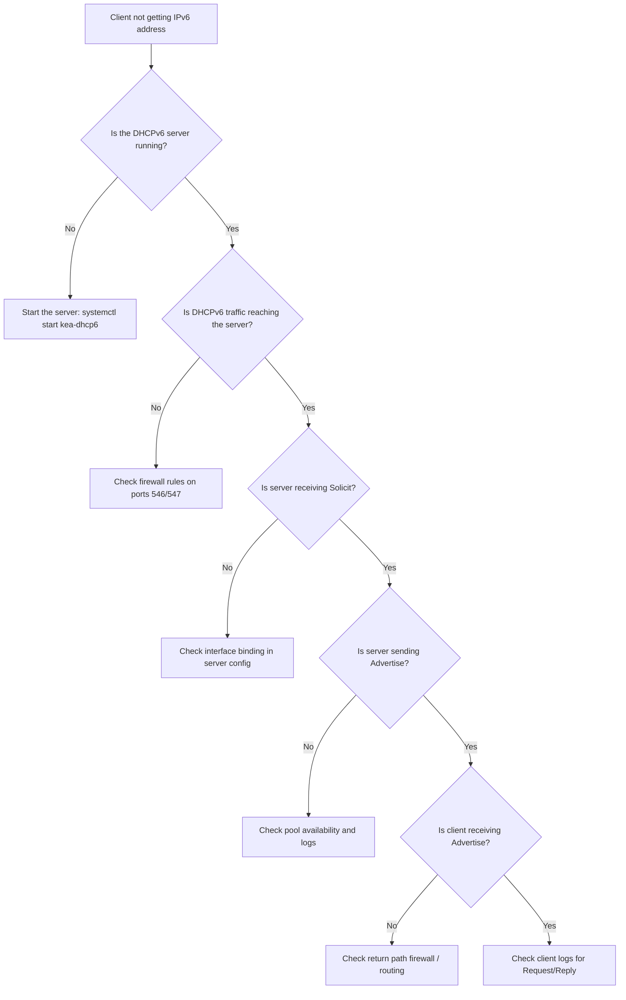

# How to Troubleshoot DHCPv6 Address Assignment Failures

Author: [nawazdhandala](https://www.github.com/nawazdhandala)

Tags: DHCPv6, IPv6, Troubleshooting, Networking, Diagnostic

Description: A systematic guide to diagnosing and resolving DHCPv6 address assignment failures using logs, packet captures, and configuration checks.

## Overview

When a DHCPv6 client fails to receive an IPv6 address, there are several layers to check: network connectivity, server configuration, firewall rules, and DUID issues. This guide provides a structured troubleshooting approach.

## Troubleshooting Checklist



## Step 1: Verify the Server is Running

```bash
# Check if Kea DHCPv6 is active

systemctl status kea-dhcp6

# Check ISC dhcpd
systemctl status isc-dhcp-server6

# Verify it's listening on port 547
ss -ulnp | grep 547
```

## Step 2: Check Server Logs

```bash
# Kea logs (adjust path based on your config)
journalctl -u kea-dhcp6 -n 50 --no-pager

# ISC dhcpd logs
tail -f /var/log/syslog | grep dhcpd

# Look for these key log entries:
# "DHCP6_PACKET_RECEIVED" - server got the Solicit
# "DHCP6_SUBNET_SELECTION_FAILED" - no matching subnet found
# "ALLOC_ENGINE_V6_ALLOC_FAIL*" - allocation failed (for example, pool exhaustion)
```

## Step 3: Capture Traffic to Verify Exchange

```bash
# On the server, capture incoming DHCPv6
sudo tcpdump -i eth0 -n -v "udp port 547"

# On the client, trigger a fresh request
sudo dhclient -6 -r eth0 && sudo dhclient -6 eth0 -v

# Typical sequence without Rapid Commit:
# Client → ff02::1:2: Solicit
# Server → client: Advertise
# Client → server: Request
# Server → client: Reply
```

## Step 4: Check Firewall Rules

```bash
# List current ip6tables rules on the server
sudo ip6tables -L -n -v

# Ensure these rules exist on the server:
# INPUT: -p udp --dport 547 -j ACCEPT
# OUTPUT: -p udp --sport 547 -j ACCEPT

# Quick fix - temporarily flush rules for testing
sudo ip6tables -F  # WARNING: removes all rules
```

## Step 5: Verify Interface Binding

Kea must be configured to listen on the correct interface:

```json
// In kea-dhcp6.conf, verify the interface is listed
{
  "Dhcp6": {
    "interfaces-config": {
      "interfaces": ["eth0"]  // Must match the interface name
    }
  }
}
```

```bash
# Verify the interface name
ip link show
# Restart Kea after fixing
systemctl restart kea-dhcp6
```

## Step 6: Check Subnet Configuration

The server must be able to select the correct subnet for the client's link:

```bash
# Check whether the client is on the expected IPv6 link
ip -6 addr show dev eth0

# For directly attached clients, Kea should have a matching subnet6 entry
# with the correct "interface". For relayed clients, match the subnet6 entry
# against the relay's link-address or interface-id.
# Example: if the client link is 2001:db8::/64, the server must have that subnet
```

## Step 7: Check Pool Availability

```bash
# Kea: check per-subnet statistics (endpoint depends on your control channel config)
curl -s -X POST http://localhost:8000/ \
  -H "Content-Type: application/json" \
  -d '{"command": "statistic-get-all", "service": ["dhcp6"], "arguments": {}}' | \
  jq '.[0].arguments | to_entries |
      map(select(.key | startswith("subnet"))) |
      map({key, value: .value[0][0]})'
```

## Common Issues and Fixes

| Issue | Symptom | Fix |
|-------|---------|-----|
| Server not listening | No packets on port 547 | Check `interfaces-config` in Kea |
| Pool exhausted | `NoAddrsAvail` (status code 2) in Advertise/Reply | Expand pool range or reduce lease time |
| Server ID / DUID mismatch | Client ignores Advertise/Reply or renewals fail | Verify client/server identifiers; clear stale client lease state if needed |
| Wrong subnet | No Advertise | Add matching subnet to server config |
| Firewall blocking | Solicit seen but no Advertise | Add ip6tables rules for port 547 |

## Summary

Common DHCPv6 address-assignment failures include the server not running, firewall rules blocking ports 546/547, incorrect subnet selection, pool exhaustion, or client/server identifier mismatches. Work through this checklist in order and use tcpdump to confirm each step.
