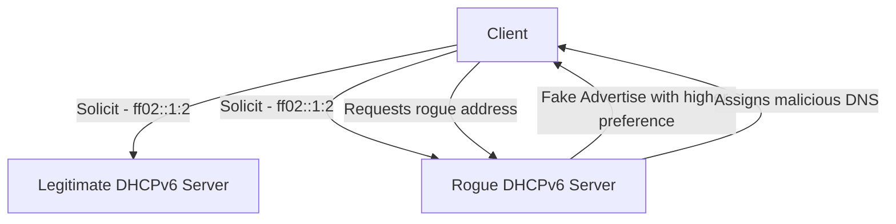

# How to Secure DHCPv6 with Authentication

Author: [nawazdhandala](https://www.github.com/nawazdhandala)

Tags: DHCPv6, IPv6, Security, Authentication, DHCP

Description: Learn how to protect DHCPv6 infrastructure using authentication options to prevent rogue server attacks and unauthorized address assignment.

## Overview

DHCPv6 includes an Authentication option in the current base specification (RFC 9915, which obsoletes RFC 8415 and RFC 3315). However, the delayed-authentication mechanism from RFC 3315 is obsolete, and common DHCP implementations generally do not support DHCPv6 Authentication for routine client/server exchanges. Without network protections, a rogue DHCPv6 server can poison clients with malicious DNS servers or incorrect prefixes.

## Threat Model



## DHCPv6 Authentication Option (Option 11)

The Authentication option is a framework for DHCP message authentication. In the current base protocol, the standardized use that remains is Reconfigure Key Authentication Protocol (RKAP) for authenticating Reconfigure messages, and RFC 9915 defines that use with HMAC-MD5.

## ISC DHCP Server Authentication Support

ISC DHCP 4.4 does not support DHCPv6 Authentication (Option 11), so there is no supported `dhcpd6.conf` syntax to enable general DHCPv6 message authentication on the server.

## ISC DHCP Client Authentication Support

ISC DHCP 4.4 likewise does not support DHCPv6 Authentication (Option 11) in `dhclient6.conf`, so `send dhcp6.authentication` and `require authentication` are not valid ISC DHCP client configuration.

## Alternative: RA-Guard and DHCPv6-Shield

For environments where DHCPv6 Authentication is unavailable or impractical, use network-layer protections:

**DHCPv6-Shield (RFC 7610)** - Implemented on managed switches to drop DHCPv6 server messages arriving on untrusted ports.

```text
! Cisco IOS - Enable DHCPv6 Guard on access ports
ipv6 dhcp guard policy CLIENT_PORTS
 device-role client

interface GigabitEthernet0/1
 ipv6 dhcp guard attach-policy CLIENT_PORTS
```

This ensures only designated uplink ports can carry DHCPv6 server messages.

## Rogue Server Detection with Monitoring

Even without DHCPv6 Authentication, monitoring tools can detect rogue DHCPv6 servers:

```bash
# Listen for DHCPv6 server messages on the network
sudo tcpdump -i eth0 -vv -n "udp port 547"

# Look for DHCPv6 Advertise messages from unexpected source addresses
# Legitimate server: fe80::1
# Unexpected: fe80::aaaa:bbbb:cccc:dddd
```

## Best Practices

1. **Deploy DHCPv6 Guard on all switches** - This is the most practical protection in most environments.
2. **Use authenticated Reconfigure only when both peers explicitly support it** - DHCPv6 Authentication is not widely implemented for general client/server exchanges.
3. **Monitor for rogue Advertise messages** - Set up IDS rules to alert on unknown DHCPv6 sources.
4. **Limit DHCPv6 multicast to known VLANs** - Use VLAN segmentation to reduce exposure.
5. **Log all DHCPv6 assignments** - Correlate IP assignments with switch port data to detect anomalies.

## Checking for Rogue Servers with nmap

```bash
# Scan for active DHCPv6 servers on the local link
sudo nmap -6 --script=broadcast-dhcp6-discover -e eth0
```

## Summary

DHCPv6 includes an Authentication option, but current standards use it primarily for authenticated Reconfigure support and common DHCP stacks such as ISC DHCP do not implement Option 11 for general use. In practice, DHCPv6 Guard on managed switches plus active monitoring is the most deployable defense against rogue servers.
