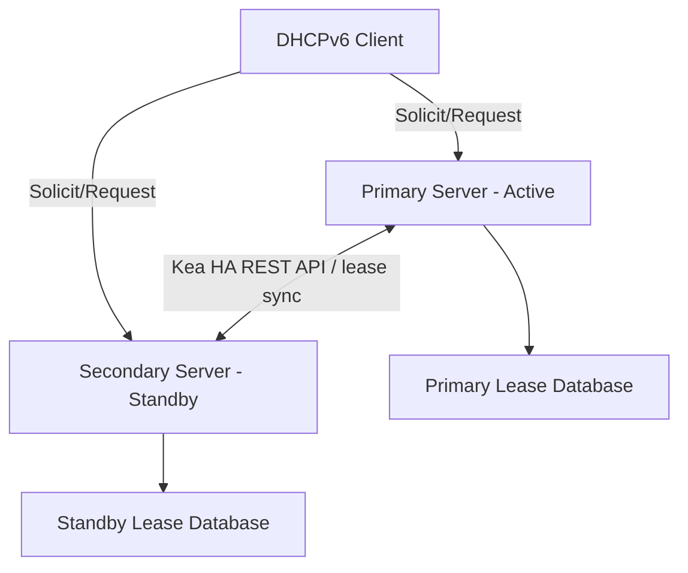

# How to Configure DHCPv6 Failover for High Availability - High Availability

Author: [nawazdhandala](https://www.github.com/nawazdhandala)

Tags: DHCPv6, IPv6, High Availability, Failover, Networking

Description: Learn how to configure DHCPv6 failover between two servers to ensure uninterrupted IPv6 address assignment in your network.

## Overview

RFC 8156 defines a DHCPv6 failover protocol, but Kea DHCP provides IPv6 high availability through its HA hook library rather than by implementing RFC 8156 failover. In a hot-standby pair, the standby server can take over if the primary fails.

## Failover Architecture



## ISC Kea DHCPv6 High Availability (HA Hook)

Kea DHCP supports HA via its `libdhcp_ha` hook library. The HA setup also requires `libdhcp_lease_cmds` so peers can exchange lease updates and synchronize state. Below is a working configuration for a two-node hot-standby setup using HTTP control sockets on each `kea-dhcp6` server.

### Primary Server Configuration

```json
// /etc/kea/kea-dhcp6.conf (Primary)
{
  "Dhcp6": {
    "control-sockets": [
      {
        "socket-type": "http",
        "socket-address": "192.0.2.1",
        "socket-port": 8000
      }
    ],
    "hooks-libraries": [
      {
        "library": "/usr/lib/kea/hooks/libdhcp_lease_cmds.so"
      },
      {
        "library": "/usr/lib/kea/hooks/libdhcp_ha.so",
        "parameters": {
          "high-availability": [{
            "this-server-name": "server1",
            "mode": "hot-standby",
            "heartbeat-delay": 10000,
            "max-response-delay": 60000,
            "max-ack-delay": 5000,
            "max-unacked-clients": 5,
            "multi-threading": {
              "enable-multi-threading": false,
              "http-dedicated-listener": false
            },
            "peers": [
              {
                "name": "server1",
                "url": "http://192.0.2.1:8000/",
                "role": "primary",
                "auto-failover": true
              },
              {
                "name": "server2",
                "url": "http://192.0.2.2:8000/",
                "role": "standby",
                "auto-failover": true
              }
            ]
          }]
        }
      }
    ],
    "subnet6": [
      {
        "id": 1,
        "subnet": "2001:db8::/32",
        "pools": [{ "pool": "2001:db8::100 - 2001:db8::200" }]
      }
    ]
  }
}
```

### Secondary Server Configuration

The secondary server uses the same configuration, but `this-server-name` must be `server2` and the local control socket must listen on `192.0.2.2`.

```json
// /etc/kea/kea-dhcp6.conf (Secondary) - only the changed fields shown
{
  "Dhcp6": {
    "control-sockets": [
      {
        "socket-address": "192.0.2.2"
      }
    ],
    "hooks-libraries": [
      {
        "library": "/usr/lib/kea/hooks/libdhcp_lease_cmds.so"
      },
      {
        "library": "/usr/lib/kea/hooks/libdhcp_ha.so",
        "parameters": {
          "high-availability": [{
            "this-server-name": "server2"
          }]
        }
      }
    ]
  }
}
```

## Enabling the Kea HTTP Control Socket

Current Kea releases can expose the REST API directly from `kea-dhcp6`, so a separate `kea-ctrl-agent` process is not required for this example. Start the DHCPv6 service on both servers:

```bash
# Start the Kea DHCPv6 service on both nodes

systemctl enable --now kea-dhcp6

# Verify it's listening
ss -tlnp | grep 8000
```

## Checking HA Status

```bash
# Query the HA state via the REST API
curl -s -X POST http://192.0.2.1:8000/ \
  -H "Content-Type: application/json" \
  -d '{"command": "ha-heartbeat", "service": ["dhcp6"]}' | jq .

# Expected output when healthy:
# [ { "result": 0, "text": "HA peer status returned.", "arguments": { "state": "hot-standby" } } ]
```

## Failover Modes

| Mode | Description |
|------|-------------|
| `hot-standby` | Primary handles all traffic; secondary takes over if primary fails |
| `load-balancing` | Both servers handle requests; each serves its own HA scope and pools must be partitioned accordingly |
| `passive-backup` | Primary serves clients and sends lease updates to backup servers; backups do not participate in automatic failover |

## Best Practices

- Use `load-balancing` mode for large deployments, but partition scopes and pools correctly between peers.
- Ensure both servers keep lease state synchronized. Kea HA can replicate leases itself, or you can rely on replicated MySQL/PostgreSQL backends and disable HA lease syncing accordingly.
- Monitor partner state carefully: exceeding `max-response-delay` marks communication as interrupted; transition to `partner-down` happens after the additional failure-detection checks unless `max-unacked-clients` is set to `0`.
- Test failover quarterly by intentionally stopping the primary and verifying new client requests and client rebinds succeed.

## Summary

DHCPv6 HA with Kea provides robust address assignment continuity. By configuring the `libdhcp_ha` hook with hot-standby or load-balancing mode, you can keep DHCPv6 service available when a server goes offline.
