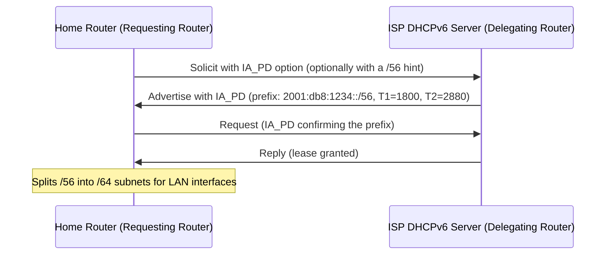

# How to Configure DHCPv6 Prefix Delegation for Home Networks

Author: [nawazdhandala](https://www.github.com/nawazdhandala)

Tags: DHCPv6, IPv6, Prefix Delegation, Home Networking, IA_PD

Description: Learn how to configure DHCPv6 Prefix Delegation (PD) on a home router to receive an IPv6 prefix from your ISP and distribute it to your LAN.

## Overview

DHCPv6 Prefix Delegation (PD), defined in RFC 8415, allows a home router (the "requesting router") to receive an IPv6 prefix from the ISP's DHCPv6 server (the "delegating router") and then assign /64 subnets to LAN interfaces or further delegate prefixes to downstream routers.

## How Prefix Delegation Works



## Linux Router: Requesting a Prefix with systemd-networkd

On a home Linux router connected to the ISP via `eth0` and serving the LAN on `eth1`:

```ini
# /etc/systemd/network/10-wan.network
[Match]
Name=eth0

[Network]
DHCP=ipv6

# The below setting is optional, to also assign an address in the delegated prefix
# to the upstream interface. If not necessary, then comment out the line below and
# the [DHCPPrefixDelegation] section.
DHCPPrefixDelegation=yes

# If the upstream network provides Router Advertisement with Managed bit set,
# then comment out the line below and WithoutRA= setting in the [DHCPv6] section.
IPv6AcceptRA=no

[DHCPv6]
WithoutRA=solicit
# Optional prefix-length hint:
# PrefixDelegationHint=::/56

[DHCPPrefixDelegation]
UplinkInterface=:self
SubnetId=0
Announce=no

# /etc/systemd/network/20-lan.network
[Match]
Name=eth1

[Network]
DHCPPrefixDelegation=yes
IPv6SendRA=yes
IPv6AcceptRA=no

[DHCPPrefixDelegation]
UplinkInterface=eth0
SubnetId=1
Announce=yes
```

Restart `systemd-networkd` and inspect the delegated prefix:

```bash
sudo systemctl restart systemd-networkd

networkctl status eth0
networkctl status eth1
```

## Distributing the Prefix to the LAN

If you are assigning a delegated prefix manually, once the router receives a `/56` prefix (e.g., `2001:db8:1234::/56`), it can assign `/64` subnets to each LAN interface and advertise them with Router Advertisements:

```bash
# Assuming the ISP delegated 2001:db8:1234::/56
# Assign 2001:db8:1234:1::/64 to the LAN interface
sudo ip -6 addr add 2001:db8:1234:1::1/64 dev eth1

# Enable IPv6 forwarding
sudo sysctl -w net.ipv6.conf.all.forwarding=1
```

```text
# /etc/radvd.conf
interface eth1 {
    AdvSendAdvert on;
    prefix 2001:db8:1234:1::/64 {
        AdvOnLink on;
        AdvAutonomous on;
    };
}
```

```bash
sudo systemctl restart radvd
```

## ISC Kea DHCP: Acting as a Delegating Router

To act as the ISP-side delegating server in a lab:

```json
// /etc/kea/kea-dhcp6.conf
{
  "Dhcp6": {
    "subnet6": [
      {
        "id": 1,
        "subnet": "2001:db8::/32",
        "pd-pools": [
          {
            // Delegate /56 prefixes from this /32 pool
            "prefix": "2001:db8::",
            "prefix-len": 32,
            "delegated-len": 56
          }
        ]
      }
    ]
  }
}
```

## OpenWrt Configuration

For OpenWrt home routers, prefix delegation is configured in `/etc/config/network`:

```text
# /etc/config/network

config interface 'wan6'
    option device   'eth0.2'
    option proto    'dhcpv6'
    option reqprefix 'auto'   # Request any available prefix
    option reqaddress 'try'   # Also try to get a global address

config interface 'lan'
    option device   'br-lan'
    option proto    'static'
    option ip6assign '60'     # Assign a /60 from the delegated prefix to LAN
```

## Verifying Prefix Delegation

```bash
# Check delegated prefixes on a Linux router
networkctl status eth0
networkctl status eth1

# If you configured the LAN manually, verify the delegated /64 on eth1
ip -6 addr show dev eth1 scope global

# On OpenWrt, inspect the delegated prefix on wan6
ifstatus wan6

# Check the delegation in Kea's lease database via the Control Agent
# (requires the lease_cmds hook library)
curl -s -X POST http://127.0.0.1:8000/ \
  -H "Content-Type: application/json" \
  -d '{"command": "lease6-get-all", "service": ["dhcp6"]}' | jq .
```

## Summary

DHCPv6 Prefix Delegation enables a home router to receive a block of IPv6 addresses from the ISP and distribute /64 subnets to each LAN segment. On Linux, `systemd-networkd` can request and distribute delegated prefixes, while OpenWrt simplifies the process with `reqprefix auto`. The key is that IA_PD requests a prefix, not an individual address, and the router must then advertise or further delegate subnets downstream.
