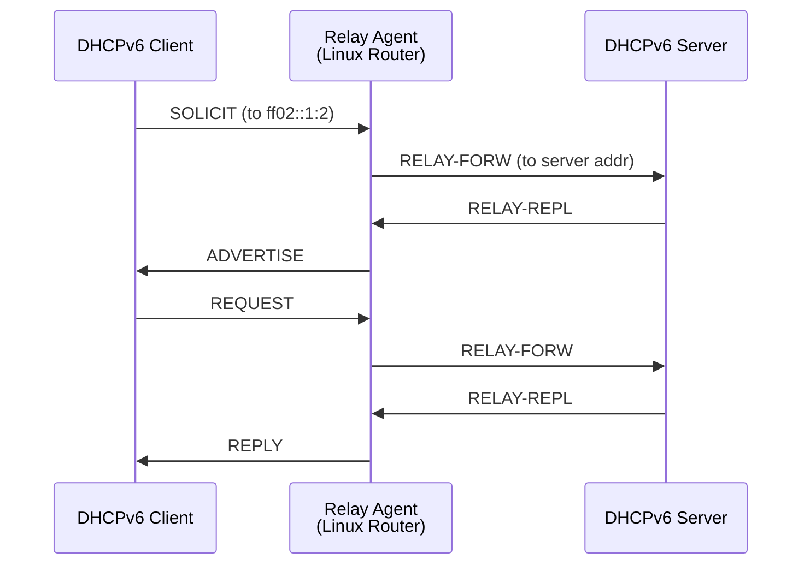

# How to Configure DHCPv6 Relay on Linux

Author: [nawazdhandala](https://www.github.com/nawazdhandala)

Tags: DHCPv6, Relay, Linux, ISC Kea, Dibbler, Networking

Description: Configure DHCPv6 relay agents on Linux using ISC Kea, dibbler, and wide-dhcpv6 to forward DHCPv6 messages between clients and servers on different subnets.

## DHCPv6 Relay Architecture



## ISC Kea DHCPv6 Server

```bash
# Install the Kea DHCPv6 server on Ubuntu

apt-get install -y kea-dhcp6-server

# Kea does not have a built-in relay agent.
# Use kea-dhcp6 on the server and a separate relay implementation on Linux.
```

## wide-dhcpv6-relay Configuration

```bash
# Install wide-dhcpv6
apt-get install -y wide-dhcpv6-relay

# /etc/default/wide-dhcpv6-relay
cat > /etc/default/wide-dhcpv6-relay << 'EOF'
# Arguments passed to dhcp6relay by the init script:
# -r eth1: server-facing interface
# -s 2001:db8::53: DHCPv6 server address
# eth0: client-facing interface to listen on
INTERFACES="-r eth1 -s 2001:db8::53 eth0"
EOF

# Start the relay
systemctl enable wide-dhcpv6-relay
systemctl start wide-dhcpv6-relay
systemctl status wide-dhcpv6-relay
```

## dibbler-relay Configuration

```bash
# Install dibbler
apt-get install -y dibbler-relay

# /etc/dibbler/relay.conf
cat > /etc/dibbler/relay.conf << 'EOF'
# Interface facing clients
iface eth0 {
    client multicast yes
    interface-id 1000
}

# Interface facing server
iface eth1 {
    server unicast 2001:db8::53
}
EOF

# Start dibbler relay
dibbler-relay start

# Check status
dibbler-relay status
```

## dhcrelay for DHCPv6 (ISC DHCP)

```bash
# Install ISC DHCP relay
apt-get install -y isc-dhcp-relay

# /etc/default/isc-dhcp-relay6
cat > /etc/default/isc-dhcp-relay6 << 'EOF'
# Lower interface (client-facing)
LOWER_INTERFACES="eth0"

# Upper interface (server-facing), with server address specified as address%interface
UPPER_INTERFACES="2001:db8::53%eth1"

# Additional dhcrelay(8) options
OPTIONS=""
EOF

systemctl restart isc-dhcp-relay6
```

## Manual DHCPv6 Relay with dhcrelay

```bash
# Run dhcrelay directly (useful for testing)
# -l eth0: lower (client-facing) interface
# -u 2001:db8::53%eth1: upper (server-facing) interface and server address
dhcrelay -6 \
    -l eth0 \
    -u 2001:db8::53%eth1

# With debug output
dhcrelay -6 -d -f \
    -l eth0 \
    -u 2001:db8::53%eth1 &

# Verify relay is working
ss -6 -ulnp | grep 547  # DHCPv6 port
```

## Firewall Rules for DHCPv6 Relay

```bash
# Allow DHCPv6 relay traffic

# Allow incoming DHCPv6 from clients (UDP 546 -> 547)
ip6tables -A INPUT -i eth0 -p udp --sport 546 --dport 547 -j ACCEPT

# Allow outgoing RELAY-FORW to server (UDP 547 -> 547)
ip6tables -A OUTPUT -o eth1 -p udp --sport 547 --dport 547 -j ACCEPT

# Allow RELAY-REPL from server (UDP 547 -> 547)
ip6tables -A INPUT -i eth1 -p udp --sport 547 --dport 547 -j ACCEPT

# Allow ADVERTISE/REPLY back to clients (UDP 547 -> 546)
ip6tables -A OUTPUT -o eth0 -p udp --sport 547 --dport 546 -j ACCEPT

# Save rules (for systems using iptables-persistent)
ip6tables-save > /etc/iptables/rules.v6
```

## Verifying Relay Operation

```bash
# Capture DHCPv6 relay messages
tcpdump -i eth0 -n 'udp port 547 or udp port 546'

# Decode relay messages
tcpdump -i eth1 -n -v 'udp port 547' | head -30

# Check relay is listening
ss -6 -ulnp | grep ":547"

# Verify multicast group joined
ip -6 maddr show eth0 | grep ff02::1:2

# Test with a DHCPv6 client on the downstream network
dhclient -6 -v -d eth0 2>&1 | head -20
```

## Conclusion

DHCPv6 relay agents on Linux forward SOLICIT/REQUEST messages from clients on one subnet to a DHCPv6 server on another. ISC's `dhcrelay -6` is the simplest option with command-line configuration. wide-dhcpv6-relay and dibbler-relay provide file-based configuration. All relay implementations join the `ff02::1:2` `All_DHCP_Relay_Agents_and_Servers` multicast group on client-facing interfaces. Firewall rules must allow UDP 546 -> 547 from clients, UDP 547 -> 547 between the relay and server, and UDP 547 -> 546 back to clients. Always test with `tcpdump` on the relay to confirm RELAY-FORW/RELAY-REPL message exchange.
