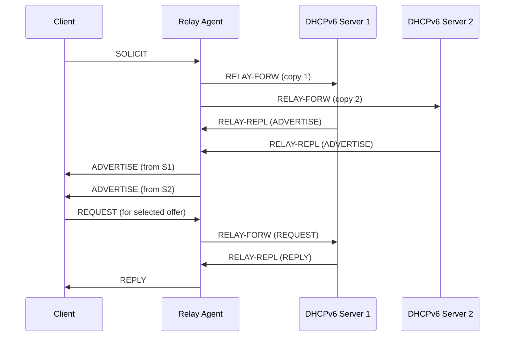

# How to Configure DHCPv6 Relay to Multiple Servers

Author: [nawazdhandala](https://www.github.com/nawazdhandala)

Tags: DHCPv6, Relay, Redundancy, High Availability, Failover, Networking

Description: Configure DHCPv6 relay agents to forward to multiple servers for redundancy and load distribution, with failover behavior on various platforms.

## DHCPv6 Multi-Server Relay Behavior

When a relay is configured with multiple destination addresses, it forwards each client message to all configured servers. A DHCPv6 client does not simply use the first ADVERTISE received; it collects valid ADVERTISE messages and selects a server based on preference and the advertised parameters:



## Linux (dhcrelay) - Multiple Servers

```bash
# dhcrelay: specify each upstream destination with -u address%interface

dhcrelay -6 \
    -l eth0 \
    -u 2001:db8::10%eth1 \
    -u 2001:db8::11%eth1

# Kea is the DHCPv6 server here; use dhcrelay or a network-device relay agent
```

## Cisco IOS - Multiple Servers

```text
! Forward to two DHCPv6 servers
interface GigabitEthernet0/1
 ipv6 dhcp relay destination 2001:db8::10
 ipv6 dhcp relay destination 2001:db8::11
```

## Juniper - Server Groups with Redundancy

```text
# Junos: DHCPv6 server group with multiple servers
set forwarding-options dhcp-relay dhcpv6 server-group PRIMARY-SERVERS 2001:db8::10
set forwarding-options dhcp-relay dhcpv6 server-group PRIMARY-SERVERS 2001:db8::11

set forwarding-options dhcp-relay dhcpv6 group CLIENTS interface ge-0/0/1.0
set forwarding-options dhcp-relay dhcpv6 group CLIENTS active-server-group PRIMARY-SERVERS
```

## ISC Kea with HA (High Availability)

```json
// kea-dhcp6.conf - Primary server with HA
{
    "Dhcp6": {
        "hooks-libraries": [
            {
                "library": "/usr/lib/kea/hooks/libdhcp_lease_cmds.so",
                "parameters": {}
            },
            {
                "library": "/usr/lib/kea/hooks/libdhcp_ha.so",
                "parameters": {
                    "high-availability": [{
                        "this-server-name": "server1",
                        "mode": "hot-standby",
                        "peers": [
                            {
                                "name": "server1",
                                "url": "http://[2001:db8::10]:8000/",
                                "role": "primary",
                                "auto-failover": true
                            },
                            {
                                "name": "server2",
                                "url": "http://[2001:db8::11]:8000/",
                                "role": "standby",
                                "auto-failover": true
                            }
                        ]
                    }]
                }
            }
        ],
        "subnet6": [{
            "subnet": "2001:db8:1::/64",
            "pools": [{"pool": "2001:db8:1::100-2001:db8:1::200"}]
        }]
    }
}
```

## MikroTik - Multiple Relay Targets

```text
# RouterOS supports multiple DHCPv6 relay targets natively

/ipv6 dhcp-relay
add name=relay1 interface=ether2 dhcp-server=2001:db8::10%ether1,2001:db8::11%ether1 link-address=2001:db8:1::1 disabled=no
```

## Testing Multi-Server Relay Failover

```bash
#!/bin/bash
# Test DHCPv6 relay failover

PRIMARY="2001:db8::10"
BACKUP="2001:db8::11"

echo "=== DHCPv6 Multi-Server Relay Test ==="

# Check both servers reachable
for SERVER in ${PRIMARY} ${BACKUP}; do
    if ping -6 -c 2 -W 2 ${SERVER} &>/dev/null; then
        echo "Server ${SERVER}: UP"
    else
        echo "Server ${SERVER}: DOWN"
    fi
done

# Simulate primary failure
echo "Simulating primary server failure..."
# ip6tables -A INPUT -s ${PRIMARY} -p udp --sport 547 -j DROP  # Block replies

# Test client can still get service from the remaining server
dhclient -6 -1 -v eth1

# Restore
# ip6tables -D INPUT -s ${PRIMARY} -p udp --sport 547 -j DROP
```

## Conclusion

DHCPv6 relay agents can forward client messages to all configured servers. Clients select a server from the valid ADVERTISE messages they receive, rather than simply using the first response. For true high availability, use ISC Kea HA mode (hot-standby), which synchronizes lease databases between two servers. When both servers are healthy, the primary responds to DHCP traffic; on failure, the standby takes over automatically. The relay configuration can stay the same because it continues forwarding to all configured destinations.
