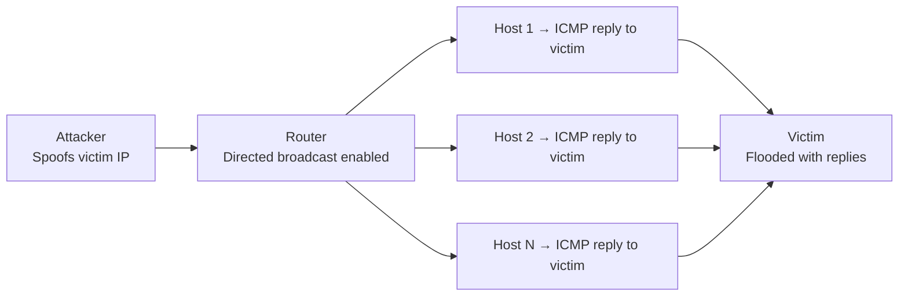

# How to Disable IP Directed Broadcast on Cisco Routers

Author: [nawazdhandala](https://www.github.com/nawazdhandala)

Tags: Networking, Cisco, Broadcast, Security, IPv4, Smurf Attack

Description: Disable IP directed broadcast on Cisco router interfaces to prevent Smurf amplification attacks and eliminate unnecessary broadcast forwarding across subnets.

## Introduction

IP directed broadcast allows a router to forward broadcast packets destined for a remote subnet's broadcast address. While occasionally useful for Wake-on-LAN, it is primarily a security liability used in **Smurf DDoS attacks**. Cisco disabled it by default starting with IOS 12.0, but older devices or intentional re-enables may leave this vulnerability open.

## What Is a Smurf Attack?

An attacker sends ICMP echo requests to a directed broadcast address with a spoofed source IP (the victim's address). Every host on the target subnet replies to the victim, creating a bandwidth amplification attack.



## Checking Current Configuration

```text
! Check the operational state on an interface
show ip interface GigabitEthernet0/1
```

If the output shows `Directed broadcast forwarding is disabled`, the interface is protected. If it shows `Directed broadcast forwarding is enabled`, directed broadcast is enabled on that interface.

## Disabling Directed Broadcast on an Interface

```text
! Disable directed broadcast on each interface
interface GigabitEthernet0/0
 no ip directed-broadcast

interface GigabitEthernet0/1
 no ip directed-broadcast

interface GigabitEthernet0/2
 no ip directed-broadcast
```

## Applying at Scale

For large deployments, push the interface-level configuration with your automation tooling; Cisco IOS does not provide a global `no ip directed-broadcast` command:

```text
interface GigabitEthernet0/0
 no ip directed-broadcast

interface GigabitEthernet0/1
 no ip directed-broadcast

interface GigabitEthernet0/2
 no ip directed-broadcast
```

## Verifying the Change

```text
! Confirm each routed interface shows directed broadcast disabled
show ip interface GigabitEthernet0/0
show ip interface GigabitEthernet0/1
show ip interface GigabitEthernet0/2
```

Each interface should show `Directed broadcast forwarding is disabled`.

## When Directed Broadcast Is Intentionally Needed

The most legitimate use case is **Wake-on-LAN** across subnets. If you need it, enable it only on the specific interface facing the target subnet, and use an ACL to limit which packets can be translated to Layer 2 broadcasts:

```text
! Create a numbered ACL allowing WoL only from the management VLAN
access-list 101 permit udp 10.0.0.0 0.0.0.255 host 192.168.50.255 eq 9

! Apply to the specific interface facing the target subnet
interface GigabitEthernet0/2
 ip directed-broadcast 101
```

## Additional Hardening: Block Smurf at the Border

If you want defense in depth, block ICMP echo requests to each local subnet's directed-broadcast address at the perimeter:

```text
! Block ICMP echo requests to directed-broadcast addresses at the upstream interface
ip access-list extended ANTI-SMURF
 deny   icmp any host 192.168.10.255 echo
 deny   icmp any host 192.168.20.255 echo
 permit ip any any

interface GigabitEthernet0/0
 ip access-group ANTI-SMURF in
```

## Conclusion

`no ip directed-broadcast` is a one-line hardening step that should be applied to every router interface. Modern Cisco IOS does this by default, but verify older devices and any interfaces that were explicitly configured. Combine with an anti-smurf ACL at border interfaces for defense in depth.
