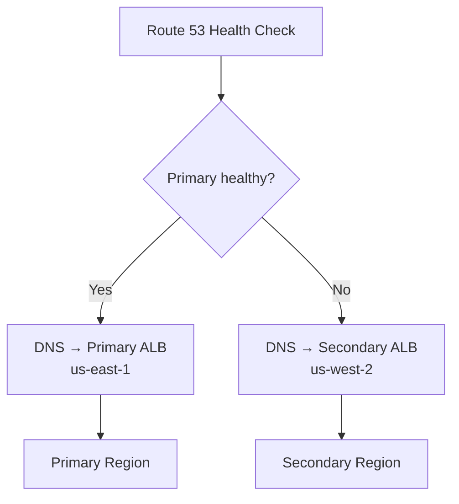

# How to Set Up DNS Failover with OpenTofu

Author: [nawazdhandala](https://www.github.com/nawazdhandala)

Tags: OpenTofu, DNS, Failover, Route53, High Availability, Health Check, Infrastructure as Code

Description: Learn how to implement DNS-based failover using Route 53 health checks and failover routing policies with OpenTofu for automatic traffic routing to a secondary region when primary fails.

---

DNS failover routes traffic to a secondary endpoint when the primary becomes unhealthy. With Route 53 failover records, Route 53 answers DNS queries with the primary or secondary record based on health, and clients observe the change as cached DNS answers expire.

## DNS Failover Architecture



## Active-Passive Failover

```hcl
# failover.tf

# Application-level health check on the primary endpoint

resource "aws_route53_health_check" "primary" {
  fqdn              = "primary.${var.domain_name}"
  port              = 443
  type              = "HTTPS"
  resource_path     = "/health"
  failure_threshold = 3
  request_interval  = 30

  tags = {
    Name = "primary-health-check"
  }
}

# Primary failover record
resource "aws_route53_record" "primary" {
  zone_id        = aws_route53_zone.main.zone_id
  name           = "api.${var.domain_name}"
  type           = "A"
  set_identifier = "primary"

  failover_routing_policy {
    type = "PRIMARY"
  }

  health_check_id = aws_route53_health_check.primary.id

  alias {
    name                   = aws_lb.primary.dns_name
    zone_id                = aws_lb.primary.zone_id
    evaluate_target_health = true
  }
}

# Secondary failover record - explicit health check optional
resource "aws_route53_record" "secondary" {
  provider = aws.secondary_region

  zone_id        = aws_route53_zone.main.zone_id
  name           = "api.${var.domain_name}"
  type           = "A"
  set_identifier = "secondary"

  failover_routing_policy {
    type = "SECONDARY"
  }

  alias {
    name                   = aws_lb.secondary.dns_name
    zone_id                = aws_lb.secondary.zone_id
    evaluate_target_health = true
  }
}
```

## Multi-Region Active-Active with Latency Routing

```hcl
# Latency-based routing sends users to the lowest-latency region
resource "aws_route53_record" "us_east" {
  zone_id        = aws_route53_zone.main.zone_id
  name           = "api.${var.domain_name}"
  type           = "A"
  set_identifier = "us-east-1"

  latency_routing_policy {
    region = "us-east-1"
  }

  health_check_id = aws_route53_health_check.us_east.id

  alias {
    name                   = aws_lb.us_east.dns_name
    zone_id                = aws_lb.us_east.zone_id
    evaluate_target_health = true
  }
}

resource "aws_route53_record" "eu_west" {
  zone_id        = aws_route53_zone.main.zone_id
  name           = "api.${var.domain_name}"
  type           = "A"
  set_identifier = "eu-west-1"

  latency_routing_policy {
    region = "eu-west-1"
  }

  health_check_id = aws_route53_health_check.eu_west.id

  alias {
    name                   = aws_lb.eu_west.dns_name
    zone_id                = aws_lb.eu_west.zone_id
    evaluate_target_health = true
  }
}
```

## Failover Alarm

```hcl
# Alert when the primary health check goes unhealthy
resource "aws_cloudwatch_metric_alarm" "failover_triggered" {
  alarm_name          = "dns-failover-triggered"
  comparison_operator = "LessThanThreshold"
  evaluation_periods  = 1
  metric_name         = "HealthCheckStatus"
  namespace           = "AWS/Route53"
  period              = 60
  statistic           = "Minimum"
  threshold           = 1

  dimensions = {
    HealthCheckId = aws_route53_health_check.primary.id
  }

  alarm_description = "Primary endpoint health check is unhealthy - failover conditions detected"
  alarm_actions     = [aws_sns_topic.incidents.arn]
}
```

## Best Practices

- Set health check `failure_threshold = 3` and `request_interval = 30` - this requires three failed 30-second observations before Route 53 marks the health check unhealthy, balancing speed and false positives.
- Use `evaluate_target_health = true` on alias records - for ALB and NLB targets, Route 53 can stop answering with a load balancer when it is considered unhealthy.
- Alias records to AWS resources inherit the target's TTL - for ELB-backed aliases, that's 60 seconds, while non-alias failover records should use a low TTL for faster client-side failover.
- Configure CloudWatch alarms on health check status - you want to know when failover conditions begin.
- Test failover regularly by temporarily blocking the health check endpoint - don't wait for a real outage to discover issues.
